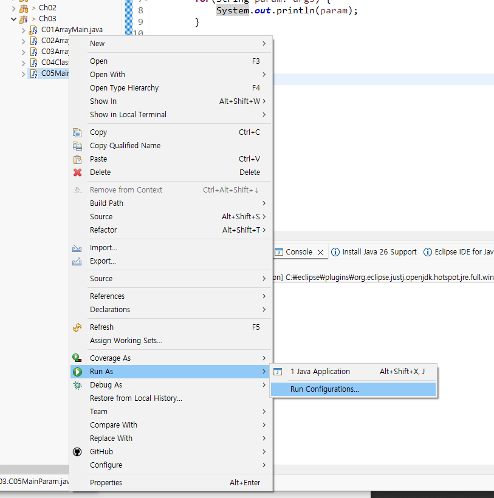
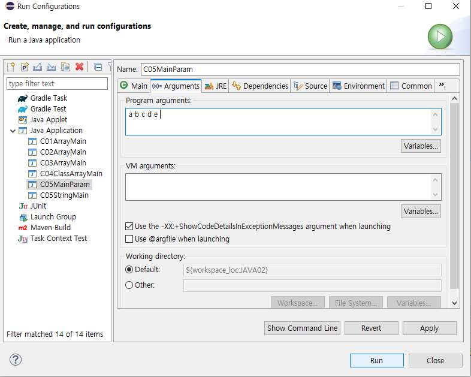
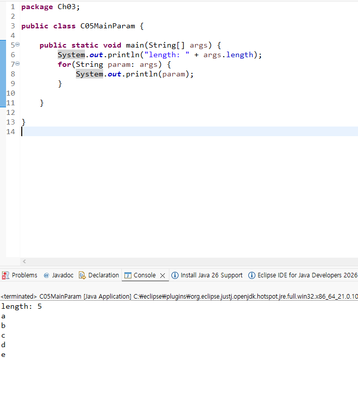

<empty-block/>
터미널로 하는 법
<empty-block/>
```shell

cd ..
javac Ch03\C05MainParam.java
java Ch03.C05MainParam
java Ch03.C05MainParam "abcd" "efg" "higieow"

# 확인
C:\Fullstack~~\Fullstack_Java\JAVA02\src\Ch03>cd ..
C:\Fullstack~~\Fullstack_Java\JAVA02\src>javac Ch03\C05MainParam.java
# 만들어진 C05MainParam.class 파일 확인
C:\Fullstack~~\Fullstack_Java\JAVA02\src>java Ch03.C05MainParam
length: 0
C:\Fullstack~~\Fullstack_Java\JAVA02\src>java Ch03.C05MainParam "abcd" "efg" "higieow"
length: 3
abcd
efg
higieow
```
