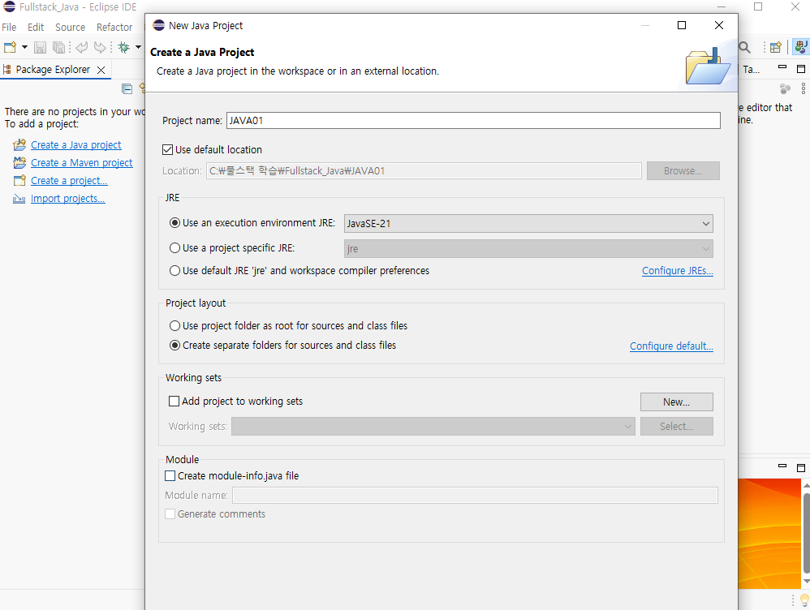

레파지토리 만들고 깃클론한 폴더 이클립스로 연 뒤 자바 프로젝트 생성




new-class


### C01SystemOut.java
```javascript
package Ch00; 				// 패키지명

public class HelloWorld {	// class 선언부 - 객체지향 문법 적용영역

	// 메서드(함수) 종류
	// 라이브러리 메서드		: 미리 만들어져 제공되는 메서드
	// 사용자정의 메서드		: 개발자에 의해 만들어지는 메서드
	// main 메서드		: 최초 실행되는 메서드
	
	/* 
	 * public: 누구나 접근 가능
	 * static: 미리 만들어짐 (객체 생성 없이 바로 메모리로 올라가 실행될 수 있음)
	 * void: 돌려줄 값이 없음 
	 * main: 메서드의 이름
	 * (String[] : 문자열 배열
	 * args): 변수 이름 
	 * 
	 * 요약: 어디서든(public) 객체 생성 없이(static) 바로 찾아서 실행할 수 있는, 
	 * 결과값은 안 줘도 되는(void) 메인 진입점(main)이며, 
	 * 필요한 정보(String[] args)를 담을 수 있는 공간
	 */
	
	public static void main(String[] args) {	// main 메서드 선언부 - 절차지향 문법 적용영역
		System.out.println("HelloWorld");		// 라이브러리 메서드
	}
}

	// 글자 크기 조정: ctrl + '+' or '-'
	// 주석 처리: ctrl + '/' 
	// 한줄 복사: ctrl + alt + 아래방향키
 	// 한줄 삭제: ctrl + d
```
---


### <span color="red">중요!</span>

<callout>

	2진수: 0과 1만 사용해 수를 표현하며 2n단위로 자릿수를 이동한다.(1,2,4,8...)<br>비트(Bit): 2진수의 한자리(0또는 1)를 나타내는 정보의 최소 단위<br>즉, 7: 111이 되면 3자리가 꽉 찼으므로 모두 올림되어 8: 1000 4자리가 가 된다.<br><br>16진수(Hex): 0\~9까지의 숫자와 A\~F(대문자/소문자)까지의 알파벳 6개를 포함하여 총 16개의 기호로 수를 표현한다. 2진수를 줄여 쓸 수 있다.

	**2진수 → 10진수 변환(가중치 계산)**<br>1  	 1  	 1	  1  	  1	  1  	  1	  1<br>\*	 \*	 \*	  \*	  \*	  \*	  \*  	  \*<br>2\^7	 2\^6	 2\^5	  2\^4  2\^3  2\^2  2\^1 2\^0<br>128	 64	 32	 16	  8	   4	   2	  1

	ex)<br>2진수 - \> 10진수<br>10101100 = 128 + 32 + 8 + 4<br>10011010 = 128 + 16 + 8 + 2

	10진수 -\> 2진수<br>192 -\> 11000000<br>224 -\> 11100000

</callout>

### C02진수
```javascript
package Ch01;

public class C02진수 {

	public static void main(String[] args) {
//		  10진수		  16진수      2진수
//		  0			      0           0
//		  1			      1           1
//		  2			      2           10
//		  3			      3           11
//		  4			      4           100
//		  5			      5           101
//		  6			      6           110
//		  7			      7           111
//		  8			      8           1000
//		  9			      9           1001
//      10          A           1010
//      11          B           1011
//      12          C           1100
//      13          D           1101
//      14          E           1110
//      15          F           1111
//      16          10          10000

// 2진수: 0과 1만 사용해 수를 표현하며 2n단위로 자릿수를 이동한다.(1,2,4,8...)
// 비트(Bit): 2진수의 한자리(0또는 1)를 나타내는 정보의 최소 단위
// 즉, 7: 111이 되면 3자리가 꽉 찼으므로 모두 올림되어 8: 1000 4자리가 가 된다.

// 16진수(Hex): 0~9까지의 숫자와 A~F(대문자/소문자)까지의 알파벳 6개를 포함하여 총 16개의 기호로 수를 표현한다.
// 2진수를 줄여 쓸 수 있다.

//		------------------------------
//		1bit : 2^1 = 2(0~1)
//		2bit : 2^2 = 4(0~3)
//		3bit : 2^3 = 8(0~7)
//		4bit : 2^4 = 16(0~15)
//		5bit : 2^5 = 32(0~31)
//		6bit : 2^6 = 64(0~63)
//		7bit : 2^7 = 128(0~127)
//		8bit : 2^8 = 256(0~255)
//		9bit : 2^9 = 512(0~511)
//		10bit: 2^10 =1024(0~1023)
//		--------------------------------
//    2진수 -> 10진수 변환(가중치 계산)
//		1  	1  	1	  1  	1	  1  	1	  1
//		*	  *	  *	  *	  *	  *	  *  	*
//		2^7	2^6	2^5	2^4	2^3	2^2	2^1	2^0
//		128	64	32	16	8	  4	  2	  1

		// 2진수 - > 10진수
		// 10101100 = 128 + 32 + 8 + 4
		// 10011010 = 128 + 16 + 8 + 2
		// 01101001 = 64 + 32 + 8 + 1
		// 10010010 = 128 + 16 + 2

		// 10진수 -> 2진수
		// 192 -> 11000000
		// 224 -> 11100000
		// 252 -> 11111100
		// 12 -> 00001100
		// 15 -> 00001111

        /* 문제 */

		// 2진수 - > 10진수
		// 10101100 = 128+32+8+4
		// 10011010 = 128+16+8+2
		// 01101001 = 64+32+8+1
		// 10010010 = 128+16+2
		// 11001100 = 128+64+8+4
		// 00110101 = 32+16+4+1
		// 10100110 = 128+32+4+2

		// 10진수 -> 2진수
		// 192 -> 11000000
		// 158 -> 10011110
		// 224 -> 11100000
		// 252 -> 11111100
		// 88  -> 01011000
		// 179 -> 10110011
		// 12  -> 00001100
		// 15  -> 00001111

		// %d : 10진수 서식문자
		// %o : 8진수 서식문자
		// %x : 16진수 서식문자
		// 코드 이쁘게 정리하기 : ctrl + shift + f

        // 0b: 0b로 시작하면 2진수다.
        System.out.printf("10진수: %d\n", 0b00001111);
        System.out.printf("10진수: %d\n", 173);     // 10진수
        System.out.printf("10진수: %d\n", 0255);    // 8진수 (0: 8진수를 의미하는 접두사)
        System.out.printf("10진수: %d\n", 0xAD);    // 16진수(0x: 16진수를 의미하는 접두사)

        System.out.println();
        System.out.printf("8진수: %o\n", 173);     // 10진수
        System.out.printf("8진수: %o\n", 0255);    // 8진수 (0: 8진수를 의미하는 접두사)
        System.out.printf("8진수: %o\n", 0xAD);    // 16진수(0x: 16진수를 의미하는 접두사)

        System.out.println();
        System.out.printf("16진수: %x\n", 173);     // 10진수
        System.out.printf("16진수: %x\n", 0255);    // 8진수 (0: 8진수를 의미하는 접두사)
        System.out.printf("16진수: %x\n", 0xAD);    // 16진수(0x: 16진수를 의미하는 접두사)
	}
}
```
### <span color="red">중요!</span>

<callout>

	JAVA에서<br>부호가 있는 타입(signed): byte, short, int, long<br>부호가 없는 타입(unsigned): **char**

	숫자를 해석하는 자료형이 부호가 있는 타입(signed)이면 맨 앞이 0이면 양수(+), 맨 앞이 1이면 음수(-)라 약속되어 있다. 부호가 없는 타입(unsigned)은 맨 앞 비트도 숫자의 크기를 나타내며 1로 시작해도 큰 양수일 뿐이다.

	---

	보수: 보충해주는 수. 작은 수 A를 큰 수 B로 만들기 위해 채워야 하는 차액.<br>보수의 종류<br>1의 보수: 모든 비트를 반전시킨 것 (0 -\> 1, 1 -\> 0).<br>2의 보수: 1의 보수에 1을 더한 것. 

	**음수변환: -B = B의 2의 보수**

	**뺄셈: (A - B) = A + (B의 2의 보수)**

</callout>

### 03음수
```javascript
package Ch01;

public class C03음수 {
    public static void main(String[] args) {
        
        /*  OX 문제
            컴퓨터(CPU)는 구조 상 덧셈연산을 할 수 있다.(O)
            컴퓨터(CPU)는 구조 상 뺄셈연산을 할 수 있다.(X)
            보수 개념 + 가산처리를 통해 뺄셈 결과를 만들어낸다.

            설명: CPU 안에는 ALU(산술논리연산장치)가 있는데, 여기 가산기(Adder,더하기 수행 회로)만 들어있다. 때문에 뺄셈을 직접 수행하는 대신, 보수(Complement)를 사용하여 뺄셈을 덧셈으로 바꾸어 처리한다.
            
            보수: 보충해주는 수. 작은 수 A를 큰 수 B로 만들기 위해 채워야 하는 차액.
            보수의 종류
            1의 보수: 모든 비트를 반전시킨 것 (0 -> 1, 1 -> 0).
            2의 보수: 1의 보수에 1을 더한 것. 
					
						즉, 2진수 뺄셈: 원 숫자 + 빼려는 수의 2의 보수
						
            숫자 맨 앞이 0이면 양수(+), 맨 앞이 1이면 음수(-)

				부호가 없는 타입(unsigned)은 맨 앞 비트도 숫자의 크기를 나타내며 1로 시작해도 큰 양수일 뿐이다.
			숫자를 해석하는 자료형이 부호가 있는 타입(signed)이면 맨 앞이 1이면 음수, 0이면 양수라 약속되어 있다.
			
			JAVA
			부호가 있는 타입(signed): byte, short, int, long
			부호가 없는 타입(unsigned): char
			

		 	7 - 4 = 3
		 	7 + 6 = 3
		 	77 - 32 = 45
		 	77 + 68 = 45
		 	
		 	5 - 5 = 0
		 	5 + 5 = 0
		 	
		 	  00000101 = 5
		 	  11111010 = 5에 대한 1의 보수(-6)
		    11111011 = 5에 대한 2의 보수(-5)
		 
		 	  00000101 = 5		 
		 +	11111011 = 5에 대한 2의 보수(-5)
		 	-----------------------------
		 (1)00000000 = 0 --> 넘치는 1은 버린다.
		    
		 	
		 	11111010 = -128 + 64 + 32 + 16 + 8 + 2 = -6
		 			 
		문제
		음수값임을 고려하여 풉니다
		10 진수 -> 2진수
		111 	-> 01101111
		-111 	-> 10010001
		96		-> 01100000
		-96		-> 10100000
		31 		-> 00011111
	  -31		-> 11100001
		
		2진수		-> 10진수
		10101111 	-> -128+32+8+4+2+1
		00110101	-> 32+16+4+1
		11001100	-> -128+64+8+4
		10101010	-> -128+32+8+2
        
    */
    }

}

```

### 04 변수_자료형
```javascript
	/* 		
		byte(1byte - signed)
		char(2byte - unsigned) 음수 불가
		short(2byte - signed) 
		int(4byte - signed) 기본 자료형
		float(4byte)
		double(8byte) 기본 자료형 */

		int num1;	// um1을 int(정수)형으로 정의
		num1 = 10;					// 변수 num1을 10으로 정의
		int num2 = 4;				// int형 num2을 4로 정의 
		int num3 = num1 + num2;		// int형 num3을 num1+num2, 즉 10+4= 14로 정의
		System.out.println(num3);	// 정의된 값 14 출력		

		/* 강사님 답
		int num1;	
		// int만큼의 크기(4byte)의 공간 형성 + num1 이름 부여(변수 정의)				
		num1 = 10;					
		// 10이라고 하는 값(리터럴 상수)을 상수 pool에 저장, num1공간에 대입(복사)
		int num2 = 4;				
		// 4라는 값(리터럴 상수)을 상수 pool 저장, 4byte 정수공간 num2 초기화
		int num3 = num1 + num2;		
		// num1안의 값과 num2안의 값의 덧셈 결과(cpu 가산처리)를 4byte 정수 공간 num3에 초기화
		System.out.println(num3);	
		// num3안의 값을 println메서드로 전달해서 내부적으로 표준출력 처리	
		*/

		/* 
			Data(수, 자료): 선저장 / 후처리
			변수		  : 개발자의 유지보수 측면에서 유리하도록 지정한 수(바뀔 예정인 수)
			변수명 		  :	저장되어 있는 변수 공간에 접근하기 위한 문자 형태의 주소
			자료형		  : Data(수, 자료)를 저장하기 위한 공간을 형성하고 저장될 자료의 형태를 제한하는 예약어
			
			연산자 = 	  : lv(공간) = rv(값). rv를 먼저 처리(저장 or 연산)한 다음 lv에 대입
		*/
```
### 05 변수_자료형
```javascript
                                                                                        package Ch01;

import java.nio.charset.StandardCharsets;

public class C05변수_자료형 {

	public static void main(String[] args) {
		// --------------------------------------
		// 정수 int = 4byte 정수 부호 O
		// --------------------------------------
		
		int n1 = 0b10101101;	// 2진수 		-> 0b는 2진수를 의미하는 접두사.
		int n2 = 173;			// 10진수 정수값 
		int n3 = 0255;			// 8진수		-> 0은 8진수를 의미하는 접두사.
		int n4 = 0xad; 			// 16진수 		-> 0x는 16진수를 의미하는 접두사.
		System.out.printf("%d %d %d %d\n",n1,n2,n3,n4);

		System.out.println("----------------------------");
		// --------------------------------------
		// 정수 byte = 1byte 정수 부호 O
		// --------------------------------------
		// 음수 -128, 양수 127까지만 지원
		// 강제 변환 시 데이터 손실. 남은 값 버림

		byte n5 = (byte)-129;		
		byte n6 = -30;
		byte n7 = 30;
		byte n8 = 127;
		byte n9 = (byte)129;		

		System.out.println("n5: " + n5);
		System.out.println(Integer.toBinaryString((-30)));
		System.out.println("----------------------------");

		// --------------------------------------
		// 정수 short = 2byte 정수 부호 O	| char-2byte 정수 부호x (양수만)
		// --------------------------------------
		
		// 자동 형병환 방향: byte(1) → short(2) → int(4) → long(8) → float(4) → double(8)
		// 자동 형변환: 데이터 타입의 크기(Byte)가 더 크거나, 표현할 수 있는 값의 범위가 더 넓은 쪽으로 옮겨갈 때 발생 
		// 데이터 손실 가능성이 있을 경우 형변환해주지 않는다.

		char n10 = 65535;	// (0 ~ 2^16  -1)	(0~65535)
		short n11 = 32767; 	// (-2^15 ~ +2^15  -1)	(-32768 ~ +32767)

		
		char n12 = 60000;
		short n13 = (short)n12; 
		// 문제 발생 사유: 자료형 불일치+더 큰 값 넣으려 함. 데이터 손실 우려 있음. 강제 형변환 시 -5536출력.
		// short는 양수의 경우 32767까지만 지원함.

		byte n14 = 100;
		short n15 = n14; // 자료형이 불일치하나 데이터 손실 우려가 없으니 자동 형변환
		// 작은 자료형->큰 자료형 넣으려 해서 가능

		System.out.printf("%d\n",n13);
		System.out.printf("%d\n",n15);
		System.out.println("----------------------------");

		// --------------------------------------
		// 정수 long-8byte 정수 부호 O
		// --------------------------------------

		// java는 정수 리터럴을 무조건 int(4byte)로 간주
		// int범위: (-21억 ~ +21억)
		// L,l : long형 접미사

		long n16 = 2150000000L; 	// 21.5억. L,l (리터럴 접미사): long 자료형 사용하여 값 저장
		long n17 = 20;			// int 20을 자동 형변환하여 대입함
		
		long n18 = 10000000000L; 	
		long n19 = 1000000000;

		// --------------------------------------
		// 실수
		// --------------------------------------		

		// 유리수와 무리수 통칭
		// 소숫점 이하 값을 가지는 수 123.456
		// float: 4byte 실수 (6-9자리)
		// double: 8byte 실수(15-18자리), 기본 자료형

		// 정밀도 확인
		float n20 = 0.123456789123456789F; // f,F: float형 접미사
		double n21 = 0.123456789123456789;

		System.out.println(n20);
		System.out.println(n21);

/* 		// 오차 확인
		// 1E5 = 1x10^5
		float num = 0.1F;
		for(int i=0; i<=1E5; i++){
			num = num + 0.1F;
			System.out.println(i);
		}
		System.out.println("num: " + num); */

		System.out.println("----------------------------");

		// 고정 소수점: 빠른 저장, 메모리 공간 낭비
		// 부동소수점(기본값): 비교적 느린 저장, 메모리 공간 효율

		// --------------------------------------
		// 단일 문자 char 2byte 정수
		// --------------------------------------	

		char ch1 = 'a';
		System.out.println(ch1);
		System.out.println((int)ch1);
		System.out.println(Integer.toBinaryString(ch1));

		System.out.println("----------------------------");

		char ch2 = 98;
		System.out.println(ch2);
		System.out.println((int)ch2);
		System.out.println(Integer.toBinaryString(ch2));

		System.out.println("----------------------------");

		char ch3 = 'b'+1;
		System.out.println(ch3);
		System.out.println((int)ch3);
		System.out.println(Integer.toBinaryString(ch3));

		System.out.println("----------------------------");

		System.out.println((char)0b101011_00000_00000);

		char ch4 = 0xac02;
		System.out.println(ch4);
		System.out.println((int)ch4);
		System.out.println(Integer.toBinaryString(ch4));

		System.out.println("----------------------------");

		// \\u: 유니코드 이스케이프 문자
		System.out.printf("%c\n", 0xac03);	
		System.out.printf("%c\n", '갃');	

		System.out.println("----------------------------");

		// --------------------------------------
		// boolean: 논리형(true/false 저장)
		// --------------------------------------	

		boolean flag = (10>11);		// 거짓(부정)

		if(flag){
			System.out.println("참인 경우 실행");
		}else{
			System.out.println("거짓인 경우 실행");
		}

		// --------------------------------------
		// 문자열: String (클래스 자료형)
		// --------------------------------------

		// 기본 자료형(원시 타입)
		// byte n1;
		// short n2;
		// double n3;
		// long n4;

		// 클래스 자료형
		// 클래스 자료형으로 만든 변수는 '참조변수'라고 하고
		// 참조 변수는 데이터가 저장된 위치 정보(메모리 주소 값)가 저장된다.

		int a1 = 10;
		byte a2 = 20;
		char a3 = 40;

		// 한글 1글자 당 3byte
		String name = "홍길동";
		String job = "프로그래머";

		System.out.println("UTF-8기준 지정 크기: " + name.getBytes(StandardCharsets.UTF_8).length);
		System.out.println("UTF-8기준 지정 크기: " + job.getBytes(StandardCharsets.UTF_8).length);

		// 사이즈 확인
		char ch = '홍';		//16bit == 2byte 사용
		String str= "홍";	//24bit == 3byte 사용

		// ch 는 2byte (단일, 숫자로 저장)
		// str로 쓰면 개당 3byte (객체화)
		
		System.out.println("ch 실제 크기(bit): " + Integer.toBinaryString(ch).length());
		System.out.println("str 실제 크기(byte): " + str.getBytes(StandardCharsets.UTF_8).length);
	}

}
```

### 06 상수
```javascript
package Ch01;

public class C06상수 {
    public static void main(String[] args) {
     // 상수: 항상 같은 수
     // 리터럴 상수: 이름부여x, 상수pool에 저장, 단순한 수치, 값
     // 심볼릭 상수: 이름부여o, final 예약어 사용
     
     // 리터럴 접미사: 리터럴 상수가 저장되는 자료형을 지정
     // l,L: long 자료형
     // f,F: float 자료형
        
     int a = 'a';
     System.out.println(a);
     System.out.println((char)a);

     int n1 = 100; // 100은 리터럴 상수
     final int n2 = 200; // n2는 심볼릭 상수

     final double PI = 3.14;
    
     double result = PI*4*4;

    }
}
```

### 07 정리문제
```javascript
/* 확인 문제1

	정수타입 
	1byte : byte
	2byte : char / short
	4byte : int(기본자료형) 
	8byte : long 

	실수타입
	4byte : float 
	8byte : double(기본자료형)

	논리타입
	1byte : boolean 

	확인문제2
	맞는 코드인지 틀린 코드인지 확인 
	byte var = 200;						    ( X	) // 127이상이라
	char var='AB';						    ( X	) // 한문자만
	char var=65;						    ( O )
	long var=500_0000_0000;				    ( X	) // int는 21억까지만 지원. L붙여줘야
	float var = 3.14;					    ( X	) // 
	double var = 100.0;					    ( O )
	String var = "나의직업은 "개발자" 입니다.";	  ( X ) \" 붙여줘야
	boolean var = 0;					    ( X	) // java에서는 true, false만 작성 가능
	int v2 = 1e2; 						    ( X ) // 1e2는 실수(double)로 인식됨. 1.0x10^2 가능
	float = 1e2f;	 						    ( O	) 
*/
```

## Ch02

### C01TypeChange
```javascript
package Ch02;

public class C01TypeChange {

    public static void main(String[] args) {

        /*
        (자료) 형변환
        연산 시 일치하지 않는 자료형을 일치시키는 작업
        
        자동 형변환(암시적 형변환): 컴파일러에 의해 자동 형변환
        강제 형변환(명시적 형변환): 프로그래머에 의해 강제 형변환

        자동 형변환(=)
        '변수 연산 처리'시 범위가 넓은 공간에 작은 값이 대입되는 경우
        '리터럴 상수 연산 처리' 시 리터럴 값에 따른 형변환 여부 결정

        ex)
        byte > short, char > int > long > float > double
        */

        byte byteValue = 10;
        int intValue = byteValue; // byte -> int 자동 형변환
        System.out.println("intValue: " + intValue);

        char charValue = '가';
        intValue = charValue; // char -> int 자동 형변환
        System.out.println("가 의 유니코드: " + intValue);

        intValue = 50;
        long longValue = intValue; // int -> long 자동 형변환
        System.out.println("longValue: "+longValue);

        longValue = 100;
        float floatValue = longValue; // long -> float 자동 형변환
        System.out.println("floatValue: "+floatValue);

        floatValue = 100.5F;
        double doubleValue = floatValue; // float -> double 자동 형변환
        System.out.println("doubleValue: "+doubleValue);
    }
}

```
### C02TypeChange
```javascript
package Ch02;

public class C02TypeChange {
    public static void main(String[] args) {

        /*
            강제 형변환
            좁은 범위 공간에 큰 값을 넣으려고 하는 경우
            기본적으로 불가능하기 때문에 강제로 자료형을 바꾸어 전달
            ! 변수 타입 크기만 확인하므로 충분히 들어갈 숫자라도 오류 띄운다.
            데이터 손실 염려가 있다.

            byte > short, char > int > long > float > double
        */

        int intValue = 20000;
        char charValue = (char)intValue; // 강제 형변환 필요
        System.out.println((int)charValue);

        long longValue = 500;
        intValue = (int)longValue;
        System.out.println(intValue);

        // 데이터 손실!
        double doubleValue = 3.14;
        intValue = (int)doubleValue;
        System.out.println(intValue);
    }

}
```

### C03TypeChange
```javascript
package Ch02;

public class C03TypeChange {
    public static void main(String[] args) {
        int num1 = 129;         // 1000_0001
        int num2 = 130;         // 1000_0011

        byte ch1 = (byte)num1;  // -128+1
        byte ch2 = (byte)num2;  // -128+2+1

        System.out.printf("%d\n", ch1);
        System.out.printf("%d\n", ch2);
    }
}

```
