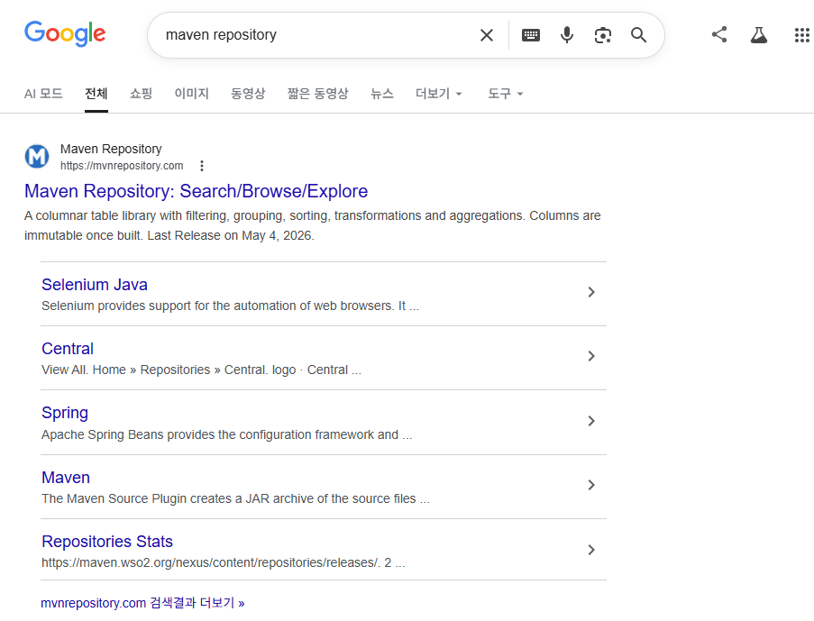
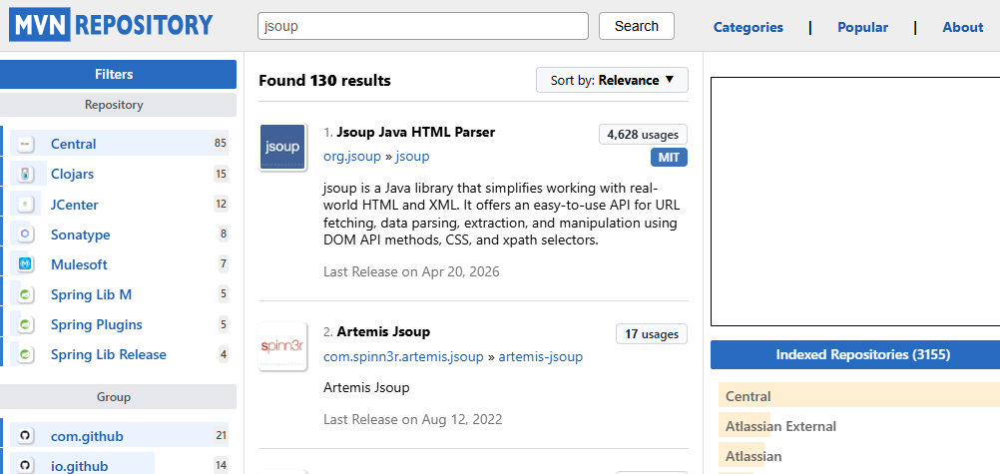
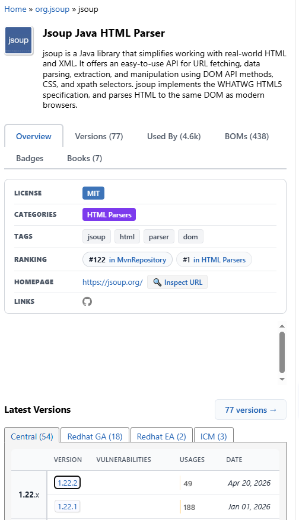
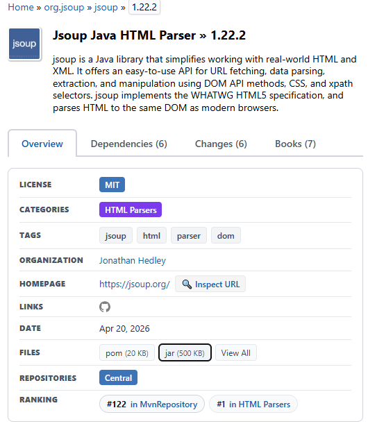
<empty-block/>
다운 받은 파일 사용할 곳에 집어넣기
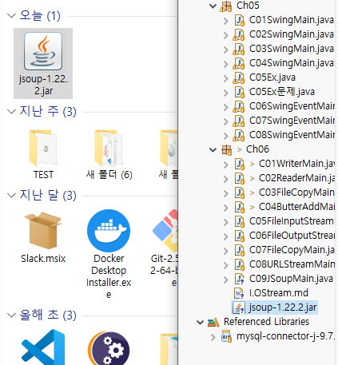
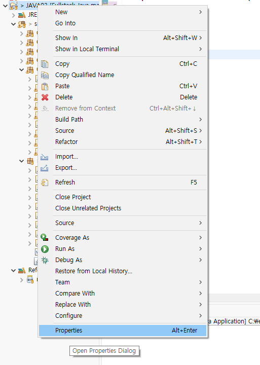
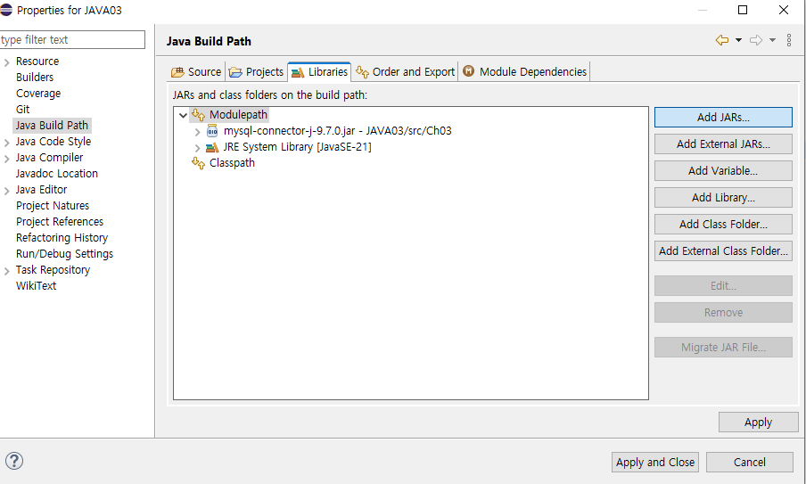
<empty-block/>
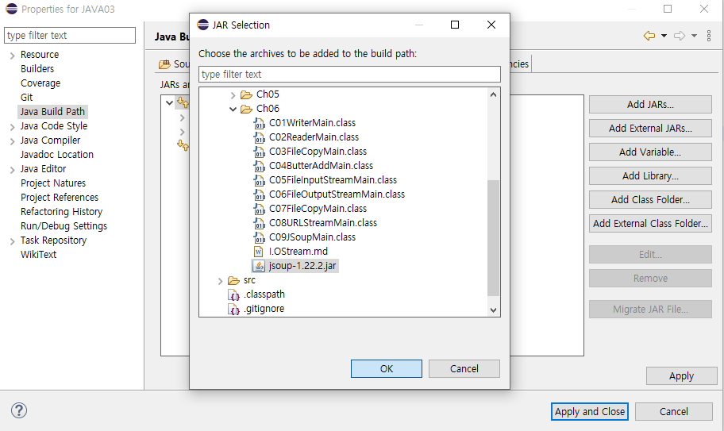
<empty-block/>
<empty-block/>
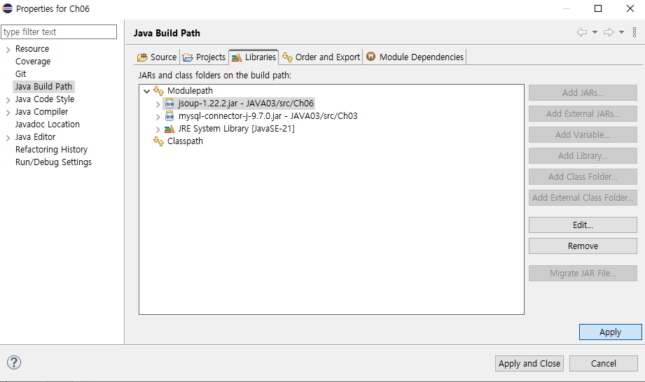
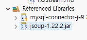
<empty-block/>
모달이아니고 클래스에 넣어야 했음
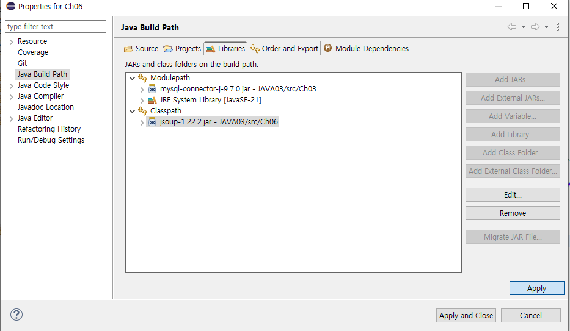
<empty-block/>
<empty-block/>
<empty-block/>
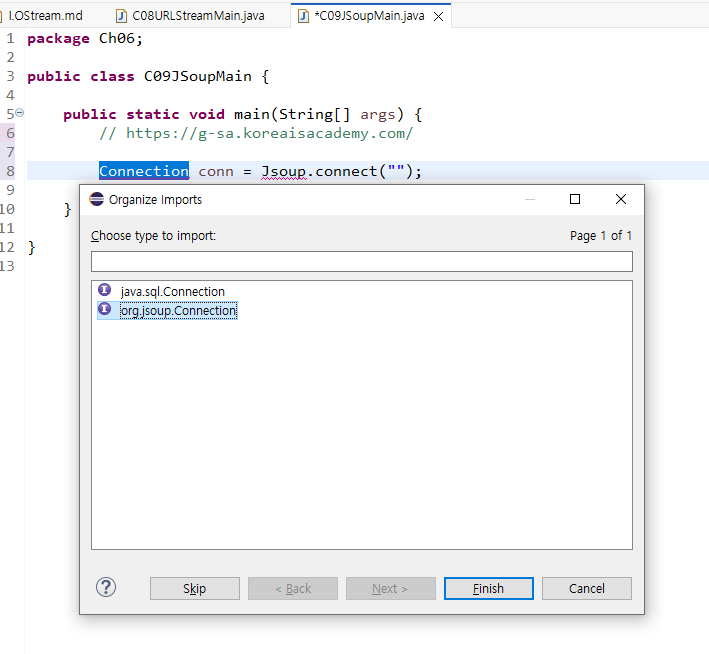
<empty-block/>
<empty-block/>
셀레움
1. 자바 아카이브
[https://www.selenium.dev/downloads/](https://www.selenium.dev/downloads/)
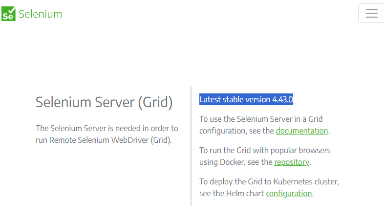
<empty-block/>
<empty-block/>
<empty-block/>
<empty-block/>
1. 크롬드라이버
[https://googlechromelabs.github.io/chrome-for-testing/#stable](https://googlechromelabs.github.io/chrome-for-testing/#stable)
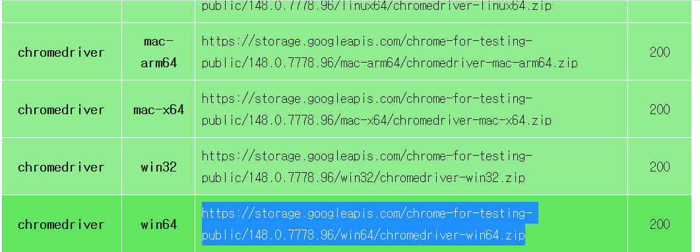
<empty-block/>
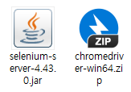
<empty-block/>
크롬드라이버 압축 풀어 드래그드랍
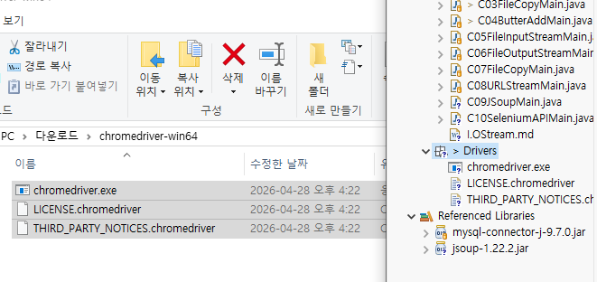
<empty-block/>
셀레늄 드래그드랍
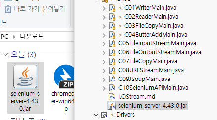
<empty-block/>
<empty-block/>
프로젝트 우클릭 - properties
<empty-block/>
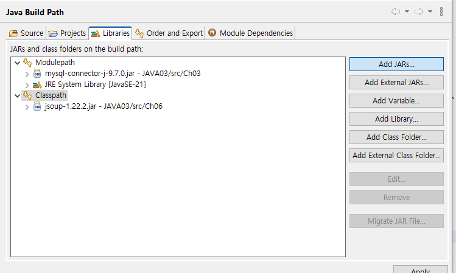
<empty-block/>
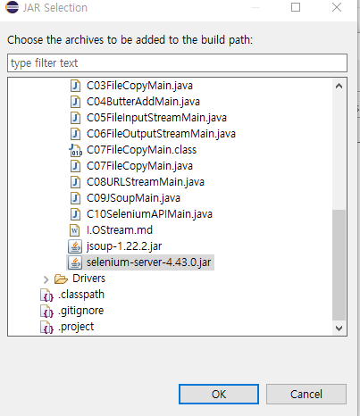
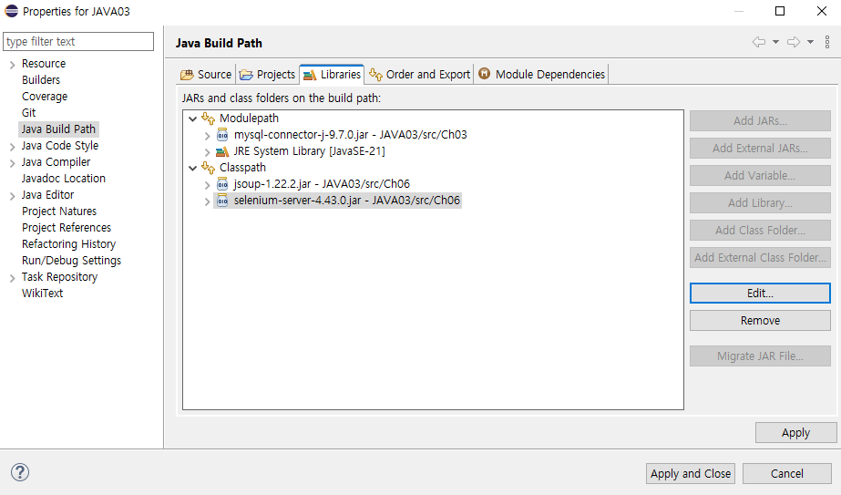
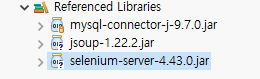
<empty-block/>
### C11RestRequestResponseMain
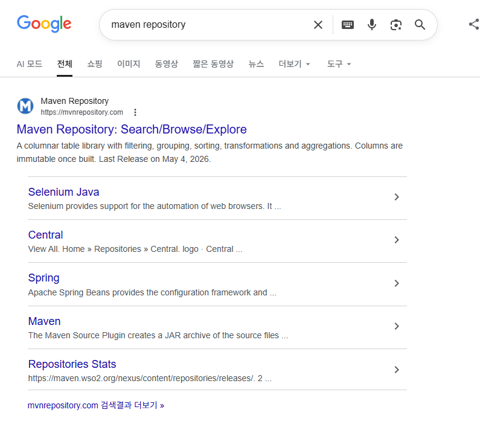
jackson 검색
아래 4개 하단처럼 최신-Files에 json다운, 없으면 bundle
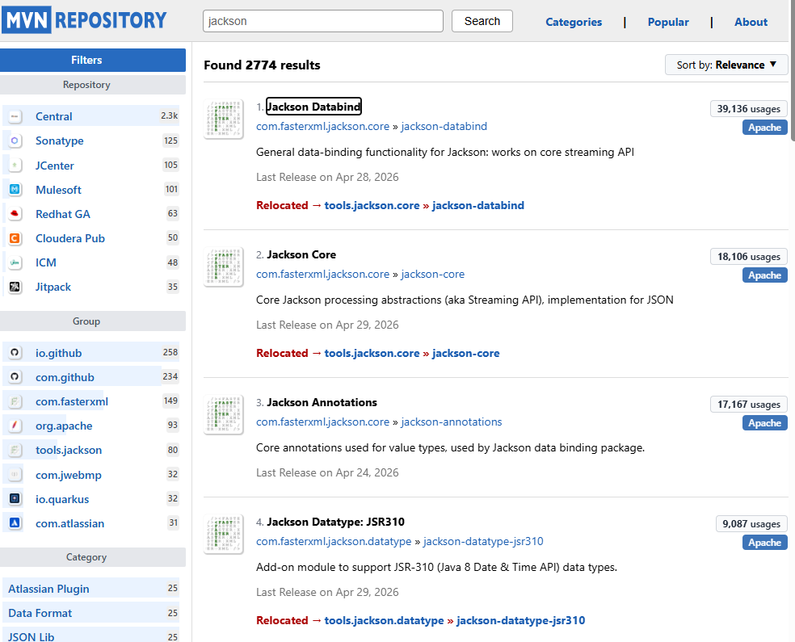
<empty-block/>
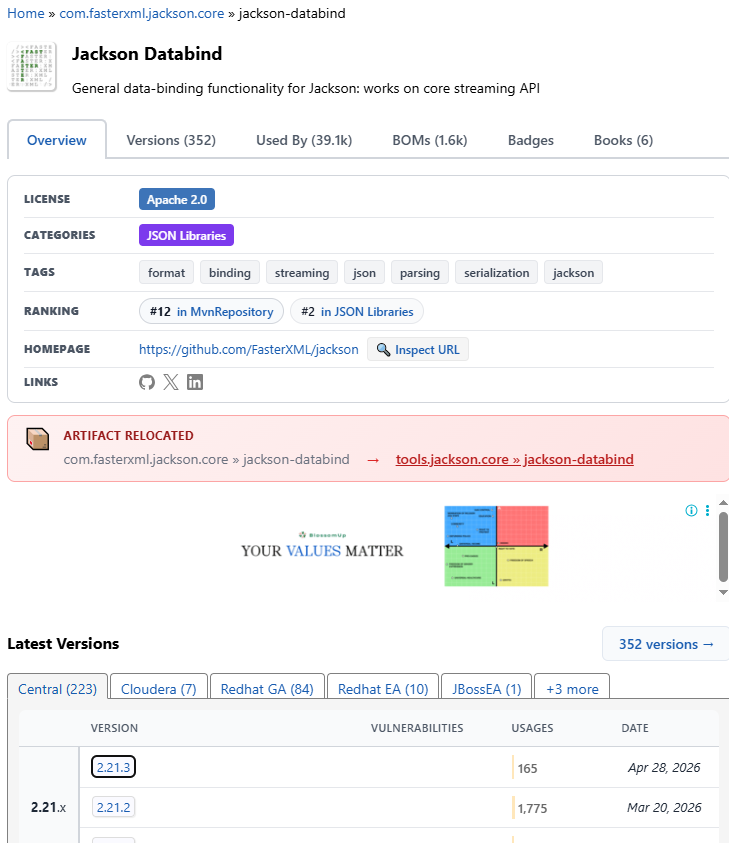
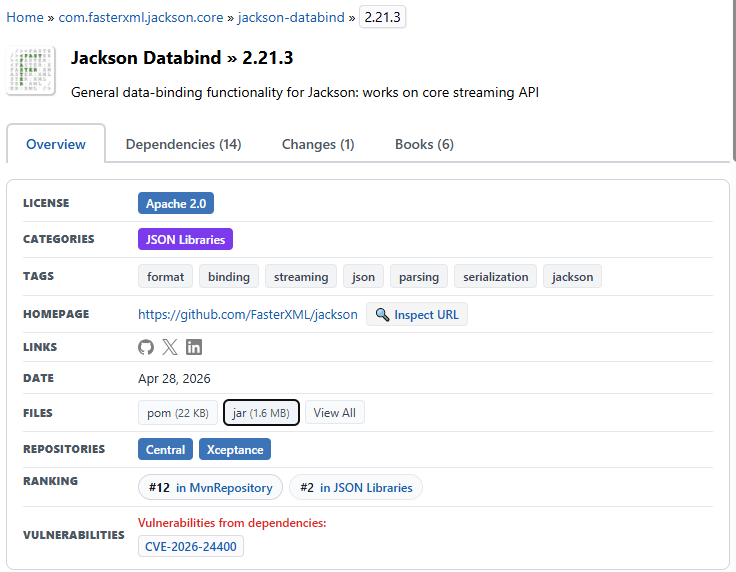
<empty-block/>
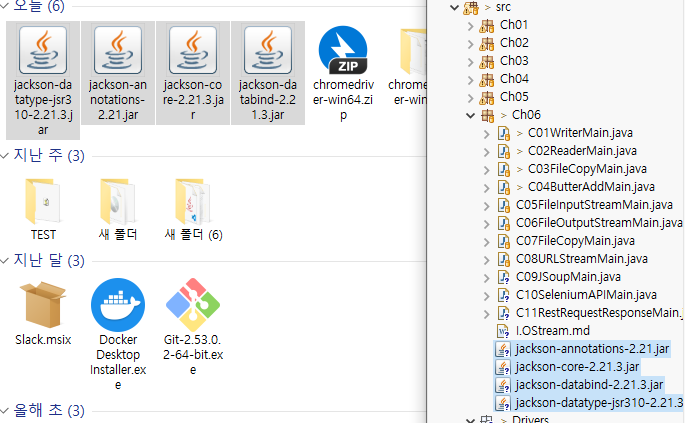
<empty-block/>
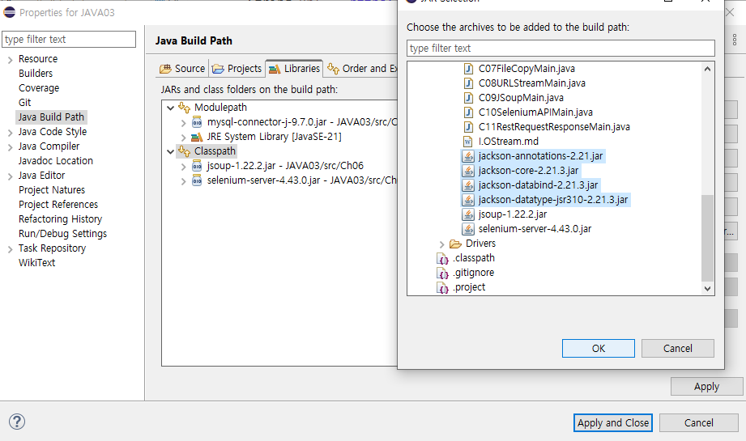
<empty-block/>
