## MYSQL 설치

<callout>

	[MySQL Community Downloads](https://downloads.mysql.com/)  사이트에서  [MySQL Installer for Windows](https://dev.mysql.com/downloads/windows/) 에 들어가 Windows (x86, 32-bit), MSI Installer 556.0M의 [Download](https://dev.mysql.com/downloads/file/?id=548821) 버튼 클릭하고 다운로드. 

	파일 바로 다운로드\> [**MYSQL 다운로드 파일**](https://dev.mysql.com/get/Downloads/MySQLInstaller/mysql-installer-community-8.0.45.0.msi)

	---

	설치된 파일 클릭하고 전부 기본 설정 그대로 넘기다 password 설정. 이후도 넘겨 다운로드

</callout>

---

### 환경변수 설정

> 실행 파일의 전체 경로를 매번 입력하지 않고도 어디서든 명령어 실행 가능하게 설정 

<callout>

	1. 검색창에 **실행** 입력 → 실행창 열기에 **sysdm.cpl **작성해 시스템 속성창 열기 

	2.  고급 → **환경변수 **→ 시스템변수에 내부 클릭 후 p 작성하면 보이는 path 클릭해 **편집** 

	3. 환경 변수 편집 창에서 맨 아래 더블클릭해 내 MYSQL bin 설치 위치 입력(ex. C:\\Program Files\\MySQL\\MySQL Server 8.0\\bin) 후 **확인**

</callout>

---

## 명령어

### 터미널-관리자 권한 접속<br>: mysql -u root -p
```javascript
mysql -u root -p
mysql -u root -p1234   // 비번 포함 가능
```
### 내 DB 확인<br>: show databases;
```javascript
mysql> show databases;
+--------------------+
| Database           |
+--------------------+
| information_schema |
| mysql              |
| performance_schema |
| sys                |
| test1db            |
| test2db            |
+--------------------+
6 rows in set (0.00 sec)
```

```javascript
mysql> use testdb;
Database changed
mysql> show databases;
+--------------------+
| Database           |
+--------------------+
| information_schema |
| mysql              |
| performance_schema |
| sys                |
| test1db            |
| test2db            |
| testdb             |
+--------------------+
7 rows in set (0.00 sec)

mysql> select * from tbl_user;
ERROR 1146 (42S02): Table 'testdb.tbl_user' doesn't exist
mysql> show tables;
+------------------+
| Tables_in_testdb |
+------------------+
| tbl_product      |
+------------------+
1 row in set (0.00 sec)

mysql> select * from tbl_product;
Empty set (0.00 sec)
```

---

## MYSQL APP  vs  CMD

<callout>

	**MYSQL 어플**

	

</callout>

### 새 DB 생성

#### 새 DB_APP

<callout>

	1. 왼쪽 Schemas 영역 **오른쪽 마우스** → **Create Schema** 클릭 → 중앙에 뜨는 창에 원하는 Name 작성하고** Apply**

	2. Apply SQL Script to Database 창 뜨면 확인하고** Apply** → **Finish**

	3. 왼쪽 영역 확인해보면 생성된 것을 확인할 수 있다. 

</callout>

<details>

<summary>참고 사진</summary>

	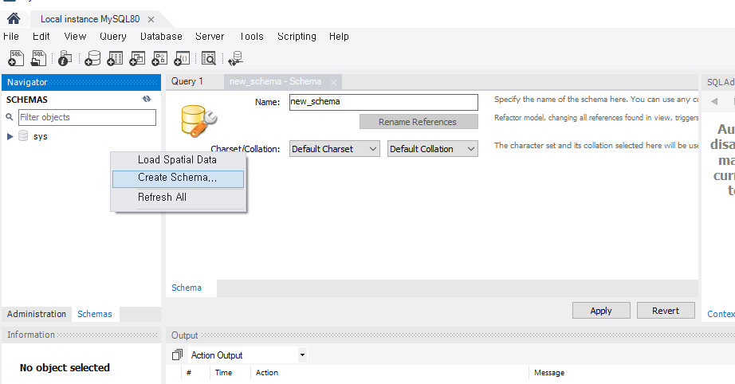

	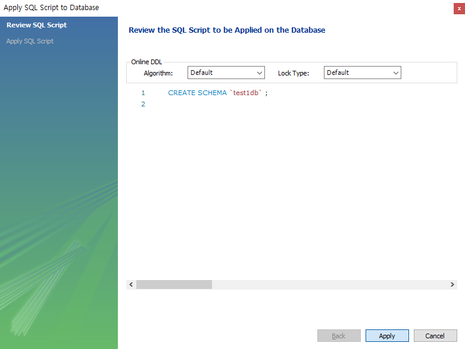

</details>

#### 새 DB_CMD<br>: create database ‘dbname';
```javascript
mysql> create database test2db;
Query OK, 1 row affected (0.01 sec)

mysql> show databases;
+--------------------+
| Database           |
+--------------------+
| information_schema |
| mysql              |
| performance_schema |
| sys                |
| test1db            |
| test2db            |
+--------------------+
6 rows in set (0.00 sec)
```

---

### DB제거 방법 1

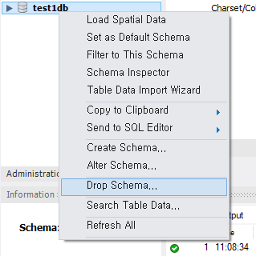

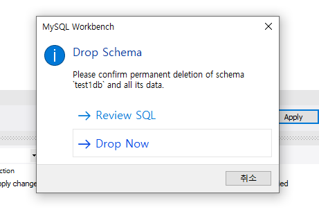

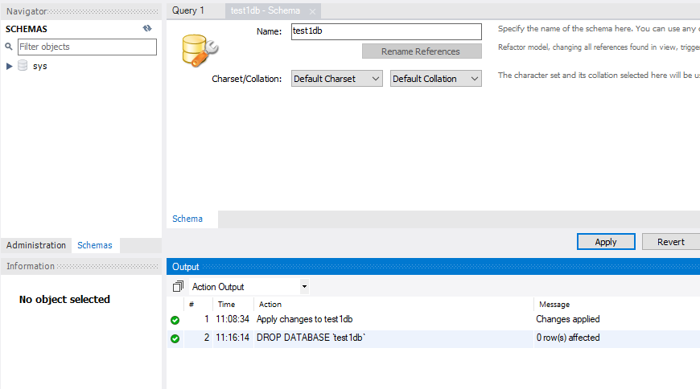

### DB제거 방법 2<br>drop database test2db;
```javascript
mysql> drop database test2db;
Query OK, 0 rows affected (0.01 sec)

mysql> show databases;
+--------------------+
| Database           |
+--------------------+
| information_schema |
| mysql              |
| performance_schema |
| sys                |
+--------------------+
4 rows in set (0.00 sec)
```
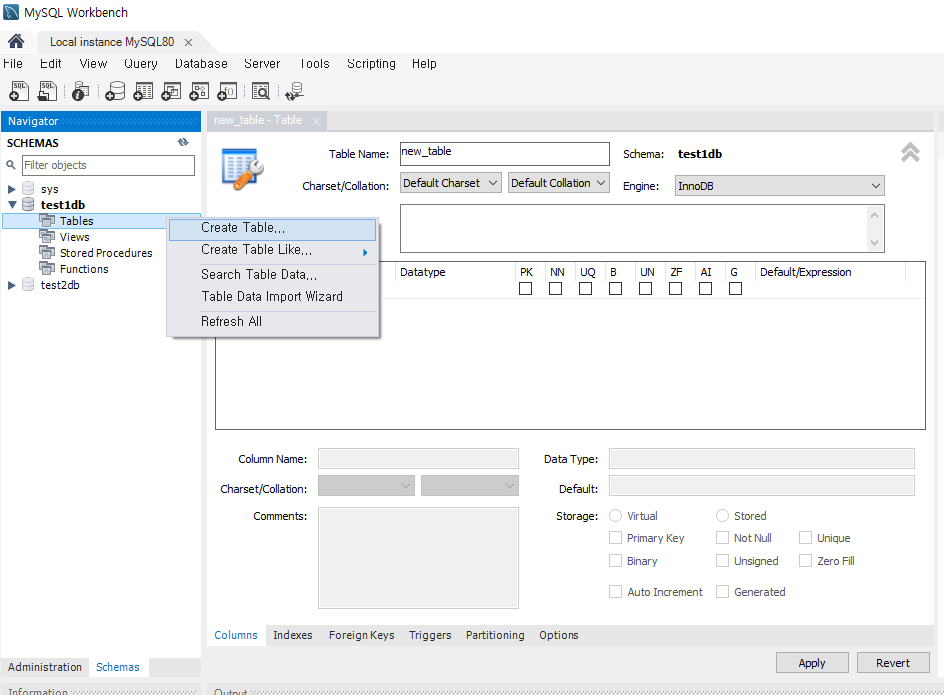

pk

key.행간구별.유일.

### 구조 만드는 방법1

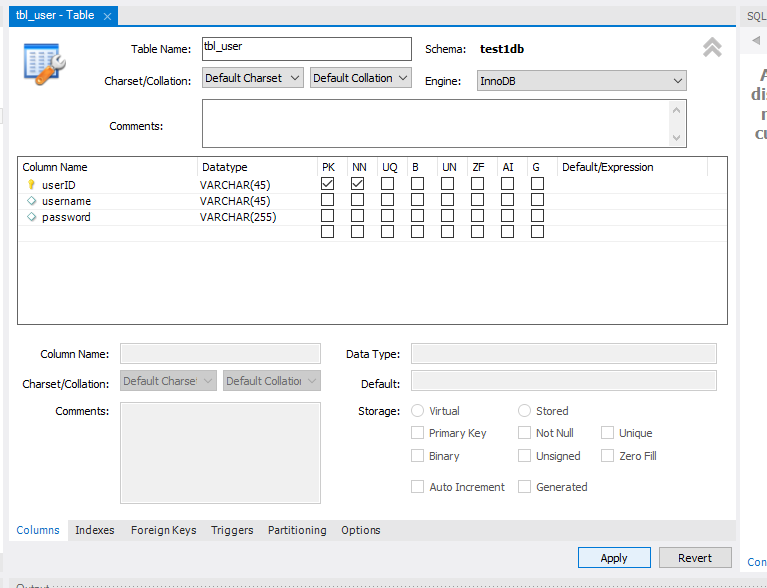

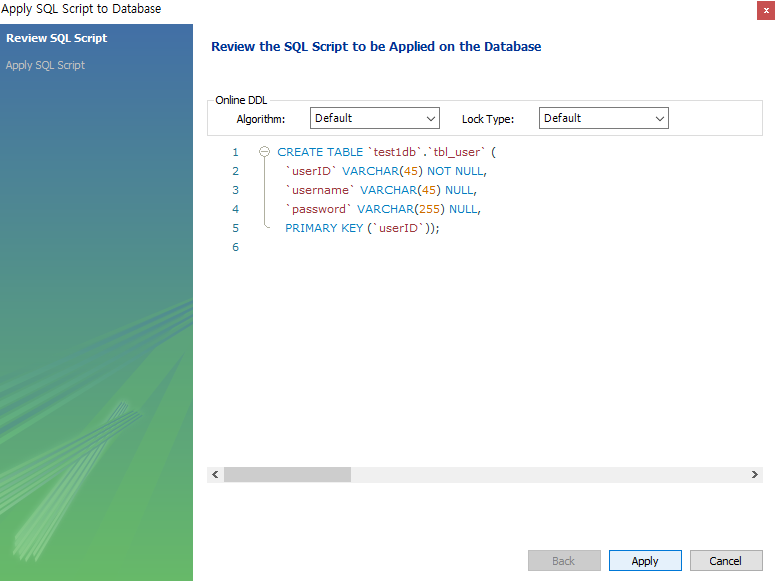
```javascript
// 축약 가능

CREATE TABLE `test1db`.`tbl_user` (
  `userID` VARCHAR(45) PRIMARY KEY,
  `username` VARCHAR(45) NULL,
  `password` VARCHAR(255) NULL,
  PRIMARY KEY (`userID`));
```
apply-finish

스패너 클릭하면 구조 수정 가능

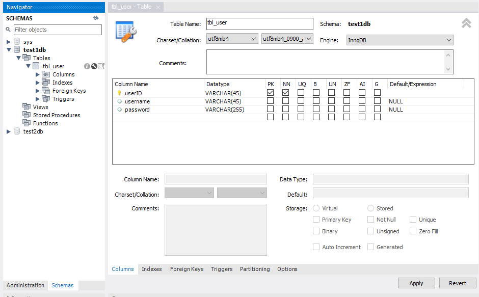

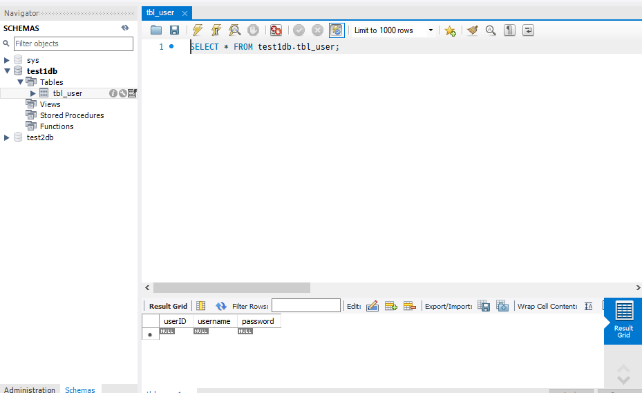

### 구조 만드는 방법2<br>create table tbl_user

use test2db;

 create table test2db.tbl_user

이미 use중이라면 create table tbl_user 생략 가능

### show tables; → desc tbl_user;
```javascript
mysql> use test2db;
Database changed
mysql> create table tbl_user(
    -> userID varchar(45) primary key,
    -> username varchar(45) null,
    -> password varchar(255));
Query OK, 0 rows affected (0.02 sec)

mysql> show tables;
+-------------------+
| Tables_in_test2db |
+-------------------+
| tbl_user          |
+-------------------+
1 row in set (0.00 sec)

// 들어가서 확인
mysql> desc tbl_user;
+----------+--------------+------+-----+---------+-------+
| Field    | Type         | Null | Key | Default | Extra |
+----------+--------------+------+-----+---------+-------+
| userID   | varchar(45)  | NO   | PRI | NULL    |       |
| username | varchar(45)  | YES  |     | NULL    |       |
| password | varchar(255) | YES  |     | NULL    |       |
+----------+--------------+------+-----+---------+-------+
3 rows in set (0.00 sec)
```

```javascript
select * from tbl_user;
Empty set (0.00 sec)
```

### 테이블 생성 (문제)<br>

-- 테이블명: tbl_product<br>-- 다음 조건으로 테이블을 생성하세요.

prod_id int primary,<br>prod_name varchar(100) not null,<br>prod_category varchar(10) null,<br>prod_details varchar(1024) null,<br>reg_date datetime not null,<br>prod_price int not null

- - 참고 문법: use testdb;<br>create table 테이블명 (<br>컬럼명 자료형 제약조건,<br>...<br>);
```javascript
mysql> create database testdb;
Query OK, 1 row affected (0.01 sec)

mysql> create table tbl_product(
    -> prod_id int primary key,
    -> prod_name varchar(100) not null,
    -> prod_category varchar(10) null,
    -> prod_details varchar(1024) null,
    -> reg_date datetime not null,
    -> prod_price int not null);
Query OK, 0 rows affected (0.02 sec)
```
오류 —\> 단어 오타. varchar을 varcher로 잘못 기입했다.
```javascript
mysql> create table tbl_product(
    -> prod_id int primary key,
    -> prod_name varcher(100) not null,  // 단어 오타
    -> prod_category varchar(10) null,
    -> prod_details varchar(1024) null,
    -> reg_date datetime not null,
    -> prod_price int not null);
ERROR 1064 (42000): You have an error in your SQL syntax; check the manual that corresponds to your MySQL server version for the right syntax to use near 'varcher(100) not null,
prod_category varchar(10) null,
prod_details varchar(1024' at line 3
```

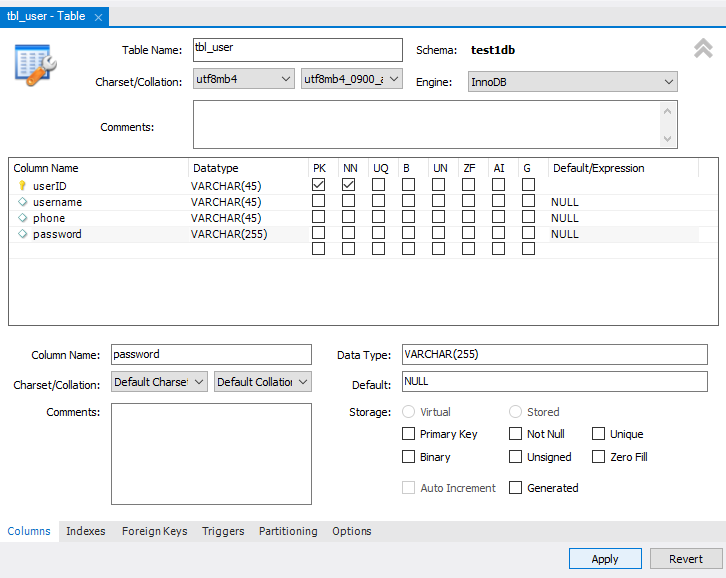

내용 추가

```javascript
mysql> alter table tbl_user
    -> add column tel varchar(45) null after userid;
    
Query OK, 0 rows affected (0.03 sec)
Records: 0  Duplicates: 0  Warnings: 0

mysql> desc tbl_user;
+----------+--------------+------+-----+---------+-------+
| Field    | Type         | Null | Key | Default | Extra |
+----------+--------------+------+-----+---------+-------+
| userID   | varchar(45)  | NO   | PRI | NULL    |       |
| tel      | varchar(45)  | YES  |     | NULL    |       |
| username | varchar(45)  | YES  |     | NULL    |       |
| password | varchar(255) | YES  |     | NULL    |       |
+----------+--------------+------+-----+---------+-------+
4 rows in set (0.00 sec)
```
---

구조 수정

걍 거기서 수정하고 어플라이

DB
```javascript
mysql> use test2db;
Database changed
mysql> show tables;
+-------------------+
| Tables_in_test2db |
+-------------------+
| tbl_user          |
+-------------------+
1 row in set (0.00 sec)

mysql> desc tbl_user;
+----------+--------------+------+-----+---------+-------+
| Field    | Type         | Null | Key | Default | Extra |
+----------+--------------+------+-----+---------+-------+
| userID   | varchar(45)  | NO   | PRI | NULL    |       |
| tel      | varchar(45)  | YES  |     | NULL    |       |
| username | varchar(45)  | YES  |     | NULL    |       |
| password | varchar(255) | YES  |     | NULL    |       |
+----------+--------------+------+-----+---------+-------+
4 rows in set (0.00 sec)

mysql> alter table tbl_user 
change column username name char(100) not null ;
Query OK, 0 rows affected (0.04 sec)
Records: 0  Duplicates: 0  Warnings: 0

mysql> desc tbl_user;
+----------+--------------+------+-----+---------+-------+
| Field    | Type         | Null | Key | Default | Extra |
+----------+--------------+------+-----+---------+-------+
| userID   | varchar(45)  | NO   | PRI | NULL    |       |
| tel      | varchar(45)  | YES  |     | NULL    |       |
| name     | char(100)    | NO   |     | NULL    |       |
| password | varchar(255) | YES  |     | NULL    |       |
+----------+--------------+------+-----+---------+-------+
4 rows in set (0.00 sec)
```

삭제

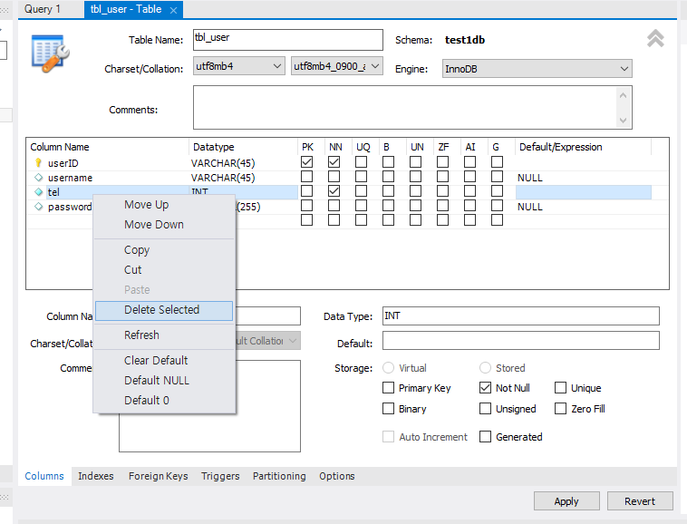

어플라이

cmd
```javascript
mysql> use test2db;
Database changed
mysql> desc tbl_user;
+----------+--------------+------+-----+---------+-------+
| Field    | Type         | Null | Key | Default | Extra |
+----------+--------------+------+-----+---------+-------+
| userID   | varchar(45)  | NO   | PRI | NULL    |       |
| tel      | varchar(45)  | YES  |     | NULL    |       |
| name     | char(100)    | NO   |     | NULL    |       |
| password | varchar(255) | YES  |     | NULL    |       |
+----------+--------------+------+-----+---------+-------+
4 rows in set (0.00 sec)

mysql> alter table tbl_user drop column name;
Query OK, 0 rows affected (0.03 sec)
Records: 0  Duplicates: 0  Warnings: 0

mysql> desc tbl_user;
+----------+--------------+------+-----+---------+-------+
| Field    | Type         | Null | Key | Default | Extra |
+----------+--------------+------+-----+---------+-------+
| userID   | varchar(45)  | NO   | PRI | NULL    |       |
| tel      | varchar(45)  | YES  |     | NULL    |       |
| password | varchar(255) | YES  |     | NULL    |       |
+----------+--------------+------+-----+---------+-------+
3 rows in set (0.00 sec)
```

ALTER 실습 문제<br>tbl_product 테이블의 구조를 다음과 같이 수정하세요.

Column 추가 : amount int not null<br>Column 수정 : prod_price → prod_price varchar(100) null<br>Column 삭제 : prod_details<br>참고 문법<br>컬럼 추가 :<br>alter table 테이블명 add column 컬럼명 자료형 제약조건;

컬럼 수정 :<br>alter table 테이블명 change column 기존컬럼명 변경컬럼명 자료형 제약조건;

컬럼 삭제 :<br>alter table 테이블명 drop 컬럼명;

alter table tbl_product<br>-\>  add column amount int not null;

 alter table tbl_product 

-\>  change column prod_price price varchar(100) null;

alter table tbl_product 

-\>  drop prod_details;

```javascript
alter table tbl_product
->  add column amount int not null;

 alter table tbl_product 
->  change column prod_price price varchar(100) null;

alter table tbl_product 
->  drop prod_details;
```
<details>

<summary>문제 풀기</summary>
	```javascript
// 컬럼 추가
mysql> desc tbl_product;
+---------------+---------------+------+-----+---------+-------+
| Field         | Type          | Null | Key | Default | Extra |
+---------------+---------------+------+-----+---------+-------+
| prod_id       | int           | NO   | PRI | NULL    |       |
| prod_name     | varchar(100)  | NO   |     | NULL    |       |
| prod_category | varchar(10)   | YES  |     | NULL    |       |
| prod_details  | varchar(1024) | YES  |     | NULL    |       |
| reg_date      | datetime      | NO   |     | NULL    |       |
| prod_price    | int           | NO   |     | NULL    |       |
+---------------+---------------+------+-----+---------+-------+
6 rows in set (0.00 sec)

mysql> alter table tbl_product
    ->  add column amount int not null;
Query OK, 0 rows affected (0.03 sec)
Records: 0  Duplicates: 0  Warnings: 0

mysql> desc tbl_product;
+---------------+---------------+------+-----+---------+-------+
| Field         | Type          | Null | Key | Default | Extra |
+---------------+---------------+------+-----+---------+-------+
| prod_id       | int           | NO   | PRI | NULL    |       |
| prod_name     | varchar(100)  | NO   |     | NULL    |       |
| prod_category | varchar(10)   | YES  |     | NULL    |       |
| prod_details  | varchar(1024) | YES  |     | NULL    |       |
| reg_date      | datetime      | NO   |     | NULL    |       |
| prod_price    | int           | NO   |     | NULL    |       |
| amount        | int           | NO   |     | NULL    |       |
+---------------+---------------+------+-----+---------+-------+
7 rows in set (0.00 sec)

// 컬럼 수정
mysql>  alter table tbl_product 
    ->  change column prod_price price varchar(100) null;
Query OK, 0 rows affected (0.04 sec)
Records: 0  Duplicates: 0  Warnings: 0

mysql> desc tbl_product;
+---------------+---------------+------+-----+---------+-------+
| Field         | Type          | Null | Key | Default | Extra |
+---------------+---------------+------+-----+---------+-------+
| prod_id       | int           | NO   | PRI | NULL    |       |
| prod_name     | varchar(100)  | NO   |     | NULL    |       |
| prod_category | varchar(10)   | YES  |     | NULL    |       |
| prod_details  | varchar(1024) | YES  |     | NULL    |       |
| reg_date      | datetime      | NO   |     | NULL    |       |
| price         | varchar(100)  | YES  |     | NULL    |       |
| amount        | int           | NO   |     | NULL    |       |
+---------------+---------------+------+-----+---------+-------+
7 rows in set (0.00 sec)

// 컬럼 삭제
mysql>  alter table tbl_product 
    ->  change column prod_price price varchar(100) null;
Query OK, 0 rows affected (0.04 sec)
Records: 0  Duplicates: 0  Warnings: 0

mysql> desc tbl_product;
+---------------+---------------+------+-----+---------+-------+
| Field         | Type          | Null | Key | Default | Extra |
+---------------+---------------+------+-----+---------+-------+
| prod_id       | int           | NO   | PRI | NULL    |       |
| prod_name     | varchar(100)  | NO   |     | NULL    |       |
| prod_category | varchar(10)   | YES  |     | NULL    |       |
| prod_details  | varchar(1024) | YES  |     | NULL    |       |
| reg_date      | datetime      | NO   |     | NULL    |       |
| price         | varchar(100)  | YES  |     | NULL    |       |
| amount        | int           | NO   |     | NULL    |       |
+---------------+---------------+------+-----+---------+-------+
7 rows in set (0.00 sec)

	```
</details>

### DB에 자료 넣기

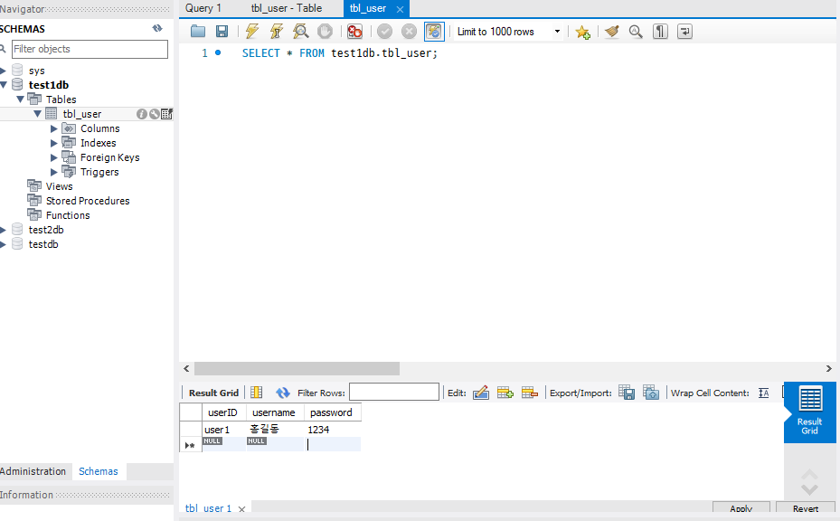

그냥 표에 넣기
```javascript
mysql> desc tbl_user;
+----------+--------------+------+-----+---------+-------+
| Field    | Type         | Null | Key | Default | Extra |
+----------+--------------+------+-----+---------+-------+
| userID   | varchar(45)  | NO   | PRI | NULL    |       |
| tel      | varchar(45)  | YES  |     | NULL    |       |
| password | varchar(255) | YES  |     | NULL    |       |
+----------+--------------+------+-----+---------+-------+
3 rows in set (0.00 sec)

mysql> select * from tbl_user;
Empty set (0.00 sec)

mysql> insert into tbl_user
    -> values('aaa','01011111111','1234');
Query OK, 1 row affected (0.00 sec)

mysql> select * from tbl_user;
+--------+-------------+----------+
| userID | tel         | password |
+--------+-------------+----------+
| aaa    | 01011111111 | 1234     |
+--------+-------------+----------+
1 row in set (0.00 sec)
```
다 안넣고 넣ㄱ을것만 넣기
```javascript
mysql> insert into tbl_user (userID,tel) values('bbb','01022222222');
Query OK, 1 row affected (0.00 sec)

mysql> select * from tbl_user;
+--------+-------------+----------+
| userID | tel         | password |
+--------+-------------+----------+
| aaa    | 01011111111 | 1234     |
| bbb    | 01022222222 | NULL     |
+--------+-------------+----------+
2 rows in set (0.00 sec)
```
---

```javascript
mysql> update tbl_user set tel ='01055554444',password='8888'; // 이렇게하면 전부바뀐다.
Query OK, 2 rows affected (0.00 sec)
Rows matched: 2  Changed: 2  Warnings: 0

mysql> select * from tbl_user;
+--------+-------------+----------+
| userID | tel         | password |
+--------+-------------+----------+
| aaa    | 01055554444 | 8888     |
| bbb    | 01055554444 | 8888     |
+--------+-------------+----------+
2 rows in set (0.00 sec)

mysql> update tbl_user set tel
    -> ='01055555555',password='9999' where userid='bbb'; // 지정 필요
Query OK, 1 row affected (0.00 sec)
Rows matched: 1  Changed: 1  Warnings: 0

mysql> select * from tbl_user;
+--------+-------------+----------+
| userID | tel         | password |
+--------+-------------+----------+
| aaa    | 01055554444 | 8888     |
| bbb    | 01055555555 | 9999     |
+--------+-------------+----------+
2 rows in set (0.00 sec)
```
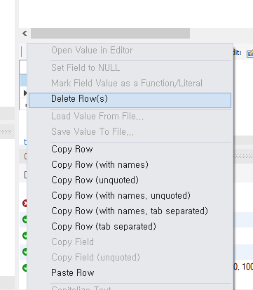
```javascript
DELETE FROM `test1db`.`tbl_user` WHERE (`userID` = 'user1');
```

```javascript
mysql> use test2db;
Database changed
mysql> show tables;
+-------------------+
| Tables_in_test2db |
+-------------------+
| tbl_user          |
+-------------------+
1 row in set (0.00 sec)

mysql> select * from tbl_user;
+--------+-------------+----------+
| userID | tel         | password |
+--------+-------------+----------+
| aaa    | 01055554444 | 8888     |
| bbb    | 01055555555 | 9999     |
+--------+-------------+----------+
2 rows in set (0.00 sec)

mysql> delete from tbl_user where userid='bbb';
Query OK, 1 row affected (0.00 sec)

mysql> select * from tbl_user;
+--------+-------------+----------+
| userID | tel         | password |
+--------+-------------+----------+
| aaa    | 01055554444 | 8888     |
+--------+-------------+----------+
1 row in set (0.00 sec)
```

```javascript
create table tbl_product(
prod_id varchar(45) primary key,
prod_name varchar(100),
prod_category varchar(100),
reg_date varchar(100),
prod_price varchar(100),
amount varchar(100));

insert into tbl_user
values('aaa','01011111111','1234')

insert into tbl_product (prod_id, prod_name, prod_category, reg_date, prod_price, amount)
values
('1111','LG_GRAM_2023','가전','2024/01/22','830,000','100'),
('1112','SAMSUNG_FLEX2','가전','2024/01/22','3,000,000','50'),
('2000','대우_통돌이_01','가전','2024/01/22','590,000','25'),
('3001','이것이리눅스다','도서','2023/01/22','30,000','1000');

update tbl_product set reg_date= '2023/01/01' where prod_category ='가전';

delete from tbl_product where prod_id='1111';

```

# **DML 문제 - tbl_product 테이블**

---

**1. 값 추가 (INSERT)**

다음 데이터를 tbl_product 테이블에 추가하세요.

<table header-row="true">

<tr>

<td>**prod_id**</td>

<td>**prod_name**</td>

<td>**prod_category**</td>

<td>**reg_date**</td>

<td>**prod_price**</td>

<td>**amount**</td>

</tr>

<tr>

<td>1111</td>

<td>LG_GRAM_2023</td>

<td>가전</td>

<td>2024/01/22</td>

<td>830,000</td>

<td>100</td>

</tr>

<tr>

<td>1112</td>

<td>SAMSUNG_FLEX2</td>

<td>가전</td>

<td>2024/01/22</td>

<td>3,000,000</td>

<td>50</td>

</tr>

<tr>

<td>2000</td>

<td>대우_통돌이_01</td>

<td>가전</td>

<td>2024/01/22</td>

<td>590,000</td>

<td>25</td>

</tr>

<tr>

<td>3001</td>

<td>이것이리눅스다</td>

<td>도서</td>

<td>2023/01/22</td>

<td>30,000</td>

<td>1000</td>

</tr>

</table>

**2. 값 수정 (UPDATE)**

prod_category가 '가전'인 모든 행의 reg_date 값을 '2023/01/01'로 변경하세요.

**3. 값 삭제 (DELETE)**

prod_id가 1111인 행을 삭제하세요.
```javascript

mysql> create table tbl_product(
    -> prod_id varchar(45) primary key,
    -> prod_name varchar(100),
    -> prod_category varchar(100),
    -> reg_date varchar(100),
    -> prod_price varchar(100),
    -> amount varchar(100));
Query OK, 0 rows affected (0.02 sec)

mysql> show tables;
+------------------+
| Tables_in_testdb |
+------------------+
| tbl_product      |
+------------------+
1 row in set (0.00 sec)

mysql> insert into tbl_product 
    -> (prod_id, prod_name, prod_category, reg_date, prod_price, amount)
    -> values
    -> ('1111','LG_GRAM_2023','가전','2024/01/22','830,000','100'),
    -> ('1112','SAMSUNG_FLEX2','가전','2024/01/22','3,000,000','50'),
    -> ('2000','대우_통돌이_01','가전','2024/01/22','590,000','25'),
    -> ('3001','이것이리눅스다','도서','2023/01/22','30,000','1000');
Query OK, 3 rows affected (0.00 sec)
Records: 3  Duplicates: 0  Warnings: 0

mysql> select * from tbl_product;
+---------+----------------+---------------+------------+------------+--------+
| prod_id | prod_name      | prod_category | reg_date   | prod_price | amount |
+---------+----------------+---------------+------------+------------+--------+
| 1111    | LG_GRAM_2023   | 가전          | 2024/01/22 | 830,000    | 100    |
| 1112    | SAMSUNG_FLEX2  | 가전          | 2024/01/22 | 3,000,000  | 50     |
| 2000    | 대우_통돌이_01 | 가전          | 2024/01/22 | 590,000    | 25     |
| 3001    | 이것이리눅스다 | 도서          | 2023/01/22 | 30,000     | 1000   |
+---------+----------------+---------------+------------+------------+--------+
4 rows in set (0.00 sec)

mysql> update tbl_product set reg_date= '2023/01/01', where pod_category ='가전';
ERROR 1064 (42000): You have an error in your SQL syntax; check the manual that corresponds to your MySQL server version for the right syntax to use near 'where pod_category ='가전'' at line 1
mysql> update tbl_product set reg_date= '2023/01/01', where prod_category ='가전';
ERROR 1064 (42000): You have an error in your SQL syntax; check the manual that corresponds to your MySQL server version for the right syntax to use near 'where prod_category ='가전'' at line 1
mysql> update tbl_product set reg_date= '2023/01/01' where prod_category ='가전';
Query OK, 3 rows affected (0.00 sec)
Rows matched: 3  Changed: 3  Warnings: 0

mysql> selet * from tbl_product;
ERROR 1064 (42000): You have an error in your SQL syntax; check the manual that corresponds to your MySQL server version for the right syntax to use near 'selet * from tbl_product' at line 1
mysql> select * from tbl_product;
+---------+----------------+---------------+------------+------------+--------+
| prod_id | prod_name      | prod_category | reg_date   | prod_price | amount |
+---------+----------------+---------------+------------+------------+--------+
| 1111    | LG_GRAM_2023   | 가전          | 2023/01/01 | 830,000    | 100    |
| 1112    | SAMSUNG_FLEX2  | 가전          | 2023/01/01 | 3,000,000  | 50     |
| 2000    | 대우_통돌이_01 | 가전          | 2023/01/01 | 590,000    | 25     |
| 3001    | 이것이리눅스다 | 도서          | 2023/01/22 | 30,000     | 1000   |
+---------+----------------+---------------+------------+------------+--------+
4 rows in set (0.00 sec)

mysql> delete from tbl_product where userid='1111';
ERROR 1054 (42S22): Unknown column 'userid' in 'where clause'
mysql> delete from tbl_product where prod_id='1111';
Query OK, 1 row affected (0.01 sec)

mysql>
mysql> select * from tbl_product;
+---------+----------------+---------------+------------+------------+--------+
| prod_id | prod_name      | prod_category | reg_date   | prod_price | amount |
+---------+----------------+---------------+------------+------------+--------+
| 1112    | SAMSUNG_FLEX2  | 가전          | 2023/01/01 | 3,000,000  | 50     |
| 2000    | 대우_통돌이_01 | 가전          | 2023/01/01 | 590,000    | 25     |
| 3001    | 이것이리눅스다 | 도서          | 2023/01/22 | 30,000     | 1000   |
+---------+----------------+---------------+------------+------------+--------+
3 rows in set (0.00 sec)
```

[MySQL workbench 계정 생성, 권한부여](https://nsmchan.tistory.com/27)

- administration - users and privileges에서 새 유저 만들고 권한 어쩌고 

```javascript
C:\Users\Administrator>mysql -u user1 -p1234 -h 192.168.5.50
mysql: [Warning] Using a password on the command line interface can be insecure.
Welcome to the MySQL monitor.  Commands end with ; or \g.
Your MySQL connection id is 121
Server version: 8.0.45 MySQL Community Server - GPL

Copyright (c) 2000, 2026, Oracle and/or its affiliates.

Oracle is a registered trademark of Oracle Corporation and/or its
affiliates. Other names may be trademarks of their respective
owners.

Type 'help;' or '\h' for help. Type '\c' to clear the current input statement.

mysql> show databases;
+--------------------+
| Database           |
+--------------------+
| information_schema |
| performance_schema |
| test1db            |
+--------------------+
3 rows in set (0.00 sec)

mysql> use test1db;
Database changed
mysql> show tables;
+-------------------+
| Tables_in_test1db |
+-------------------+
| tbl_user          |
+-------------------+
1 row in set (0.00 sec)

mysql> select * from tbl_user;
Empty set (0.00 sec)

mysql> desc tbl_user;
+----------+--------------+------+-----+---------+-------+
| Field    | Type         | Null | Key | Default | Extra |
+----------+--------------+------+-----+---------+-------+
| userId   | varchar(45)  | NO   | PRI | NULL    |       |
| username | varchar(45)  | YES  |     | NULL    |       |
| password | varchar(255) | YES  |     | NULL    |       |
+----------+--------------+------+-----+---------+-------+
3 rows in set (0.00 sec)

mysql> insert into tbl_user values
    -> ('999','박한결','1234');
Query OK, 1 row affected (0.00 sec)

mysql> select * from tbl_user;
+--------+----------+----------+
| userId | username | password |
+--------+----------+----------+
| 0      | NULL     | NULL     |
| 999    | 박한결   | 1234     |
| pyj    | 박영준   | 1234     |
| zzz    | 정승원   | 1234     |
+--------+----------+----------+
4 rows in set (0.00 sec)
```
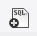

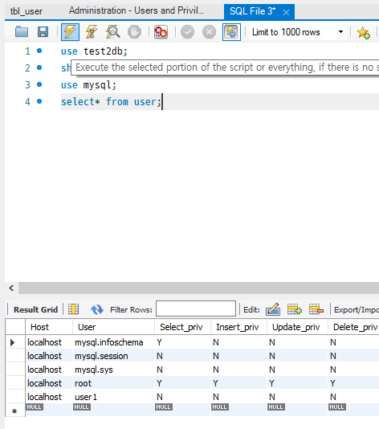

쿼리 ctrl-엔터 = 현재 커서 있는 줄 실행
```javascript
mysql> show databases;
+--------------------+
| Database           |
+--------------------+
| information_schema |
| mysql              |
| performance_schema |
| practice           |
| sys                |
| test1db            |
| test2db            |
| testdb             |
+--------------------+
8 rows in set (0.00 sec)

mysql> use mysql;
Database changed

mysql> select user ,host from user;
+------------------+-----------+
| user             | host      |
+------------------+-----------+
| mysql.infoschema | localhost |
| mysql.session    | localhost |
| mysql.sys        | localhost |
| root             | localhost |
| user1            | localhost |
+------------------+-----------+
5 rows in set (0.00 sec)

// 유저 생성

mysql> create user user30@localhost identified by '1234';
Query OK, 0 rows affected (0.02 sec)

mysql> select user ,host from user;
+------------------+-----------+
| user             | host      |
+------------------+-----------+
| mysql.infoschema | localhost |
| mysql.session    | localhost |
| mysql.sys        | localhost |
| root             | localhost |
| user1            | localhost |
| user30           | localhost |
+------------------+-----------+
6 rows in set (0.00 sec)

// 원격접속 가능 유저 생성
mysql> create user user40@'%' identified by '1234';
Query OK, 0 rows affected (0.01 sec)

//권한주기
mysql> grant select on test2db.* to user30@localhost;  //읽기 권한
Query OK, 0 rows affected (0.00 sec)

mysql> grant select, insert on test2db.* to user30@localhost; // 읽기, 쓰기 권한
Query OK, 0 rows affected (0.01 sec)

mysql> grant select, insert, update on test2db.* to user30@localhost; // 읽기, 쓰기, 수정 권한
flush privileges;

mysql> grant all privileges on test2db.* to user40@'%';  // 모든 권한 
Query OK, 0 rows affected (0.00 sec)

// 권한 삭제
mysql> revoke INSERT on test2db. * from user30@localhost;
Query OK, 0 rows affected (0.00 sec)  // 모든 권한 삭제

```

```javascript
// 내 답

[단계 1: 로컬 계정 관리]

문제 1: "localhost에서만 접속 가능한 intern_admin 계정을 생성하세요. (비밀번호: intern@123)" 
SQL : create user intern_admin@localhost identified by 'intern@123';
문제 2: "mysql 데이터베이스의 user 테이블을 조회하여 intern_admin 계정의 이름(user)과 접속 범위(host)를 확인하세요." 
SQL : select user ,host from user;
문제 3: "생성했던 intern_admin 계정을 삭제하세요." 
SQL : drop user intern_admin@localhost;

// 정답

[단계 1: 로컬 계정 관리]

문제 1: "localhost에서만 접속 가능한 intern_admin 계정을 생성하세요. (비밀번호: intern@123)" 
SQL : CREATE USER 'intern_admin'@'localhost' IDENTIFIED BY 'intern@123';
문제 2: "mysql 데이터베이스의 user 테이블을 조회하여 intern_admin 계정의 이름(user)과 접속 범위(host)를 확인하세요." 
SQL : SELECT user, host FROM mysql.user WHERE user = 'intern_admin';
문제 3: "생성했던 intern_admin 계정을 삭제하세요." 
SQL : DROP USER 'intern_admin'@'localhost';

// 내 답 = 정답 ----------------

[단계 2: 외부 접속 및 권한 부여]

문제 4: "모든 IP(%)에서 접속 가능한 dev_user 계정을 생성하세요. (비밀번호: devpass#99)" 
SQL : CREATE USER 'dev_user'@'%' IDENTIFIED BY 'devpass#99';

문제 5: "project_db 데이터베이스의 모든 테이블에 대해 SELECT, INSERT, UPDATE 권한을 dev_user에게 부여하세요." 
SQL : GRANT SELECT, INSERT, UPDATE ON project_db.* TO 'dev_user'@'%';

문제 6: "dev_user에게 부여된 권한 목록을 확인하세요." 
SQL : SHOW GRANTS FOR 'dev_user'@'%';

// 내 답 = 정답 ----------------

[단계 3: 권한 회수 및 정리]

문제 7: "dev_user에게 부여된 project_db에 대한 모든 권한을 회수하세요." 
SQL : REVOKE ALL ON project_db.* FROM 'dev_user'@'%';

문제 8: "dev_user 계정을 완전히 삭제하세요." 
SQL : DROP USER 'dev_user'@'%';

문제 9: "변경된 권한 설정을 서버에 즉시 반영하세요." 
SQL : FLUSH privileges;

```

```sql
use test1db;

SELECT @@autocommit; -- 확인하면 1로 되어있음 (true)
SET autocommit = 0;  -- 원래 자동 commit 되나 트랜잭션을 수동으로 제어하기 위해 AUTOCOMMIT 비활성화(f)

START TRANSACTION;
	INSERT INTO tbl_user VALUES('aaa','홍길동','1234'); 
	INSERT INTO tbl_user VALUES('aab','홍길동','1234'); 
	INSERT INTO tbl_user VALUES('aac','홍길동','1234'); 
ROLLBACK;  -- 걸면 전 시점으로 돌아간다
COMMIT;

SELECT * FROM tbl_user;

// 세이브포인트 설정
use test1db;

SET autocommit = 0;

START TRANSACTION;
	INSERT INTO tbl_user VALUES('aaa','홍길동','1234'); 
	INSERT INTO tbl_user VALUES('aab','홍길동','1234');
	INSERT INTO tbl_user VALUES('aac','홍길동','1234'); 
    SAVEPOINT sp1;
	INSERT INTO tbl_user VALUES('aad','홍길동','1234'); 
	INSERT INTO tbl_user VALUES('aae','홍길동','1234'); 
	INSERT INTO tbl_user VALUES('aaf','홍길동','1234'); 
    SAVEPOINT sp2;
	INSERT INTO tbl_user VALUES('aag','홍길동','1234'); 
	INSERT INTO tbl_user VALUES('aah','홍길동','1234');
	INSERT INTO tbl_user VALUES('aai','홍길동','1234'); 
    SAVEPOINT sp3;
    ROLLBACK TO sp2;   // 위 6개만 저장된다.
COMMIT;

SELECT * FROM tbl_user;
```

문제

```sql
//내답=정답

단계 1: 트랜잭션 환경 설정

문제 1: "현재 시스템의 AUTOCOMMIT 설정 상태를 확인하세요." 
SQL : SELECT @@autocommit;

문제 2: "트랜잭션을 수동으로 제어하기 위해 AUTOCOMMIT 설정을 비활성화(0)하세요." 
SQL : SET autocommit = 0;

//내답=정답
기본 환경 

-- 기존 테이블이 있다면 삭제 (초기화)
DROP TABLE IF EXISTS tbl_test;

-- 1. 테이블 생성
CREATE TABLE tbl_test (
    no INT PRIMARY KEY,
    name VARCHAR(20),
    age INT,
    gender CHAR(1)
);

단계 2: 기본 트랜잭션 (COMMIT/ROLLBACK)

문제 3: "명시적 트랜잭션을 시작하고, tbl_test 테이블에 (4, 'aa', 66, 'W') 데이터를 삽입한 뒤 이를 최종 확정하세요."
SQL : 다음 숫자 라인에 코드 입력하세요

1.START TRANSACTION;
2.INSERT INTO tbl_test VALUES (4, 'aa', 66, 'W');
3.COMMIT;

문제 4: "명시적 트랜잭션을 시작하고, tbl_test 테이블의 모든 데이터를 삭제한 뒤 삭제되기 전 상태로 되돌리세요." 
SQL : 다음 숫자 라인에 코드 입력하세요

1.START TRANSACTION;
2.DELETE FROM tbl_test;
3.ROLLBACK;

단계 3: SAVEPOINT 활용

문제 5:  다음 1,2,3,4... 에 설명에 맞는 코드를 입력하세요

1.-- 트랜잭션시작
2.-- tbl_test 테이블에 5, 'ab', 20, 'M' 삽입
3.-- SAVEPOINT : s1 지정
4.-- tbl_test 테이블에 6, 'ac', 30, 'W' 삽입
5.-- SAVEPOINT : s2 지정;
6.-- tbl_test 테이블에 7, 'cd', 35, 'M' 삽입
7.-- s2 지점으로 ROLLBACK
8.-- COMMIT 확정

1.START TRANSACTION;
2.INSERT INTO tbl_test VALUES(5, 'ab', 20, 'M');
3.SAVEPOINT s1;
4.INSERT INTO tbl_test VALUES(6, 'ac', 30, 'W');
5.SAVEPOINT s2;
6.INSERT INTO tbl_test VALUES(7, 'cd', 35, 'M');
7.ROLLBACK TO s2;
8.COMMIT;

```

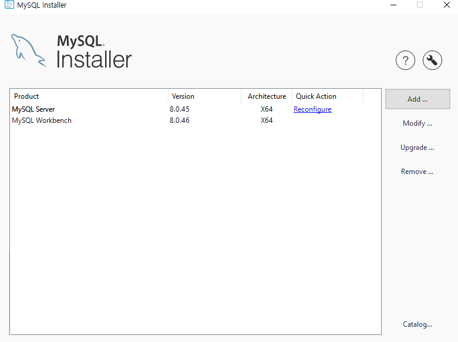

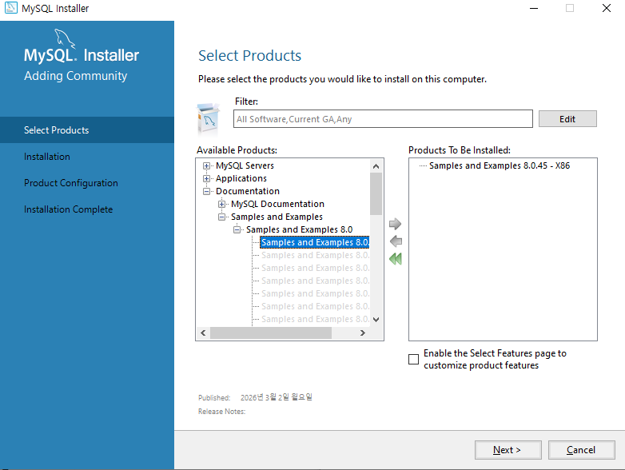

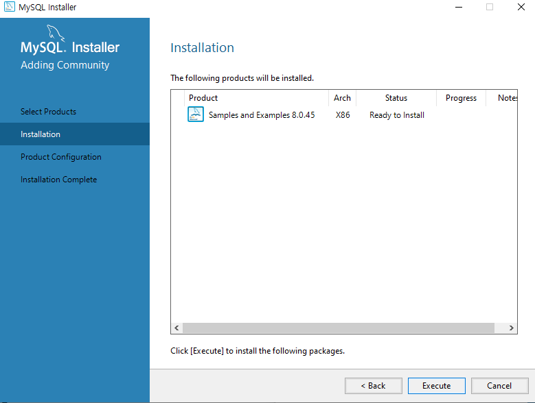

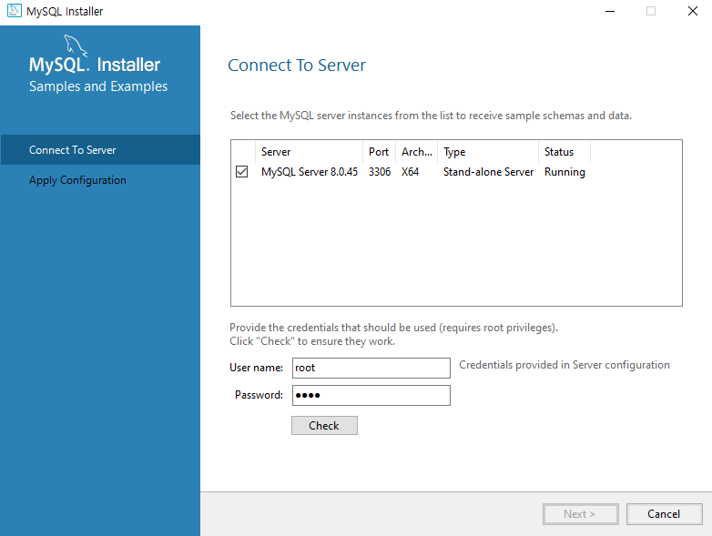

백업

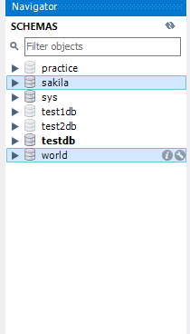

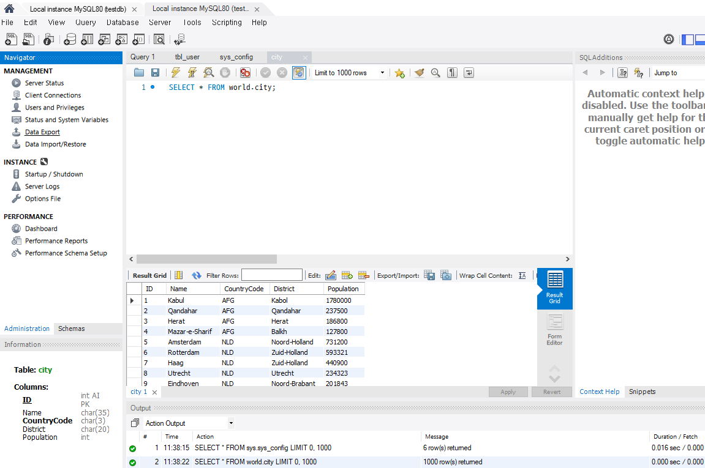

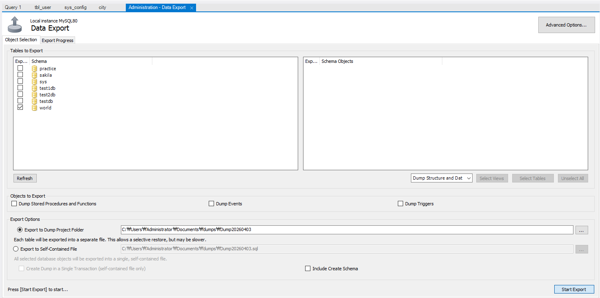

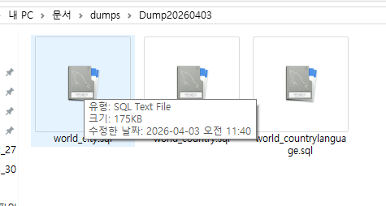

단일백업

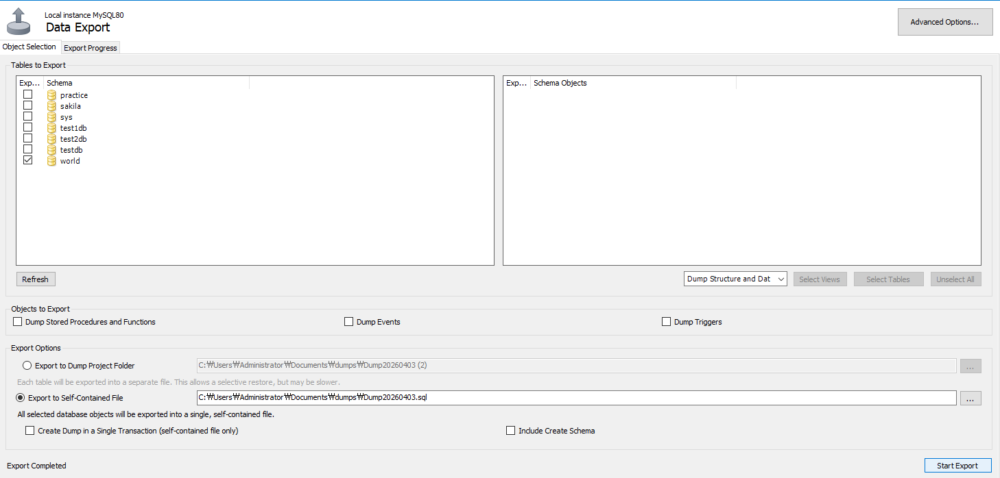

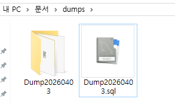

복원

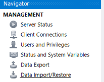

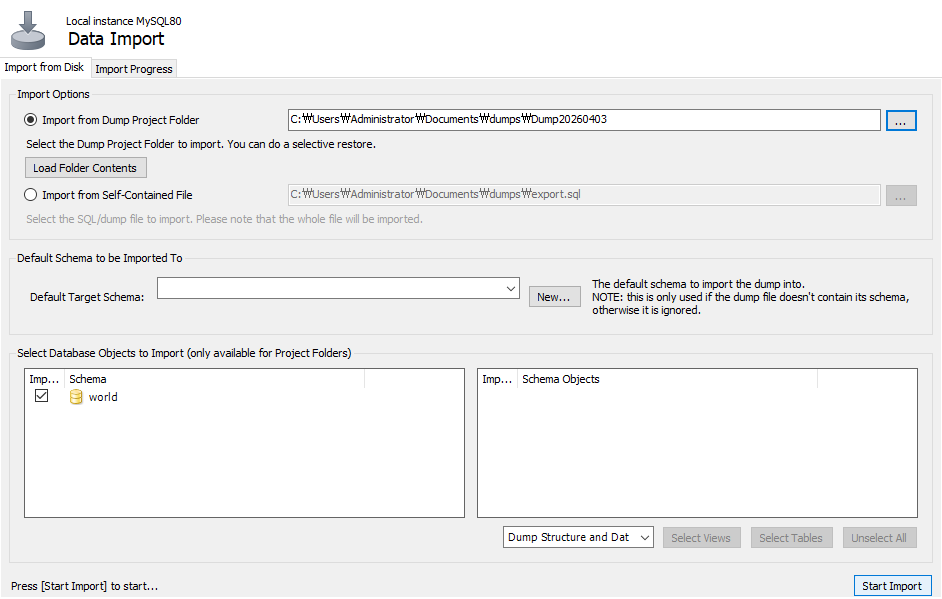

단일복원

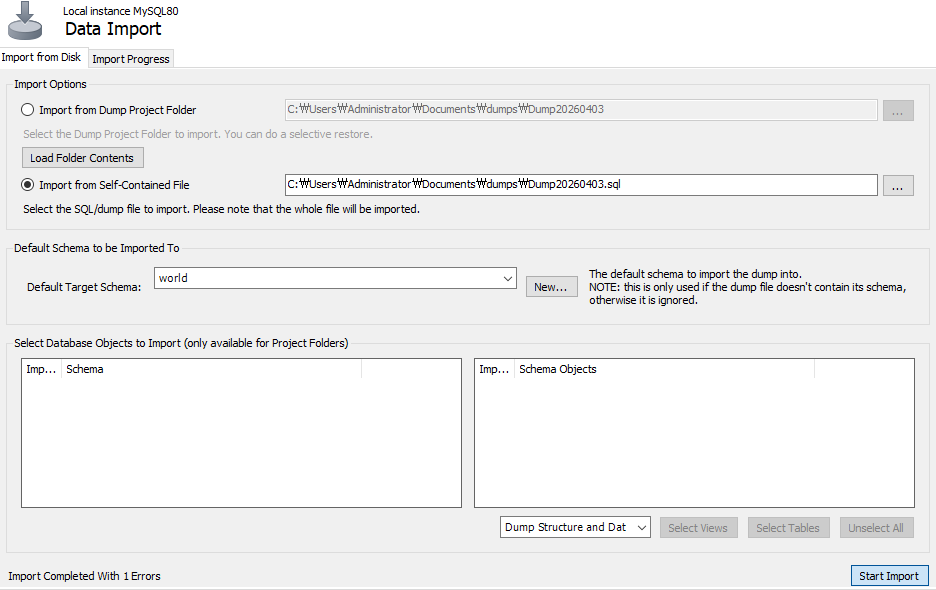

커맨드
```javascript
// 백업

C:\Users\Administrator\Downloads\BACKUP>mysqldump
Usage: mysqldump [OPTIONS] database [tables]
OR     mysqldump [OPTIONS] --databases [OPTIONS] DB1 [DB2 DB3...]
OR     mysqldump [OPTIONS] --all-databases [OPTIONS]
For more options, use mysqldump --help

C:\Users\Administrator\Downloads\BACKUP>mysqldump -u root -p1234 world > world_backup.sql
mysqldump: [Warning] Using a password on the command line interface can be insecure.

C:\Users\Administrator\Downloads\BACKUP>mysqldump -u root -p1234 --all-databases > all_backup.sql
mysqldump: [Warning] Using a password on the command line interface can be insecure.

C:\Users\Administrator\Downloads\BACKUP>mysqldump -u root -p1234 world city > world_city_backup.sql
mysqldump: [Warning] Using a password on the command line interface can be insecure.

// 복원

C:\Users\Administrator\Downloads\BACKUP>dir
 C 드라이브의 볼륨: Windows
 볼륨 일련 번호: B088-B8B1

 C:\Users\Administrator\Downloads\BACKUP 디렉터리

2026-04-03  오후 12:09    <DIR>          .
2026-04-03  오후 12:09    <DIR>          ..
2026-04-03  오후 12:07         4,942,604 all_backup.sql
2026-04-03  오후 12:06           244,212 world_backup.sql
2026-04-03  오후 12:09           179,315 world_city_backup.sql
               3개 파일           5,366,131 바이트
               2개 디렉터리  290,134,765,568 바이트 남음

C:\Users\Administrator\Downloads\BACKUP>mysql -u root -p < all_backup.sql
Enter password: ****

// --------
mysql> source all_backup.sql
```

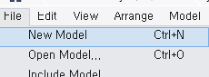

ㄴ 이렇게 생성

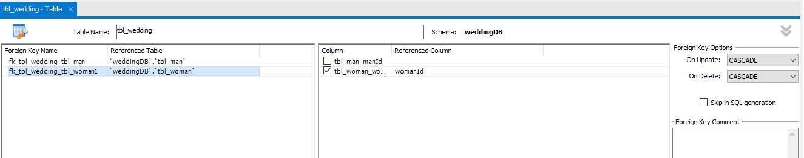

ㄴ cascade: 기본 수정 시 외래도 수정+삭제되게 설정필

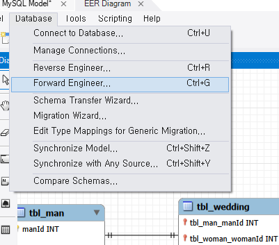

다 넥스트, . . . 

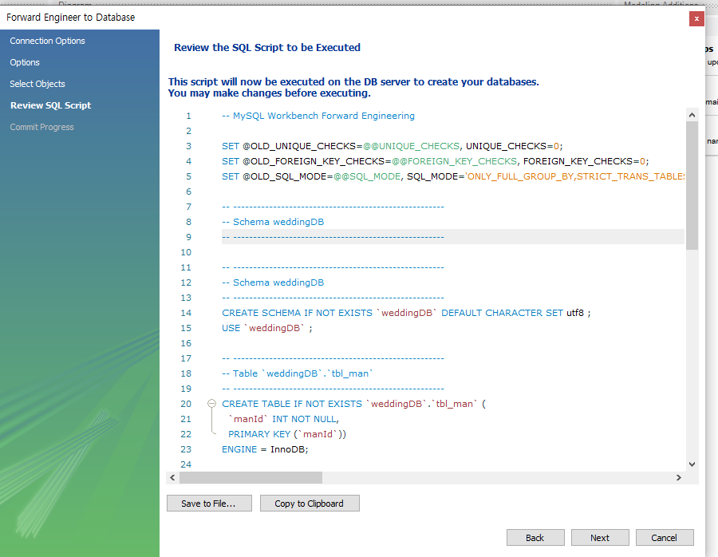

이게 쿼리문. 과제낼때 복붙

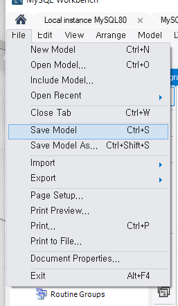

이게 저장

존재하는 데이터베이스 열기

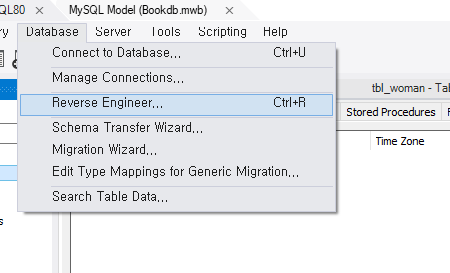

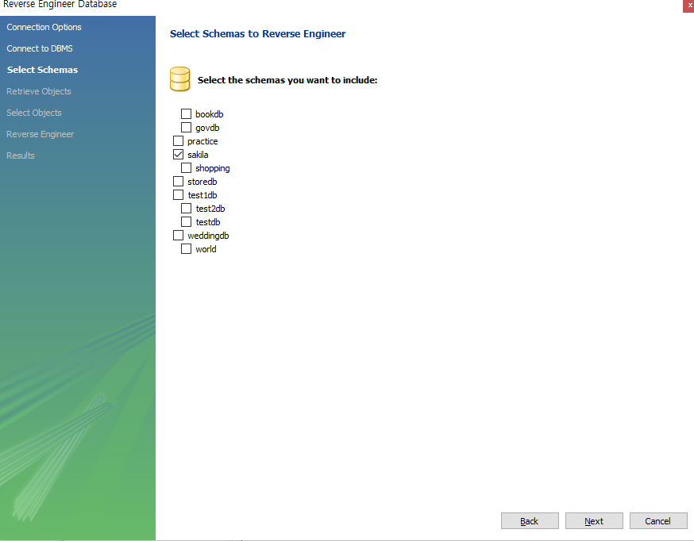

#### PK 설정

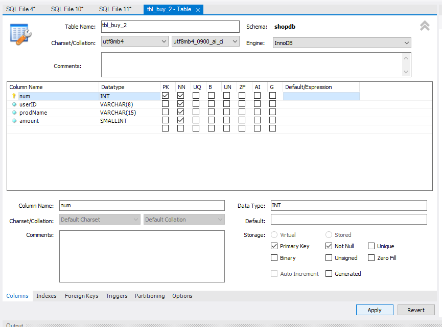

#### AI설정<br>: 자동 값 증가(기존값 수정도)

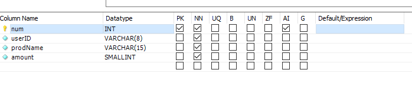

#### Safe모드 해제<br>: update, delete 가능하게 설정

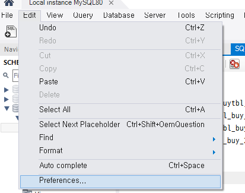

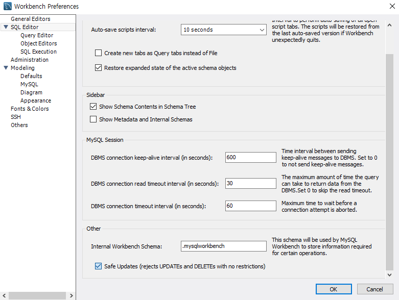

### 정규화

<table header-row="true" header-column="true">

<colgroup>

<col width="75">

<col width="166.65625">

<col>

<col>

</colgroup>

<tr>

<td>**구분**</td>

<td>**후보키 (Candidate Key)**</td>

<td>**기본키 (Primary Key)**</td>

<td>**복합키 (Composite Key)**</td>

</tr>

<tr>

<td>**정의**</td>

<td>기본키가 될 수 있는 자격을 갖춘 **모든 키**</td>

<td>후보키 중 설계자가 **대표로 선택한 단 하나**의 키</td>

<td>**2개 이상의 속성(컬럼)**을 결합하여 만든 키</td>

</tr>

<tr>

<td>**개수**</td>

<td>테이블에 **여러 개** 존재 가능</td>

<td>테이블당 **무조건 1개**</td>

<td>기본키나 후보키가 복합키일 수 있음</td>

</tr>

<tr>

<td>**주요 특징**</td>

<td>유일성과 최소성을 만족해야 함</td>

<td>**중복 불가(Unique)**, **비어있을 수 없음(Not Null)**</td>

<td>하나의 컬럼만으로 식별이 안 될 때 사용</td>

</tr>

<tr>

<td>**비유**</td>

<td>반장 후보들 (A, B, C 학생)</td>

<td>당선된 반장 (A 학생)</td>

<td>공동 반장 체제 (A+B 학생이 한 팀)</td>

</tr>

</table>

---

#### 1NF: 제1정규형

모든 속성이 원자값을 가져야 한다.

**하나의 셀에는 하나의 값만 존재**해야하며, 반복 그룹(중첩 테이블)은 허용되지 않는다.

<br>잘못된 예시. (정규화 전) 홍길동의 전화번호가 2가지 값을 가지고 있으므로 위반

<table header-row="true">

<tr>

<td>**학생ID**</td>

<td>**이름**</td>

<td>**전화번호**</td>

</tr>

<tr>

<td>1001</td>

<td>홍길동</td>

<td>010-1234-5678, 010-2222-3333</td>

</tr>

<tr>

<td>1002</td>

<td>김영희</td>

<td>010-4444-5555</td>

</tr>

</table>

옳은 예시 (정규화 후)

<table header-row="true">

<tr>

<td>**학생ID**</td>

<td>**이름**</td>

<td>**전화번호**</td>

</tr>

<tr>

<td>1001</td>

<td>홍길동</td>

<td>010-1234-5678</td>

</tr>

<tr>

<td>1001</td>

<td>홍길동</td>

<td>010-2222-3333</td>

</tr>

<tr>

<td>1002</td>

<td>김영희</td>

<td>010-4444-5555</td>

</tr>

</table>

---

#### 2NF: 제2정규형

> 1NF를 만족하면서, 기본키(복합키) 일부분에만 종속되는 속성(부분 함수 종속)을 제거한 형태. 즉, 기본키 모두를 만족하는 값끼리 나눈다.

잘못된 예시

<table header-row="true">

<tr>

<td>**학생ID(기본키)**</td>

<td>강좌이름(기본키)</td>

<td>강의실</td>

<td>성적</td>

</tr>

<tr>

<td>1001</td>

<td>자료구조</td>

<td>공학관 120</td>

<td>3.8</td>

</tr>

<tr>

<td>1002</td>

<td>스포츠경영학</td>

<td>체육관103</td>

<td>4.0</td>

</tr>

</table>

기본키가 두개로 복합키다. 

**결정자: 학생ID, 강좌이름 → 성적**

여기서 강의실은 부분 함수인 강좌이름에 의해 결정될 수 있다. 그러므로 강의실을 분리해 별도로 관리하여 제2정규형을 만족시켜야 한다.

옳은 예시(정규화 후)

<columns>

	<column>

		<table header-row="true">

<tr>

<td>**학생ID(기본키)**</td>

<td>강좌이름(기본키)</td>

<td>성적</td>

</tr>

<tr>

<td>1001</td>

<td>자료구조</td>

<td>3.8</td>

</tr>

<tr>

<td>1002</td>

<td>스포츠경영학</td>

<td>4.0</td>

</tr>

		</table>

	</column>

	<column>

		<table header-row="true">

<tr>

<td>강좌이름(기본키)</td>

<td>강의실</td>

</tr>

<tr>

<td>자료구조</td>

<td>공학관 120</td>

</tr>

<tr>

<td>스포츠경영학</td>

<td>체육관103</td>

</tr>

		</table>

	</column>

</columns>

---

#### 3NF: 제3정규형

> 2NF를 만족하면서, 이행 함수 종속이 존재하지 않도록 정규화하는 형태.<br>이행 함수 종속이란 A → B, B → C인 경우, A → C가 성립되는 상황

잘못된 예시

<table header-row="true">

<tr>

<td>**학생ID(기본키)**</td>

<td>강좌이름</td>

<td>수강료</td>

</tr>

<tr>

<td>1001</td>

<td>자료구조</td>

<td>20000</td>

</tr>

<tr>

<td>1002</td>

<td>스포츠경영학</td>

<td>15000</td>

</tr>

</table>

여기서 이행적 종속이 존재할 때 1001학생이 스포츠경영학으로 강좌를 변경하고 나서 수강료 20000원을 내는 상황이 발생할 수도 있다. 이를 다시 변경해주어야하는 번거로움을 없애기 위해 정규화한다.

옳은 예시(정규화 후)

<columns>

	<column>

		<table header-row="true">

<tr>

<td>**학생ID(기본키)**</td>

<td>강좌이름</td>

</tr>

<tr>

<td>1001</td>

<td>자료구조</td>

</tr>

<tr>

<td>1002</td>

<td>스포츠경영학</td>

</tr>

		</table>

	</column>

	<column>

		<table header-row="true">

<tr>

<td>강좌이름</td>

<td>수강료</td>

</tr>

<tr>

<td>자료구조</td>

<td>20000</td>

</tr>

<tr>

<td>스포츠경영학</td>

<td>15000</td>

</tr>

		</table>

	</column>

</columns>

---

#### BCNF 정규화

> 3NF의 강화형. 3NF를 만족하지만 여전히 결정자가 후보키가 아닌 경우를 해결

잘못된 예시

<table header-row="true">

<tr>

<td>**강의실(기본키)**</td>

<td>**강의시간(기본키)**</td>

<td>**담당교수**</td>

</tr>

<tr>

<td>101호</td>

<td>9시</td>

<td>김교수</td>

</tr>

<tr>

<td>101호</td>

<td>10시</td>

<td>김교수</td>

</tr>

<tr>

<td>102호</td>

<td>9시</td>

<td>이교수</td>

</tr>

</table>

**결정자: 강의실, 강좌이름 → 교수<br>결정자: 교수 → 강의실**

여기서 교수는 강의실을 결정하는 결정자이지만 후보키가 아니다. 

옳은 예시(정규화 후)

<columns>

	<column>

		<table header-row="true">

<tr>

<td>**강의실(기본키)**</td>

<td>**강의시간(기본키)**</td>

</tr>

<tr>

<td>101호</td>

<td>9시</td>

</tr>

<tr>

<td>101호</td>

<td>10시</td>

</tr>

<tr>

<td>102호</td>

<td>9시</td>

</tr>

		</table>

	</column>

	<column>

		<table header-row="true">

<tr>

<td>**담당교수(기본키)**</td>

<td>**강의실**</td>

</tr>

<tr>

<td>김교수</td>

<td>101호</td>

</tr>

<tr>

<td>김교수</td>

<td>101호</td>

</tr>

<tr>

<td>이교수</td>

<td>102호</td>

</tr>

		</table>

	</column>

</columns>

---

### 4NF: 제4정규형

> BCNF를 만족하면서 다치종속을 제거한 정규형. <br>**다치종속**이란 기본키A에 대해 서로 독립적인 값들 B와 C가 묶여있는 형태다. 이는 관계 없는 속성들을 묶어두어 중복 값들이 계속 늘어날 수 있으니 쪼개어주는 것이다.

잘못된 예시

<table header-row="true">

<tr>

<td>**학생ID(PK)**</td>

<td>**수강과목**</td>

<td>**동아리**</td>

</tr>

<tr>

<td>1001</td>

<td>데이터베이스</td>

<td>연극동아리</td>

</tr>

<tr>

<td>1001</td>

<td>데이터베이스</td>

<td>사진동아리</td>

</tr>

<tr>

<td>1001</td>

<td>알고리즘</td>

<td>연극동아리</td>

</tr>

<tr>

<td>1001</td>

<td>알고리즘</td>

<td>사진동아리</td>

</tr>

</table>

옳은 예시(정규화 후)

<columns>

	<column>

		<table header-row="true">

<tr>

<td>**학생ID**</td>

<td>**수강과목**</td>

</tr>

<tr>

<td>1001</td>

<td>데이터베이스</td>

</tr>

<tr>

<td>1001</td>

<td>알고리즘</td>

</tr>

		</table>

	</column>

	<column>

		<table header-row="true">

<tr>

<td>**학생ID**</td>

<td>**동아리**</td>

</tr>

<tr>

<td>1001</td>

<td>연극동아리</td>

</tr>

<tr>

<td>1001</td>

<td>사진동아리</td>

</tr>

		</table>

	</column>

</columns>

쪼개어 다치종속을 제거한다.

---

#### 1번
```sql
show tables;
desc usertbl;
desc buytbl;
select * from usertbl;
select * from buytbl;

-- 01 Select
select userId,birthyear from usertbl;
select userId as '아이디', birthyear as '생년월일' from usertbl;
select userid as '아이디', birthyear as '생년월일', concat(mobile1,'-',mobile2) as '연락처' from usertbl;

-- 02 Select where 조건절-비교연산자
select * from usertbl where name ='김경호'; -- 동등비교연산자 (=)
select * from usertbl where userId = 'LSG';
select * from usertbl where birthyear >= 1970; -- 대소비교연산자 (>=)
select * from usertbl where height <= 170; 

-- 03 Select where 조건절-논리연산자
select * from usertbl where birthyear >= 1970 and height >= 180; -- and 연산자 _둘 다 만족하는 값
select * from usertbl where birthyear >= 1970 or height >= 180; -- or 연산자 _둘 중 하나를 만족하는 값
select * from usertbl where birthyear >= 1910 and birthyear <= 1970; -- 동일 컬럼 내 연산
select * from usertbl where birthyear between 1910 and 1970; -- BETWEEN 시작값 AND 끝값 연산자 _이상이하 범위내 값

-- 04 In, Like 포함문자열
select * from usertbl;

select * from usertbl where addr in ('서울', '경기'); -- addr 컬럼에 포함되어 있을 때
select * from usertbl where addr = '서울' or addr = '경기'; -- 이것과 동일한 결과값

select * from usertbl where name like '%경%';  -- %: 글자 개수 상관X 
select * from usertbl where name like '%수';
select * from usertbl where name like '__경'; -- _: 글자 개수 상관O

-- 05 Select 조건절 서브쿼리

-- 김경호보다 키가 큰 행 조회
select * from usertbl where height > (select height from usertbl where name='김경호');
select height from usertbl where name='김경호';

-- 성시경보다 나이(birthyear)가 많은 모든 행 조회
select birthyear from usertbl where name = '성시경';
select * from usertbl where birthyear < (select birthyear from usertbl where name = '성시경');

-- 지역이 '경남'인 사람보다 키(height)가 큰 모든 행 조회
-- all: 모든 조건 만족 (and)
-- any: 하나라도 만족하면 ok (or)
select * from usertbl where height > all (select height from usertbl where addr in('경남')); 
select * from usertbl where addr in('경남');

-- 06 Select order by
-- order by: 데이터 정렬 명령어. ASC(오름차순, 기본값) / DESC(내림차순)
select * from usertbl order by mDate;
select * from usertbl order by mDate desc;
select * from usertbl where birthYear >= 1970 order by mDate desc;
select * from usertbl order by height, mdate desc; -- 같은 키인 경우 mdate 기준 오름차순

-- 07 distinct
-- distinct: 중복값 제거하고 고유값만 보여주는 명령어
select distinct addr from usertbl;

-- 08 limit
-- limit: 행 개수 제한 키워드. 상위 n개 출력. limit 행개수; limit 시작인덱스, 행개수;
-- 사용처: 게시판 페이징 처리, top n(랭킹) 추출...
select * from usertbl;
select * from usertbl limit 3;
select * from usertbl limit 2,3;

-- 09 SELECT 테이블(구조 + 값) 복사
-- 테이블 구조, 데이터 통째로 복사. (데이터,구조 복사o / PK, FK, Index 복사x)
-- 사용처: 백업, 외부 파일 가져오기, 데이터 옯기기, 기존 데이터에 다른 데이터 합치기 ...

create table tbl_buy_copy(select * from buytbl);
create table tbl_buy_copy as select * from buytbl;
select * from tbl_buy_copy;
-- disc: 구조를 보여주는 명령어. 항목이름, 데이터타입, null가능 여부...
desc tbl_buy_copy; -- 테이블 구조 확인. 데이터 대신 어떤 컬럼들이 있는지 보여준다.

create table tbl_buy_copy2(select userid,prodname,amount from buytbl); -- userid,prodname,amount만 뽑아 생성
select * from tbl_buy_copy2;

-- 09-2 LIKE 테이블(구조) 복사
-- 구조만 복사. (구조, PK, Index 복사o / PK, 데이터 복사X )
create table tbl_buy_copy3 like buytbl;
select * from tbl_buy_copy3;
desc tbl_buy_copy3;

-- 09-3 select심화- 데이터만 복사
-- insert into: 테이블에 새 데이터를 한줄씩 집어넣을 때 사용하는 명령어.
insert into tbl_buy_copy3 select * from buytbl where amount>=3 ;
insert into tbl_buy_copy3 -- tbl_buy_copy3에 데이터 추가
select * from buytbl -- buytbl에 있는 데이터를
where amount>=3 ; -- amount가 3개 이상인 것들
select * from tbl_buy_copy3;

```
#### 1번 문제 풀기 {toggle="true"}

	01\~04 문제 풀기

	```sql
-- 문제 1
select * from buytbl;

-- 1. 구매량(amount)이 5개 이상인 행 출력
select * from buytbl where amount >=5;

-- 2. 가격(price) 50 이상 500 이하인 행의 UserID와 prodName만 출력
select * from buytbl where price between 50 and 500;  -- 확인용
select userID, prodName from buytbl where price between 50 and 500;

-- 3. 구매량(amount)이 10이상이거나 가격이 100이상인 행 출력
select * from buytbl where amount >= 10 or price >= 100;

-- 4. userid가 k로 시작하는 행 출력
select * from buytbl where userid like 'k%';

-- 5. groupName이 '서적'이거나 '전자'인 행 출력
select * from buytbl where groupName in ('서적', '전자');

-- 6. 상품(prodName)이 책이거나 userID가 W로 끝나는 행 출력
select * from buytbl where prodName = '책' or userID like '%W';

-- 7. groupname이 비어있지 않은 행만 출력 (!=, <>)
select * from buytbl where groupname !='';
select * from buytbl where groupname <>'';
select * from buytbl where groupname is not null;
	```

	05 문제풀기
	```sql
-- 문제2
select * from buytbl;

-- 1 amount가 10인 행보다 price가 더 큰 행을 출력하세요(서브쿼리)
select * from buytbl where price > (select price from buytbl where amount ='10');
select price from buytbl where amount ='10';

-- 2 userID 가 K로 시작하는 행의 / (amount) 보다 큰 행을 출력하세요(서브쿼리 + ALL) 
select * from buytbl where amount > all (select amount from buytbl where userID like 'K%');
select amount from buytbl where userID like 'K%';

-- 3 amount 가 5인 행의 price보다 큰 행을 출력하세요(서브쿼리 + ALL)
select * from buytbl where price > all (select price from buytbl where amount ='5');
select price from buytbl where amount ='5';
	```

	06\~09 문제풀기
	```sql
-- 문제3
select * from buytbl;

-- 1 userId 순으로 오름차순 정렬
select * from buytbl order by userID; 

-- 2 price 순으로 내림차순 정렬
select * from buytbl order by price desc;

-- 3 amount 순으로 오름차순 /prodName은 내림차순정렬
select * from buytbl order by amount, prodName desc;

-- 4 prodName을 오름차순으로 정렬, 중복 제거
select distinct prodName from buytbl order by prodName;

-- 5 userID열의 검색 시 중복된 아이디제거 select 
select distinct userID from buytbl;

-- 6 구매량(amount)이 3이상인 행을/ prodName 내림차순으로 정렬
select * from buytbl where amount >= 3 order by prodName desc;

-- 7 usertbl의 addr가 서울,경기인 값들을 Cusertbl에 복사
create table Cusertbl (select * from usertbl where addr in ('서울','경기'));
select * from Cusertbl;
	```

---

#### 2번
```sql
use shopdb;

-- =========================================
-- 01 select group by
-- =========================================
-- group by: 특정 컬럼 기준 그룹화. 
-- 같은 값을 가진 행들을 하나로 합쳐주기 때문에 이를 계산하기 위해 집계함수와 함께 사용해야 한다.
-- COUNT(): 행의 개수 / SUM(): 합계 / AVG(): 평균 / MAX() / MIN(): 최대/최소값...

select * from usertbl;

-- Userid별 amount 총합(sum)
select userid,sum(amount) as '구매총량' from buytbl group by userid;

-- Userid별 amount*price의 총합(sum)
select userid, sum(amount*price) as '구매총액' from buytbl group by userid;

-- Userid별 amount 평균(avg)
select userid, avg(amount) as '구매평균값' from buytbl group by userid;

-- Userid별 amount*price 소숫점 둘째자리까지 평균(avg)
-- trancate(숫자, 자릿수): 자릿수+1부터 버리기
-- raund(숫자, 자릿수): 자릿수+1부터 버리기, 자릿수+1 반올림
select userid, truncate(avg(amount*price),2)  as '구매평균액' from buytbl group by userid;

-- max(),min()
select max(height) from usertbl;
select min(height) from usertbl;

-- =========================================
-- 02 select group by + having
-- =========================================

use shopdb;
select * from buytbl;

select userid, sum(amount) as '구매총량' -- userid기준 amount집계
from buytbl 
group by userid
having sum(amount) >= 5; -- 여기서 where절 사용 불가해 having 사용
-- having 구매총량 >= 5; -- 이렇게도 사용 가능

-- + GROUP BY (지역별 구매총량)
select addr, sum(amount) as '구매총량' -- 원하는 컬럼 지정
from usertbl U-- u라는 별칭을 가진 user테이블과
inner join buytbl B-- b라는 별칭을 가진 buy테이블의 innerjoin(교집합)
on U.userid = B.userid -- 고객 정보에 대한
group by U.addr -- addr로 묶어서
having 구매총량 >= 5 -- 5 이상인
order by 구매총량 desc; -- 내림차순 정렬

select * from buytbl;
```
```sql
use shopdb;

-- =========================================
-- 01 select group by
-- =========================================
-- group by: 특정 컬럼 기준 그룹화. 
-- 같은 값을 가진 행들을 하나로 합쳐주기 때문에 이를 계산하기 위해 집계함수와 함께 사용해야 한다.
-- COUNT(): 행의 개수 / SUM(): 합계 / AVG(): 평균 / MAX() / MIN(): 최대/최소값...

select * from usertbl;

-- Userid별 amount 총합(sum)
select userid,sum(amount) as '구매총량' from buytbl group by userid;

-- Userid별 amount*price의 총합(sum)
select userid, sum(amount*price) as '구매총액' from buytbl group by userid;

-- Userid별 amount 평균(avg)
select userid, avg(amount) as '구매평균값' from buytbl group by userid;

-- Userid별 amount*price 소숫점 둘째자리까지 평균(avg)
-- trancate(숫자, 자릿수): 자릿수+1부터 버리기
-- raund(숫자, 자릿수): 자릿수+1부터 버리기, 자릿수+1 반올림
select userid, truncate(avg(amount*price),2)  as '구매평균액' from buytbl group by userid;

-- max(),min()
select max(height) from usertbl;
select min(height) from usertbl;

-- =========================================
-- 02 select group by + having
-- =========================================

use shopdb;
select * from buytbl;

select userid, sum(amount) as '구매총량' -- userid기준 amount집계
from buytbl 
group by userid
having sum(amount) >= 5; -- 여기서 where절 사용 불가해 having 사용
-- having 구매총량 >= 5; -- 이렇게도 사용 가능

```
#### 2번 문제 풀기 {toggle="true"}
	```sql
-- 문제1 max(),min() 
-- 가장 큰 키를 가진 user 정보 확인
select * from usertbl where height = (select max(height) from usertbl);
-- 가장 작은 키를 가진 user 정보 확인
select * from usertbl where height = (select min(height) from usertbl); 
-- 가장 큰 키, 가장 작은 키 유저 정보 함께 출력
select * from usertbl where 
height=(select max(height) from usertbl)
or
height=(select min(height) from usertbl);

-- 문제2
select * from usertbl;
select * from buytbl;

-- 1 buytbl에서 userid 별로 구매량(amount)의 합을 출력하세요
select userid, sum(amount) as '구매총량' from buytbl group by userid;

select userid,groupName, sum(amount) as '구매총량' from buytbl group by userid,groupName; -- + 여러 값을 묶을 수도 있다.

-- 2 usertbl에서 키(height)의 평균값을 구하세요
select avg(height) as '평균 키' from usertbl;

-- 3 buy테이블에서 최대구매량과 최소구매량을 userid와 함께 출력하세요
select distinct userid,amount from buytbl where 
amount = (select max(amount) from buytbl)
or
amount = (select min(amount) from buytbl);

-- 4 buytbl의 groupname의 개수를 출력하세요 ((count())
select count(groupName) as '그룹명 총합' from buytbl;

use world;
select * from city;
-- 5 city 테이블에서 CountryCode 별로 Population의 총합을 구하세요 (worldDB에서 진행)
select Countrycode,sum(Population) from city group by Countrycode;

-- 6 country 테이블에서 continent 별로 lifeexpectancy의 평균을 구하세요(worldDB에서 진행)
select Continent,avg(LifeExpectancy) from country group by Continent;
	```
---

#### 3번
```sql
-- INSERT
use shopdb;

-- 1) 여러 값 한 번에 삽입 (똑같은 값도 삽입됨)
insert into tbl_buy_2 values
(1, 'aaa','운동화',1),
(1, 'aaa','운동화',1),
(1, 'aab','구두',3);
select * from tbl_buy_2;

-- 2) ignore  PK 중복 시 무시하고 다음 라인 계속 실행(중요)
insert ignore into tbl_buy_2 values(1, 'aaa','운동화',1);
insert ignore into tbl_buy_2 values(1, 'bbb','냉장고',4);
insert ignore into tbl_buy_2 values(3, 'ccc','세탁기',3);

delete from tbl_buy_2;
select * from tbl_buy_2;

-- 3) [AI] AUTO INCREMENT(중요)
-- AUTO INCREMENT: 테이블에 새 레코드가 삽입될 때마다 고유 숫자 번호 자동 생성.
insert ignore into tbl_buy_2 values(null, 'aaa','운동화',1);
insert ignore into tbl_buy_2 values(null, 'bbb','냉장고',4);
insert ignore into tbl_buy_2 values(66, 'ccc','세탁기',3); -- 직접 값 주기 가능
insert ignore into tbl_buy_2 values(null, 'ddd','노트북',2); -- 값 준 다음 것부터 증가(67)

-- 3-1) AUTO INCREMENT 확인
select auto_increment from information_schema.tables where table_schema='shopdb' and table_name='tbl_buy_2';
-- 마지막으로 성공한 auto_increment 확인
select last_insert_id();

-- AUTO INCREMENT 초기화

delete from tbl_buy_2;
alter table tbl_buy_2 auto_increment = 1;
insert ignore into tbl_buy_2 values(null, 'aaa','운동화',1);  -- delete로 초기화 x

select * from tbl_buy_2;

insert ignore into tbl_buy_2 values(null, 'aaa','운동화',1);  -- delete로 초기화 x

alter table tbl_buy_2 AUTO_INCREMENT = 1;

-- DUPLICATE KEY 옵션
insert ignore into tbl_buy_2 values(null, 'aaa','운동화',1) on duplicate key update amount=amount+1;
select * from tbl_buy_2;
```

#### 4번
```sql
-- ------------------------------
-- PK 제약조건
-- ------------------------------
use shopdb;

-- 01 테이블 생성 시 PK 제약조건 포함
create table tbl_a(
	id varchar(45) primary key,
    name varchar(45) not null
);
-- 
desc tbl_a;
select * from information_schema.columns 
where table_schema= 'shopdb' 
and 
table_name='tbl_a';

-- pk 설정
create table tbl_b(
	id varchar(45),
	name varchar(45) not null,
	primary key(id)
);
desc tbl_b;

-- pk 복합키 설정
create table tbl_c(
	id varchar(45),
	name varchar(45) not null,
	primary key(id, name)
);
desc tbl_c;

-- 02 기존 테이블에 PK 제약조건 추가
create table tbl_d(
	id varchar(45),
	name varchar(45) not null
);
desc tbl_d;

-- PK 설정 add constraint
alter table tbl_d add constraint PK_tbd_d primary key(id);
desc tbl_d;

-- 03 PK 제약조건 제거 drop primary key
alter table tbl_d drop primary key;
desc tbl_d;

-- 문제
-- buytbl을 C_buytbl로 구조+데이터 복사하고 num을 pk로 설정
create table C_buytbl(select * from buytbl);
alter table C_buytbl add constraint PK_C_buytbl primary key(num);
desc C_buytbl;

select * from C_buytbl;

-- ------------------------------
-- FK 제약조건
-- ------------------------------

-- 테이블 생성 시 FK 설정
desc tbl_a;

create table tbl_tast1(
	no int primary key,
    id varchar(45) not null,
    constraint FK_tbl_test1_tbl_a 
    foreign key(id)  -- id열을 외래키 설정
    references tbl_a(id) -- 참조 테이블 설정
);
desc tbl_tast1;

--  FK OPTION 정리
-- Cascade 		: PK 열의 값 on Update, on Delete 이 변경 시 FK 열의 값도 함께 변경
-- No Action 	: PK 열의 값 변경 시 FK열의 값은 변경 X
-- RESTRICT		: PK, FK 열의 값 변경 차단
-- Set null		: PK 열 값 변경 시 FK열의 값 NULL로 설정
-- set Default 	: PK 열 값 변경 시 Default로 설정된 기본값 적용

create table tbl_test2(
	no int primary key,
    id varchar(45) not null,
    constraint FK_tbl_test2_tbl_b
    foreign key(id)  -- id열을 외래키 설정
    references tbl_a(id) -- 참조 테이블 설정
on update cascade -- 부모 테이블 수정 값 따르기
on delete cascade -- 부모 테이블 삭제 따르기
);
desc tbl_tast2;
select * from information_schema.referential_constraints
where constraint_schema='shopdb'
and table_name = 'tbl_test2';

-- 기존 테이블에서 FK 추가

-- 테이블 생성
create table tbl_test3(
	no int primary key,
    id varchar(45) not null
);
desc tbl_test3;

-- FK 추가
alter table tbl_test3 
add constraint FK_tbl_test3_tbl_c -- 제약조건 이름 설정
foreign key(id) references tbl_c(id) -- id열을 FK 설정. tbl_c의 id열 참조.
on update cascade -- 부모 테이블 수정 값 따르기
on delete cascade -- 부모 테이블 삭제 따르기
;

-- 복합 키에 대한 FK    (tbl_c)
create table tbl_test4(
	no int primary key,
	id varchar(45),
	name varchar(45)
);
desc tbl_test4;

alter table tbl_test4 
add constraint FK_tbl_test4_tbl_c
foreign key(id,name) references tbl_c(id,name)
on update cascade
on delete cascade 
;
desc tbl_test4;

-- FK 제거
desc tbl_test1;
alter table tbl_test1 drop foreign key FK_tbl_test1_tbl_a;

-- INDEX 제거
show index from tbl_test1;
alter table tbl_test1 drop index FK_tbl_test1_tbl_a;

-- FK명 모를 때 확인
show create table tbl_test2;

-- PK -FK 설정 시 PK 열의 테이블 삭제 x -> 정상삭제
drop table tbl_c; -- x FK 테이블이기 때문에 삭제 불가
drop table tbl_test4; -- FK 테이블 삭제 진행
drop table tbl_c; -- FK 테이블 삭제 가능

-- PK -FK 설정 시 PK 열의 테이블 삭제 x -> 강제삭제
-- set foreign_key_checks: 외래 키(FK) 제약 조건 검사를 일시적으로 켜거나 끌 때 사용하는 설정

set foreign_key_checks = 0;
drop table tbl_a;
drop table tbl_b;
drop table tbl_c;
set foreign_key_checks = 1;

-- 문제
-- buytbl 을 copy_buytbl로 구조+데이터 복사 후
create table copy_buytbl(select * from buytbl);
-- num을 pk설정
alter table copy_buytbl add constraint PK_copy_buytbl primary key(num);
desc copy_buytbl;
-- useid를 FK 설정(on delete Restrict on update cascade)
select * from copy_buytbl;

alter table copy_buytbl
add constraint FK_usertbl_tbl_b 
foreign key(userID) references usertbl(userID)
on update cascade 
on delete cascade 
;

-- ------------------------------
-- UNIQUE 제약조건
-- ------------------------------
-- UNIQUE: 중복된 값을 허용하지 않고 오직 유일한 값만 저장
-- 생성 시 unique 설정
create table tbl_test05(
	id int primary key,
	name varchar(25),
	email varchar(50) unique
);
desc tbl_test05;
show index from tbl_test05;

create table tbl_test06 (
	id int primary key,
	name varchar(25),
	email varchar(50),
	constraint uk_email unique(email)
);

-- 생성 후 UNIQUE 설정
create table tbl_test07 (
	id int primary key,
	name varchar(25),
	email varchar(50)
);
alter table tbl_test07 add constraint Uk_tbl_test07_email unique(email);
desc tbl_test07;

-- UNIQUE 제약조건 삭제
alter table tbl_test07 drop constraint Uk_tbl_test07_email;

-- 확인
show create table tbl_test07;

-- ------------------------------
-- CHECK 제약조건
-- ------------------------------

create table tbl_test08 (
	id varchar(20) primary key,
	name varchar(20) not null,
	age int check(age >= 10 and age <= 50),
	addr varchar(5),
	constraint CK_ADDR check(addr in ('서울','대구','인천'))
);
desc tbl_test08;
show create table tbl_test08;
select * from INFORMATION_SCHEMA.CHECK_CONSTRAINTS;

-- CHECK 제거
alter table tbl_test08 drop check CK_ADDR;

-- ------------------------------
-- DEFAULT 설정
-- ------------------------------

create table tbl_test09 (
	id varchar(20) primary key,
	name varchar(20) default '이름없음',
	age int default 20 check(age >= 10 and age <= 50),
	addr varchar(5) default '인천',
	constraint CK_ADDR check(addr in ('서울','대구','인천'))
);
desc tbl_test09;

-- 기본값 변경
alter table tbl_test09 alter column name set default '홍길동';
desc tbl_test09;

-- 기본값 제거
alter table tbl_test09 alter column age drop default;
desc tbl_test09;
```
---

#### 5. 변수&형변환
```sql
-- ------------------
-- 01 변수
-- ------------------
-- 변하는 수 
-- 수(Data,자료)는 기본 선저장 , 후처리를 원칙으로 한다
-- 저장된 수가 특정상황에 있어 바뀔가능성이 있는경우 이 수를 변수라고 한다

use shopdb;
set @var1 = 5;
set @var2 = 4.56;
set @var3 = "가수이름=>";

select @var1;
select @var2;
select @var3;
select @var1+@var2;

select @var3 as 'TITLE',name,addr from usertbl; 

-- LIMIT 에서 변수 사용
set @rowcnt = 5;

prepare sqlQuery01  # 쿼리 미리 저장. ?: 변수부분
from 'select * from usertbl order by height limit ?';

execute sqlQuery01 using @rowcnt;

-- ------------------
-- 형변환
-- ------------------
-- 연산작업시(ex 대입연산,비교연산...) 자료형(Data Type)이 불일치시 자료형을 일치시키는 작업
-- 자동형변환(암시적형변환)	: 시스템에 의한 형변환(데이터 손실을 최소화 방향)
-- 강제형변환(명시적형변환)	: 프로그래머에 의한 형변환(프로그램 제작 목적에 따른->데이터 손실 우려가 비교적 큼)

select mdate from usertbl;
select cast('2024$01$01 12:12:12' as datetime); -- date타입으로 강제 형변환
select cast('2024@01@01' as date);

select 
num, 
concat(cast(price as char(10)),' X ',cast(amount as char(10)),"=") as '가격x수량',
price*amount as '결과값'

from buytbl;

select 100 + 200; -- 300
select '100' + 200; -- 300 java와 다르게 산술 연산자를 보고 숫자 형변환 해준다.
select '100' + '200'; -- 100
select '100a' + '200'+'300'; -- 600 왼쪽부터 읽을 수 있는 곳까지만 숫자로 바꾸고 나머지는 버린다. 즉 100만 가져와 계산.

-- 숫자 비교연산의 결과(참 : 1, 거짓 : 0 )
select 1 < 2; -- 1 T
select 2 > '1a1bcd'; -- 1 T. 1뒤 다버리므로 2>1 은 T
select 0 = 'mega'; -- 1 T. mega는 숫자 없으므로 0처리되니 0=0 은 T
```
---

#### 6. 내장함수
```sql
-- ---------------------
-- 내장함수 (https://velog.io/@wngud4950/MySQL-%EB%82%B4%EC%9E%A5%ED%95%A8%EC%88%98-%EC%A0%95%EB%A6%AC)
-- ---------------------
-- Concat(), Concat_ws()
-- Concat: 여러 문자열이나 숫자를 하나로 합친다.
-- Concat_ws: 첫 번째 인자를 구분자로 사용하여 합친다.

select concat('hello','-','world',5,6); -- 전부 합치기
select concat_ws("-",'hello','world',5,6); -- 첫번째 인자를 구분자로 사용해 합치기

-- SubString(): 문자열의 특정 위치부터 잘라낸다.
-- MySQL은 인덱스가 1부터 시작
select substring("HELLO WORLD",6);	-- 6 index 부터 마지막 문자까지
select substring("HELLO WORLD",1,6);	-- 1 index부터 6개문자

-- substring_index(): 구분자를 기준으로 n번째까지 잘라낸다.
select substring_index("HELLO MY NAME IS JUNG"," ",3); -- 3번째 공백 앞부분까지 출력
select userId,substring_index(mDate,'-',2) as '가입연월' from usertbl; -- -가 두번째 나오는 곳까지 자르기
select mdate from usertbl;

-- 문자열 길이: LENGTH()
select length("Hello World");                         -- 11
select length(lastname) from classicmodels.employees;

-- 소문자/대문자 변환
select lower("HELLO WORLD");
select upper("hello world");

-- 공백 제거: TRIM()
select trim("  HELLO WORLD  ");                       -- "HELLO WORLD"

-- 문자열 치환: REPLACE()
select replace("HELLO WORLD", "WORLD", "MYSQL");      -- HELLO MYSQL

-- 문자열 포함 위치: INSTR(), LOCATE()
select instr("HELLO MYSQL", "SQL");                   -- 8
select locate("MYSQL", "HELLO MYSQL");                -- 7

-- 문자열 채우기: LPAD(), RPAD()
select lpad("HELLO", 10, '*');                        -- *****HELLO
select rpad("HELLO", 10, '#');                        -- HELLO#####

-- 문자열 왼쪽/오른쪽 추출: LEFT(), RIGHT()
select left("HELLO MYSQL", 5);                        -- HELLO
select right("HELLO MYSQL", 5);                       -- MYSQL

-- 문자열 중간 추출: MID()
select mid("HELLO MYSQL", 7, 5);                      -- MYSQL

-- 숫자 진수 변환: BIN(), OCT(), HEX()
select bin(1), bin(5), bin(10), bin(15);              -- 이진수
select oct(10), hex(255);                             -- 8진수, 16진수

select bin(1);
select bin(2);
select bin(3);
select bin(4);
select bin(5);
select bin(6);
select bin(7);
select bin(8);
select bin(9);
select bin(10);
select bin(11);
select bin(12);
select bin(13);
select bin(14);
select bin(15);

-- REVERSE
-- SPACE
-- REPEAT
-- LOCATE
-- FORMAT

-- ---------------------
-- 날짜 관련 내장 함수
-- ---------------------
use shopdb;
select Year(mDate) from usertbl;
select month(mDate) from usertbl;
select day(mDate) from usertbl;

-- 현재 날짜/시간
select now();             -- 현재 날짜시간
select date(now());       -- 날짜만
select curdate();         -- 날짜만
select time(now());       -- 시간만
select curtime();         -- 시간만

-- 날짜/시간 포맷 조합 출력
-- YYYY#MM#DD hh|mm|ss

select replace(curdate(),'-','#') ;
select replace(curtime(),':','|') ;
select concat(replace(curdate(),'-','#')," ",replace(curtime(),':','|'));
```
---

#### 7. 업로드 다운로드
```sql
create database testdb;
use testdb;

create table tbl_file(
	title varchar(50),
    filedata longblob
);

desc tbl_file;
select * from tbl_file;

delete from tbl_file;
select * from tbl_file;

-- 업로드
insert into tbl_file
values('test1.exe',load_file('c:\\sql\\test1.exe'));

insert into tbl_file
values('test2.jpg',load_file('c:\\sql\\test2.jpg'));

use testdb;
select * from tbl_file;

-- 다운로드
select filedata from tbl_file where title='test1.exe'
into dumpfile 'c:\\sql\\test1_copy.exe';
```

---

#### 8. INDEX
```sql
-- -----------------
-- INDEX
-- -----------------
-- 데이터 베이스 테이블의 검색 성능을 향상시키기 위해 사용되는 데이터 구조
-- where 이하 조건절열에 index로 지정된 열을 사용한다
-- index로 지정된 열은 기본적으로 정렬 처리가 된다(모든 DBMS는 아님)

-- -----------------
-- MYSQL INDEX 검색 알고리즘 종류
-- -----------------
-- B-Tree : 기본값 , 대부분의 데이터 index에 잘 적용되어 사용
-- Hash : 해시 함수를 이용한 index , 정확한 일치 검색에 사용(포함검색에는 다소 성능이 저하될수 있다)
-- Full-text : 전체 텍스트 검색에 사용되는 index , 텍스트 검색기능 향상시 유리
-- Spatial : 공간데이터(위도/경도등을 담는 지도데이터)을 처리하기 위한 Index, 지리 정보 검색에 유리

-- -----------------
-- MYSQL INDEX TYPE 
-- -----------------
-- 클러스터형 인덱스	: PK열에 기본적으로 적용되는 index , 사전편찬 순서에 맞게 정렬이 된다. [기본 : B-Tree]
-- 						: 한테이블에 한개만 생성
-- 						: 실제 데이터의 정렬이 인덱스의 순서로 정렬
-- 						: 보조인덱스보다 빠른 속도
                        
-- 보조(Secondary) 인덱스	: PK이외 다른 제약조건이나 수동으로 설정시 적용 [기본 : B-Tree]
-- 						: 한테이블에 여러 Index를 생성

-- 01 제약조건 PK 설정시 unique index 확인
use testdb;
create table tbl_a(     	-- 기본키: 중복 불가, NULL 불가
	col1 int primary key,	-- 고유키: 중복 불가, NULL 허용 (클러스터형 인덱스 생성)
    col2 int 				-- 일반 컬럼: 제약 조건 없음
);

desc tbl_a;
show index from tbl_a;  -- 생성된 인덱스 목록 테이블 형태 출력

-- MySQLdptj PK설정 시 입력 순서대로 쌓는 것이 아니라 PK기준 오름차순 정렬하게 된다. 
-- 따라서 3을 나중에 넣었더라도 정렬되어 3,1이 먼저 출력된다.
insert into tbl_a values(5,1);
insert into tbl_a values(3,1);
select * from tbl_a;

-- 02 제약조건 unique 설정시 unique index 확인
create table tbl_b
(
	col1 int primary key, 	-- 클러스터형 인덱스 (정렬 기준점)
	col2 int unique,		-- 보조 인덱스
    col3 int
);
desc tbl_b;
show index from tbl_b;

-- col1(기준점) 기준 오름차순 정렬됨.
insert into tbl_b values(6,5,1);	-- 1번째
insert into tbl_b values(4,7,1);	-- 2번째
insert into tbl_b values(1,2,1);	-- 3번째

select * from tbl_b;

-- 03 index 삭제
use testdb;
show index from tbl_b; 	-- col1에 PRIMARY KEY 인덱스, col2에 UNIQUE 인덱스 생성된 상태
desc tbl_b;
alter table tbl_b drop primary key; -- 기본키 삭제
show index from tbl_b; -- 사라져 있음을 확인
alter table tbl_b drop constraint col2; -- 고유키 삭제
-- alter table tbl_b drop index [인덱스명]; -- 위 또는 아래 사용
desc tbl_b;
show index from tbl_b;

-- 보조 인덱스 추가
-- 클러스터 인덱스, 보조 인덱스와 같은 값 중복 불가
create table tbl_c
(
	col1 int primary key, -- PK 클러스터형 인덱스
    col2 int,
    col3 int,
    unique index col2_index(col2) -- 보조 인덱스 생성,인덱스 이름 직접 지정
);
show index from tbl_c;

-- 결합 인덱스 추가
-- 각각 컬럼 값은 중복될 수 있지만 클러스터 인덱스, 결합 인덱스는 중복 불가.
-- 1,2 추가 후 1,2 추가 불가. 1,3이나 2, 2는 추가 가능.
create table tbl_d
(
	col1 int primary key, -- PK 클러스터형 인덱스
    col2 int,
    col3 int,
    unique index col2_3_index(col2,col3) -- 둘 결합해 보조 인덱스 생성
);
show index from tbl_d;

-- 테이블 먼저 생성 후 인덱스 추가 생성
-- 보조 인덱스 추가

create table tbl_e
(
	col1 int primary key,
    col2 int,
    col3 int 
);
show index from tbl_e;
create index col2_idx on tbl_e(col2); -- 중복 허용 보조 인덱스 생성 (UNIQUE:중복불허 미포함)
show index from tbl_e;

-- 외래키 설정 -> 그로 인해 참조 무결성 위해 인덱스 자동생성

create table tbl_f
(
	col1 int primary key,
    tbl_e_col1 int,
    col3 int,
    constraint Fk_tbl_f_tbl_e foreign key(tbl_e_col1) references tbl_e(col1)
    on update cascade
    on delete cascade
);
show index from tbl_f; -- 인덱스 확인

-- --------------------------------
-- Index 성능확인
-- --------------------------------
use employees;
select count(*) from employees.salaries;    -- 전체 행 개수 확인
SELECT * FROM employees.salaries;			-- 전체 데이터 조회
SELECT * FROM employees.salaries where to_date = '1986-01-01';	-- 인덱스 없는 상태에서 모든 행 조회
create index to_date_idx on employees.salaries(to_date);	-- 인덱스 생성
show index from employees.salaries;							-- 인덱스 확인
alter table employees.salaries drop index to_date_idx;		-- 인덱스 삭제
SELECT * FROM employees.salaries where to_date = '1986-12-01';  -- 다시 조회
```

---

#### 9. JOIN
```sql
create database testdb;

use testdb;

-- [참고] https://hongong.hanbit.co.kr/sql-%EA%B8%B0%EB%B3%B8-%EB%AC%B8%EB%B2%95-joininner-outer-cross-self-join/

-- --------------------
-- JOIN
-- --------------------
-- 두 개 이상의 테이블을 연결하여 하나의 결과셋으로 출력

-- --------------------
-- JOIN 종류
-- --------------------
-- INNER JOIN: ON 조건에 맞는 데이터만 조인
-- OUTER JOIN:
--   LEFT OUTER JOIN: 왼쪽 테이블 전체 + 오른쪽 조건 일치 행
--   RIGHT OUTER JOIN: 오른쪽 테이블 전체 + 왼쪽 조건 일치 행
--   FULL OUTER JOIN: 양쪽 테이블 전체 (MySQL은 직접 지원하지 않음 → UNION으로 구현)
-- CROSS JOIN: 모든 행끼리 조인 (조건 없음)
-- SELF JOIN: 자기 자신 테이블을 조인

-- 설명:
-- INNER JOIN: 교집합.
-- OUTER JOIN:
--   LEFT OUTER JOIN: 왼쪽의 모든 데이터 + 교집합. 
--   RIGHT OUTER JOIN: 오른쪽의 모든 데이터 + 교집합. 
--   FULL OUTER JOIN: 합집합(=둘의 모든 데이터).
-- CROSS JOIN: 곱하기(왼쪽과 오른쪽을 조인한 모든 경우의 수 출력) 
-- SELF JOIN: 자기 자신 테이블을 조인

-- --------------------
-- INNER JOIN 실습
-- --------------------
use shopdb;
select * from usertbl;
select * from buytbl;
desc buytbl;

-- innerjoin_ 구매한 고객에 대한 모든 정보
select * 
from usertbl -- user테이블과
inner join buytbl -- buy테이블의 innerjoin(교집합)
on usertbl.userid = buytbl.userid; -- 고객 정보에 대한

-- innerjoin_ 원하는 컬럼만 출력
select usertbl.userID, name, addr, mobile1, mobile2, prodname, price, amount -- 원하는 컬럼 지정
from usertbl -- user테이블과
inner join buytbl -- buy테이블의 innerjoin(교집합)
on usertbl.userid = buytbl.userid; -- 고객 정보에 대한

-- innerjoin_ 별칭 지정
select U.userID, name, addr, mobile1, mobile2, prodname, price, amount -- 원하는 컬럼 지정
from usertbl U-- u라는 별칭을 가진 user테이블과
inner join buytbl B-- b라는 별칭을 가진 buy테이블의 innerjoin(교집합)
on U.userid = B.userid; -- 고객 정보에 대한

-- innerjoin_ JOIN + WHERE
select U.userID, name, addr, mobile1, mobile2, prodname, price, amount -- 원하는 컬럼 지정
from usertbl U-- u라는 별칭을 가진 user테이블과
inner join buytbl B-- b라는 별칭을 가진 buy테이블의 innerjoin(교집합)
on U.userid = B.userid -- 고객 정보에 대한
where amount >= 5; -- 5 이상 구매한alter

-- --------------------
-- OUTER JOIN 실습
-- --------------------

-- OUTER JOIN:
--   LEFT OUTER JOIN: 왼쪽의 모든 데이터 + 교집합. 
--   RIGHT OUTER JOIN: 오른쪽의 모든 데이터 + 교집합. 
--   FULL OUTER JOIN: 합집합(=둘의 모든 데이터).

-- LEFT OUTER JOIN: 왼쪽 테이블의 모든 행 + 조건 일치하는 오른쪽 행
select *
from usertbl U  -- LEFT
left outer join buytbl B -- RIGHT
on U.userid = B.userid;

-- LEFT OUTER JOIN: 왼쪽 테이블의 모든 행 + 조건 일치하는 오른쪽 행
select *
from buytbl B  -- LEFT
left outer join usertbl U -- RIGHT
on U.userid = B.userid;

-- FULL OUTER JOIN: 합집합(=둘의 모든 데이터)
-- MySQL은 FULL OUTER JOIN 직접 지원x
-- 대신 UNION을 사용해 left, right를 outer join연결
-- 즉, left로 뽑고 right로 뽑아 합침

-- union: 2개 이상의 테이블에서 SELECT한 결과 집합을 하나로 합쳐서 보여주는 연산자.

select * from usertbl U left outer join buytbl B on U.userid = B.userid
union
select * from usertbl U right outer join buytbl B on U.userid = B.userid;

-- --------------------

use employees;

desc employees;
desc salaries;
desc salaries;
desc dept_emp;
desc departments;

select E.emp_no, concat(first_name,' ', last_name) as name, salary, hire_date, S.from_date, S.to_date, D.dept_no, dept_name
from employees E -- left
inner join salaries S -- right
on E.emp_no = S.emp_no -- 사번 기준 이너조인. 직원&급여 매칭
inner join dept_emp DE
on E.emp_no = DE.emp_no -- 사번기준 이너조인. 직원&부서 매칭
inner join departments D
on DE.dept_no = D.dept_no -- 부서번호 기준 실제 부서 이름 조인
limit 100;

```

#### 9번 문제 {toggle="true"}
	```sql
-- 문제

-- 1. 바비킴의 userID, birthYear, prodName, groupName을 출력하세요.
select * from usertbl;
select * from buytbl;

select U.userID, birthYear, prodName, groupName
from usertbl U
inner join buytbl B
on U.userID = B.userID
where name='바비킴';

-- 2. amount*price의 값이 100 이상인 행의 name, addr, prodname, mobile1 - mobile2를 (Concat()함수)출력하세요.

select name, addr, prodname, concat(mobile1, '-' ,mobile2)
from usertbl U
inner join buytbl B
on U.userID = B.userID
where amount*price >= 100;

-- groupName이 '전자'인 행의 userID, birthYear, prodName, groupName을 출력하세요.

select name, U.userID, birthYear, prodName, groupName
from usertbl U
inner join buytbl B
on U.userID = B.userID
where groupNAme = '전자';

-- 문제
-- WORLD DB진행
-- countryCode를 만족하는 Co.name, C.name, region, population, Capital, Language 출력
use world;
select * from city; -- C
select * from country; -- Co
select * from countrylanguage; -- CL

-- 내답
select Co.name as 'contry name', C.name as 'city name', region, C.population, Capital, Language
from city C

inner join country Co
on C.countryCode = Co.Code

inner join countrylanguage CL
on C.countryCode = CL.countryCode
;

-- 선생님
select distinct C.name as 'contry name', CT.name as 'city name', region, CT.population, Capital, Language
from country C

inner join city CT
on C.Code = CT.countryCode

inner join countrylanguage CL
on C.Code = CL.countryCode
order by C.name asc
;
	```

---

#### 10. VIEW
```sql
-- ---------------------------
-- View (참고: https://coding-factory.tistory.com/224)
-- ---------------------------
-- View(뷰)는 복잡한 쿼리를 재사용하거나,
-- 보안 상 사용자에게 제한된 열만 제공할 때 사용하는 가상 테이블

use shopdb;
select * from usertbl;
select * from buytbl;

-- 1. 기본 뷰 생성 (사용자 ID, 이름, 주소, 연락처)
create view view_01   
as 
select userid, name, addr, concat(mobile1,'-',mobile2) as 'phone' from usertbl;

select * from view_01; -- 데이터 조회
show create view view_01; -- 소스코드 확인
select * from information_schema.views where table_schema= 'shopdb'; -- 메타데이터 조회
desc view_01; -- 구조 확인

-- 2. WHERE 조건이 포함된 뷰 (서울/경기 거주자만)
-- or replace: 없으면 새로 만들고, 있으면 덮어씌운다.
create or replace view view_02
as 
select userid, name, addr, concat(mobile1,'-',mobile2) as 'phone' 
from usertbl
where addr in ('서울','경기');

select * from view_02;

-- 두 테이블 조인해 view 만들기

create view view_03  
as 
select U.userid, name, addr, concat(mobile1,'-',mobile2) as 'phone', prodName, price, amount 
from usertbl U
inner join buytbl B
on U.userid = B.userid;

select * from view_03;

create view view_04
as 
select C.name  as 'countryname', CT.name, C.region, CT.population, C.Capital, CL.Language
from world.country C

inner join world.city CT
on C.Code = CT.countryCode

inner join world.countrylanguage CL
on C.Code = CL.countryCode
order by C.name asc
;

select * from view_04;

-- 세 테이블 조인해 view 만들기

create view view_04
as 
select C.name  as 'countryname', CT.name, C.region, CT.population, C.Capital, CL.Language
from world.country C

inner join world.city CT
on C.Code = CT.countryCode

inner join world.countrylanguage CL
on C.Code = CL.countryCode
order by C.name asc
;

select * from view_04;

-- 각 테이블 만들어 view해 값 넣기

-- 테이블 만들기
create table tbl_a(
	col1 int  primary key,
    col2 int 
);
create table tbl_b(
	col3 int  primary key,
    col4 int 
);

-- view 만들기
create or replace view view_a_b
as
select col1, col3
from tbl_a
inner join tbl_b;

-- 확인
desc tbl_a;
desc tbl_b;
select * from tbl_a;
select * from tbl_b;
select * from view_a_b;

-- 각 테이블 값 넣기
insert into tbl_a values(1,10);
insert into tbl_b values(2,20);

-- view통해 값 넣기(단일)
-- join된 view table은 insert 불가(단일 view table은 제약조건 만족하면 가능)
-- insert into view_a_b (col1, col3) values(3,4); -- 오류
insert into view_a_b (col1) values(3);
insert into view_a_b (col3) values(4);

```

---

#### 11. JSON
```sql
-- ----------------------
-- JSON 다루기 
-- ----------------------

-- JSON: 데이터를 주고받기 위해 만든 텍스트 형식
-- {}: 객체(Object). Key : Value 쌍으로 이루어짐
-- []: 배열(Array). 데이터의 목록.

use shopdb;

-- JSON_OBJCT :json 단위 생성 함수(K,V,K,V...)
-- 데이터를 JSON 형태의 객체로 만들어준다.

select json_object('name','홍길동','height',182); -- json 생성

set @json_data = json_object('name','홍길동','height',182); -- 생성된 json 객체를 @json_data 변수 저장
select @json_data; -- 확인

set @json_data_2 = '{"name": "홍길동", "height": 182}'; -- 함수 없이 문자열로 작성("" 주의)
select @json_data_2;

-- 계층 구조 가진 json 변수 저장
set @json_data_3='{ 
	"userinfo":[
		{"name" : "홍길동", "age" : 55 , "addr" : "대구"},
        {"name" : "남길동", "age" : 45 , "addr" : "서울"},
        {"name" : "서길동", "age" : 35 , "addr" : "인천"}
    ]
}';
select @json_data_3;

-- JSON_VALID(): 이 데이터가 올바른 JSON 형식인지 확인. (1이면 T, 0이면 F)
select json_valid(@json_data_3); 
-- JSON_SEARCH(): JSON 데이터 내부에서 특정 문자열(서울)의 경로 찾기. (one: 첫번째 매칭 결과만 찾기)
select json_search(@json_data_3,'one',"서울");
-- JSON_EXTRACT(): JSON 데이터에서 특정 값 찾기 (경로 표현식 $ 사용)
select json_extract(@json_data_3,'$.userinfo[2].age'); -- userinfo 배열의 [2] 인덱스 2에서 age를 가져온다.
-- JSON_INSERT(): 값 삽입(기존 데이터 있으면 유지, 없으면 추가)
select json_insert(@json_data_3,'$.userinfo[1].mDate',"2024-02-05"); -- 2번째 유저정보에 mDate 항목 추가

-- 변경된 내용을 변수에 다시 저장하여 데이터 업데이트
set @json_data_3 = json_insert(@json_data_3,'$.userinfo[1].mDate',"2024-02-05"); 
select @json_data_3;

-- JSON_REPLACE(): 기존 경로 값 변경
select json_replace(@json_data_3,'$.userinfo[0].name','티모'); -- 1번째 이름 티모로 변경
-- JSON_REMOVE(): 기존 경로 값 삭제
select json_remove(@json_data_3, '$.userinfo[1]'); -- 2번째 유저정보 삭제

-- JSON 타입을 지원 테이블 생성
create table tbl_json(
	id int primary key,
	json_data json not null -- json
);
desc tbl_json;
-- 만들어둔 변수(@) 값들 테이블 삽입
insert into tbl_json values(1, @json_data);
insert into tbl_json values(2, @json_data_2);
insert into tbl_json values(3, @json_data_3);
select * from tbl_json;

-- 테이블 내의 JSON 데이터들에 함수 적용 가능
select json_valid(json_data) from tbl_json;
select json_search(json_data,'one','서울') from tbl_json;
-- $.userinfo[*].name: 모든 유저 정보의 name만 리스트로 추출
select json_extract(json_data,'$.userinfo[*].name') from tbl_json;
select json_insert(json_data,'$.userinfo[1].mDate',"2024-02-05") from tbl_json;

desc tbl_json;
insert into tbl_json values(4,'{"name":"김영수","age":"33"}'); -- 직접 문자열 넣기 형식이 맞으면 삽입 가능
select * from tbl_json;

select json_extract(json_data ,'$.name') from tbl_json; -- $.name 경로의 값 추출

-- JSON_OBJECT 함수를 사용해 객체를 만들어 삽입
insert into tbl_json values(5,json_object("name","티모","age","555","addr","LOL"));
select * from tbl_json;

set @중구맛집='[{"cnt":"1","OPENDATA_ID":"1816","GNG_CS":"대구광역시 중구 삼덕동2가 149-6","FD_CS":"한식","BZ_NM":"장모님국밥","TLNO":"053-425-9347","MBZ_HR":"09:00 ~ 21:00","SEAT_CNT":"40석(룸1)","PKPL":"없음","HP":"없음","PSB_FRN":"가능한 외국어가 없습니다.","BKN_YN":"가능","INFN_FCL":"불가능","BRFT_YN":"불가능","DSSRT_YN":"가능","MNU":"[저염메뉴] 순대국밥 9,000원 <br />돼지국밥 9,000원<br />섞어국밥 9,000원<br />수육 25,000원 ~ 30,000원 <br />순대한접시 12,000원","SMPL_DESC":"장모님국밥은 대구에서 유일한 특별한 돼지국밥을 제공하는 전문점입니다.","SBW":"지하철 2호선 경대병원역 1번 출구에서 도보로 약 123m 거리.","BUS":"버스 정류장은 경북대학교병원앞 정류장이 가장 가깝습니다."  },{"cnt":"2","OPENDATA_ID":"1810","GNG_CS":"대구광역시 중구 동인동4가 4","FD_CS":"한식","BZ_NM":"춘천옥","TLNO":"053-422-3333","MBZ_HR":"09:00 ~ 19:30","SEAT_CNT":"40석(룸1)","PKPL":"없음(인근유료주차장이용)","HP":"없음","PSB_FRN":"가능한 외국어가 없습니다.","BKN_YN":"가능","INFN_FCL":"불가능","BRFT_YN":"불가능","DSSRT_YN":"가능","MNU":"곰탕/양곰탕 11,000원<br />냉면 9,000원<br />갈비탕 11,000원 <br />막국수 9,000원<br />소갈비찜 30,000원 ~ 70,000원","SMPL_DESC":"춘천옥 은 곰탕, 양곰탕, 냉면, 갈비탕 등 다양한 국물과 면 요리를 맛볼 수 있는 한식당입니다.","SBW":"지하철 1호선 칠성시장역 3번 출구에서 도보로 약 862m 거리.","BUS":"버스 정류장은 중구청앞 정류장이 가장 가깝습니다."  },{"cnt":"3","OPENDATA_ID":"1807","GNG_CS":"대구광역시 중구 대봉동 17-10","FD_CS":"한식","BZ_NM":"청해회수산","TLNO":"053-422-6921","MBZ_HR":"16:00 ~ 00:00","SEAT_CNT":"30석","PKPL":"없음","HP":"없음","PSB_FRN":"영어 ","BKN_YN":"불가","INFN_FCL":"불가능","BRFT_YN":"불가능","DSSRT_YN":"불가능","MNU":"모듬회 25,000원 ~ 55,000원<br />세꼬시 33,000원 ~ 65,000원 <br />모듬회 35,000원 ~ 65,000원<br />모듬해산물 38,000원 <br />회물회 10,000원","SMPL_DESC":"청해회수산 은 매일 산지 직송 받는 맛있고 신선한 회를 합리적인 가격에 푸짐하게 드실 수 있는 회.해산물.세꼬시 전문점입니다.","SBW":"지하철 2호선 경대병원역 3번 출구에서 도보로 약 397m 거리.","BUS":"버스 정류장은 방천시장(김광석길)앞 정류장이 가장 가깝습니다."  },}]';

select @중구맛집;

select json_search(@중구맛집,'all', '%국밥%');
select json_search(@중구맛집,'all', '%초밥%');
select json_extract(@중구맛집,'$[*].BZ_NM');

select json_search(json_extract(@중구맛집,'$[*].BZ_NM'),'all','%국밥%');
select json_extract(@중구맛집,"$[0].BZ_NM");
select json_extract(@중구맛집,"$[18].BZ_NM");
select json_extract(@중구맛집,"$[82].BZ_NM");
select json_extract(@중구맛집,"$[181].BZ_NM");
select json_extract(@중구맛집,"$[0].BZ_NM","$[18].BZ_NM","$[82].BZ_NM","$[181].BZ_NM");

select json_search(json_extract(@중구맛집,'$[*].BZ_NM'),'all','%초밥%');
select json_search(json_extract(@중구맛집,'$[*].BZ_NM'),'all','%베이커리%');
select json_extract(@중구맛집,'$[61].BZ_NM');
```

---

#### 12.Pivot
```sql
use shopdb;
select * from buytbl;
-- ----------------------
-- Pivot 다루기 
-- ----------------------
-- 행(Row) 데이터를 열(Column) 데이터로 회전시키는 것

-- 사용자별 합계를 구하고, 마지막 행에 전체 총 합계를 구한다.
select userid,
sum(if(prodname='모니터',amount,0)) as '모니터', -- prodName이 '모니터'면 amount를 더하고, 아니면 0을 더함.
sum(if(prodname='운동화',amount,0)) as '운동화',
sum(if(prodname='메모리',amount,0)) as '메모리',
sum(if(prodname='청바지',amount,0)) as '청바지',
sum(if(prodname='책',amount,0)) as '책'
from buytbl 
group by userid -- userid로 그룹화
-- with rollup: group by로 묶인 데이터의 부분합계와 총 합계를 계산해준다.
with rollup; 

select * from buytbl;
select userid,
-- 카테고리별 구매 수량 합산
sum(if(groupname='전자',amount,0)) as '전자',
sum(if(groupname='의류',amount,0)) as '의류',
sum(if(groupname='서적',amount,0)) as '서적',
-- groupname이 NULL인 경우를 처리하여 '기타' 열로 합산
sum(if(groupname=null,amount,0)) as '기타',
sum(amount) as '유저별구매량' -- 가로 방향 총합
from buytbl group by userid with rollup;

create or replace view view_pivot_buytbl
as
select userid,
sum(if(groupname='전자',amount,0)) as '전자',
sum(if(groupname='의류',amount,0)) as '의류',
sum(if(groupname='서적',amount,0)) as '서적',
sum(if(groupname=null,amount,0)) as '기타',
sum(amount) as '유저별구매량'
from buytbl group by userid with rollup;

select * from view_pivot_buytbl;

select 
sum(if(addr='서울',1,0)) as '서울',
sum(if(addr='경기',1,0)) as '경기',
sum(if(addr='경남',1,0)) as '경남',
sum(if(addr='경북',1,0)) as '경북'
from usertbl  ;

select 
	count(case when addr='서울' then 1 end) as '서울',
	count(case when addr='경기' then 1 end) as '경기',
    count(case when addr='경남' then 1 end) as '경남',
    count(case when addr='경북' then 1 end) as '경북'
from usertbl;

select * from usertbl;
```
---

#### 13. Procedure
```sql
-- -------------------
-- Stored Procedure
-- -------------------
-- 데이터베이스에서 실행 가능한 저장 프로그램
-- SQL문들의 논리적인 묶음
-- Function(함수)와 유사하나 특정부분에서의 차이점이 존재한다.

-- -------------------
-- Stored Procedure 와 Function 과의 공통점
-- -------------------
-- 01 재사용성
-- 02 모듈화
-- 03 매개변수의 존재
-- 04 흐름제어 처리(if,case,while사용가능)
-- 05 트랜잭션 처리
-- 06 커서사용 
-- 07 반환값 존재 
-- 08 동적 SQL문 실행가능(prepare - execute)

-- -------------------
-- Stored Procedure 와 Function 과의 차이점
-- -------------------
-- 반환값 
	-- 프로시저에서는 반환값이 필수는 아니다
    -- 함수에서는 항상 값을 반환한다

-- 허용되는 문맥
	-- 프로시저는 SELECT,INSERT,UPDTE,DELETE문과 같은 SQL문 내에서 직접호출 가능
	-- 함수는 주로 SELECT 문이나 WHERE절에서 호출되어 사용, SQL문에서 직접호출되는 경우가 적음

-- 트랜잭션
	-- 프로시저 : 트랜잭션 내에서 여러 SQL문을 실행할수 있다
    -- 함수 : 주로 읽기 전용 작업에 사용되며, 트랜잭션에서 변경 사항을 가지지 않도록 설계

-- 예외처리
	-- 프로시저 : 프로시저 내에서 예외처리 가능
    -- 함수 : 예외처리가 가능하지만 주로 SELECT문을 사용하기 때문에(조회) 예외처리를 적용하는
	-- 경우가 적음
    
-- -------------------
-- 예제 01
-- -------------------    

delimiter $$ -- 명령의 끝을 $$로 변경. 프로시저 내부의 ;를 명령어 종료로 오해하지 않도록 하기 위해서.
create procedure pro1() -- 프로시저 변수 생성
begin -- 로직 시작 시점( { 역할)

    -- declare: 변수, 커서 등을 선언하는 명령어. 데이터 저장공간 정의
    -- declare 변수명 데이터타입;
    declare var1 int;
    
    -- set: 선언된 변수에 특정 값 대입
    -- set 변수명 = 값;
    set var1 = 100;
    
    -- if문(조건절)
    -- if ~ elsif ~ else 구조지만, else 제외 then붙는다.
    -- 기본 구조: if 조건식 then 실행로직 elseif 조건식 then 실행로직 else 실행로직 end if;
    
	if var1= 100 then
			-- select: 결과 메시지 화면 출력 용도.(print같은 역할)
			select 'var1 은 100 입니다';
        else	
			select 'var1 은 100 이 아닙니다';
    end if;
    
end $$ -- 프로시저 끝
delimiter ; -- 명령의 끝을 다시 ;로 재변경

show procedure status where db='shopdb'; -- 상태정보 출력

call pro1(); -- 실행(호출)

-- ---------------
-- 02 파라미터(in)
-- ---------------

delimiter $$
-- in: 외부에서 값을 받아오는 입력 전용 파라미터 정의
-- in 이름 매개변수명 타입; 
create procedure pro2(in param int)
begin

    -- if문(조건절)
	if param = 100 
		then
			select param ,'은 100 입니다';
        else	
			select param,'은 100 이 아닙니다';
    end if;        
    
end $$
delimiter ;
call pro2(105);
call pro2(100);
call pro2(99);
    
    
 -- -----------
-- 02 테이블 적용
-- -----------
delimiter $$
create procedure pro3(in amt int)
begin
        select * from buytbl where amount>=amt;
end $$
delimiter ;
   
call pro3(4);
call pro3(6); 

delimiter $$
create procedure pro4(in amt int,in isGt int)
begin
	if isGt != 0
		then
			select * from buytbl where amount>=amt;
        else
			select * from buytbl where amount<=amt;
    end if;    
end $$
delimiter ;

call pro4(4,0);
call pro4(4,1);

drop procedure pro5;
delimiter $$
create procedure pro5()
begin
	declare avg_total_price double;
    set avg_total_price = (select avg(amount*price) from buytbl);
    select *,price*amount,if(price*amount>=avg_total_price,'평균이상','평균이하') as '평균이상/이하' from buytbl;
end $$
delimiter ;

call pro5();

set @avr=(select avg(amount*price) from buytbl);
select @avr;
select *,price*amount,if(price*amount>=@avr,'평균이상','평균이하') as '평균이상/이하' from buytbl;

-- 문제
-- usertbl에서 출생년도를 입력받아 해당 출생년도보다 나이가 많은 행만 출력
-- birthyear열을 이용
-- 프로시저명 : older( IN param int)

delimiter $$
create procedure older(IN param int)
begin
	select * from usertbl where birthyear<=param;
end $$
delimiter ;

call older(1990);

-- 문제
-- 근태일 , 가입일로부터 지난일 구하기(usertbl)
-- 가입일로부터 지난날짜 확인(테이블 조회시 열하나 추가해서 보여주세요~)
-- select curdate(); -- 현재 날짜(YYYY-MM-DD)
-- select now();	 -- 현재 날짜시간
-- select curtime();	-- 현재 시간
-- select *,ceil(datediff(curdate(),mDate)/365) from usertbl;
select *,ceil(datediff(curdate(),mDate)/365) as '근속년수' from usertbl;
select *,ceil(datediff(curdate(),mDate)) as '근속일수' from usertbl;

drop procedure tmp;
delimiter $$
create procedure tmp()
begin
	select *,ceil(datediff(curdate(),mDate)) as '가입일로부터 N일' from usertbl;
end $$
delimiter ;

call tmp();

-- 0000년을 기준으로 현재 까지의 일수
select to_days(curdate());

-- 만 나이 계산 ('YYYY-MM-DD')
select *, DATE(CONCAT(birthyear, '-01-01')) from usertbl; 
select *,to_days( DATE(CONCAT(birthyear, '-01-01')) ) from usertbl;

select *,((to_days(curdate()) - to_days( DATE(CONCAT(birthyear, '-01-01'))))/365) from usertbl;
select *,
ceil((to_days(curdate()) - to_days( DATE(CONCAT(birthyear, '-01-01'))))/365) as '나이(만)' 
from usertbl;

use shopdb;

--  나이 계산하기
-- ceil : 올림 , round : 반올림 floor : 내림처리
drop procedure if exists  add_age;
delimiter $$
create procedure add_age()
begin 
	select U.userid,name,birthyear,prodname,price*amount,
    floor((to_days(curdate()) - to_days( DATE(CONCAT(birthyear, '-01-01'))))/365) as '나이'
	from usertbl U
	inner join buytbl B
	on U.userid=B.userid;
end $$
delimiter ;

call  add_age();

use classicmodels;
select * from employees;

-- -------------------
-- 인자 2개  
-- -------------------

delimiter $$
create procedure proc6(in arg1 int , in arg2 int)
begin
	select * from usertbl where height between arg1 and arg2;
end $$;
delimiter ;

call proc6(170,180);

select 
*,
case 
	when amount>=10 then 'VIP'
    when amount>=5 then '우수'
    when amount>=1 then '일반'
    else '구매없음'
end as 'GRADE'
from buytbl;

delimiter $$
create procedure proc7(in arg1 int , in arg2 int,in arg3 int)
begin
	select 
	*,
	case 
		when amount>=arg1 then 'VIP'
		when amount>=arg2 then '우수'
		when amount>=arg3 then '일반'
		else '구매없음'
	end as 'GRADE'
	from buytbl;

end $$;
delimiter ;

call proc7(5,3,1);

-- -------------------
-- 프로시저 + 반복문
-- -------------------
-- i=1; //반복탈출용 변수 선언
-- while(i<=10) //반복 조건식
-- {
--   select "helloworld";
--   i=i+1; //반복탈출을 위한 연산작업
-- }

drop procedure proc_while_01;
delimiter $$
create procedure proc_while_01()
begin
	declare i int;
    set i = 1;
	while i<=10 do
		select "HELLO WORLD";
        set i=i+1;
    end while;    
    
end $$;
delimiter ;

call proc_while_01();

drop procedure proc_while_02;
delimiter $$
create procedure proc_while_02(in n int)
begin
	declare i int;
    set i = 1;
	while i<=n do
		select "HELLO WORLD";
        set i=i+1;
    end while;    
    
end $$;
delimiter ;

call proc_while_02(3);

-- 1-10합
drop procedure proc_while_03;
delimiter $$
create procedure proc_while_03()
begin
	declare i int;
    declare sum int;
    set i=1;
    set sum=i;
    
    while i<=10 do
		set sum = sum+i;
		set i=i+1;
    end while;
    select sum;
end $$;
delimiter ;

call proc_while_03();

-- 1-N합

-- N-M합(N<M)

-- 구구단 2단 출력
-- 구구단 N단 출력(N<=9)
```

#### 14. transaction
```sql
create table  if not exists  tbl_test(
no	int primary key,
name varchar(20),
age int,
gender char(1)
);

delete from tbl_test;
insert into tbl_test values(1,'aa',66,'W'); -- commit;
insert into tbl_test values(2,'ab',66,'W'); -- commit;
insert into tbl_test values(3,'ac',66,'W'); -- commit;
select * from tbl_test;
commit;

start transaction;
	insert into tbl_test values(4,'aa',66,'W');
	insert into tbl_test values(5,'ab',66,'W');
	insert into tbl_test values(6,'ac',66,'W');
rollback;

start transaction;
	savepoint s1;
	insert into tbl_test values(4,'aa',66,'W');
	insert into tbl_test values(5,'ab',66,'W');
	insert into tbl_test values(6,'ac',66,'W');
    savepoint s2;
	insert into tbl_test values(7,'ac',66,'W');
	insert into tbl_test values(8,'ac',66,'W');
    savepoint s3;
    insert into tbl_test values(9,'ac',66,'W');
    insert into tbl_test values(10,'ac',66,'W');
    rollback to s3;
    rollback to s2;

select * from tbl_test;

-- AUTOCOMMIT 모드 비활성화

drop procedure Tx_Test;
DELIMITER $$
create procedure TX_Test()
begin
	declare continue handler for SQLEXCEPTION
    begin
		show errors;
        rollback;
    end;
    start transaction;
		savepoint sp;
		insert into tbl_test values(4,'aa',66,'W');
		insert into tbl_test values(5,'ab',66,'W');
		insert into tbl_test values(5,'ac',66,'W');    
	commit;
    release savepoint sp;
end $$
DELIMITER ;

call TX_Test();
show procedure status;
select * from tbl_test;
```
---

#### 15. exception
```sql
-- 예외발생
use shopdb;
select * from usertbl; 
select * from notable;
select * from buytbl;

-- 01,02
delimiter $$
create procedure Exception_Test02()
begin
	declare continue handler for 1146 select '해당 테이블이 없어요..' as 'Error_msg';
   	declare continue handler for 1136 select 'Insert시 value의 column이 다릅니다..' as 'Error_msg';

	select * from usertbl; 
	select * from notable;
	select * from buytbl;
    insert into usertbl values(1);
    select 'Result' as '끝';
end $$
delimiter ;

call Exception_Test02();

show errors;
-- 03 모든 예외 받기..
delimiter $$
create procedure Exception_Test03()
begin
	declare continue handler for SQLEXCEPTION select '예외가 발생했어요..' as 'Error_msg';

	select * from usertbl; 
	select * from notable;
	select * from buytbl;
    insert into usertbl values(1);
    select 'Result' as '끝';
end $$
delimiter ;

call Exception_Test03();

-- 04 예외코드 확인
drop procedure Exception_Test04;
delimiter $$
create procedure Exception_Test04()
begin
	declare continue handler for SQLEXCEPTION 
    begin
		show errors;
    end;

	select * from usertbl; 
	select * from notable;
	select * from buytbl;
    insert into usertbl values(1);
    select 'Result' as '끝';
end $$
delimiter ;
call Exception_Test04();

-- 05 Error_log 기록하는 테이블처리

create table tbl_std (id varchar(20) primary key, name char(10) , age int );
drop table tbl_std_errlog;
create table tbl_std_errlog(error_date datetime , error_code int ,error_msg text);
show errors;

drop procedure tbl_std_proc;
delimiter $$
create procedure tbl_std_proc(in id varchar(20),in name char(10),in age varchar(10))
begin 
	DECLARE error_code VARCHAR(5);
    DECLARE error_message VARCHAR(255);
	-- PK 중복 예외 처리
    declare continue handler for 1062 
    begin
		show errors;
		get DIAGNOSTICS CONDITION 1
			error_code = MYSQL_ERRNO,
            error_message = MESSAGE_TEXT;
		-- select error_code,error_message;
        insert into tbl_std_errlog values(now(),error_code,error_message);
    end;
    
    -- Exception Code 1265 
    declare continue handler for 1265 
    begin
		show errors;
		get DIAGNOSTICS CONDITION 1
			error_code = MYSQL_ERRNO,
            error_message = MESSAGE_TEXT;
		-- select error_code,error_message;
        insert into tbl_std_errlog values(now(),error_code,error_message);
        set age = 0;
        insert into tbl_std values(id,name,age);
        
    end;
    
	insert into tbl_std values(id,name,age);
    select * from tbl_std;
end $$
delimiter ;

call tbl_std_proc('aa','홍길동',10);
call tbl_std_proc('ab','남길동',20);
call tbl_std_proc('af','홍길동','5-');
select * from tbl_std_errlog;
select * from tbl_std;
show errors;

delete from tbl_std;
-- 프로시저(예외처리 + 트랜잭션)
drop procedure tbl_std_proc_tx;
delimiter $$
create procedure tbl_std_proc_tx()
begin
	declare exit handler for SQLEXCEPTION
    begin
		show errors;
		rollback;
    end;
	start transaction;
		insert into tbl_std values('f','hoho',11);
		insert into tbl_std values('g','hoho',12);
		insert into tbl_std values('f','hoho',13);
		insert into tbl_std values('i','hoho',14);
		commit;
	select * from tbl_std;
        
    
end $$
delimiter ;

call tbl_std_proc_tx();
```
---

#### 16. trigger
```sql
use shopdb;
-- 01 After Trigger

drop table c_usertbl;
create table c_usertbl select * from usertbl;
select * from c_usertbl;
create table c_usertbl_bak like c_usertbl;
select * from c_usertbl_bak;
alter table c_usertbl_bak add column type char(5);
alter table c_usertbl_bak add column U_D_date char(5);
alter table c_usertbl_bak change column U_D_date U_D_date datetime;
desc c_usertbl_bak;
select * from c_usertbl_bak;

delimiter $$
create trigger trg_c_usertbl_update
after update
on c_usertbl
for each row
begin
	insert into c_usertbl_bak values(
    old.userid,old.name,old.birthyear,old.addr,old.mobile1,old.mobile2,old.height,
    old.mDate,'수정',now()
    );
end $$
delimiter ;

show triggers;
show create trigger trg_c_usertbl_update;

select * from c_usertbl;
select * from c_usertbl_bak;
update c_usertbl set name='바비' where userid='BBK';
update c_usertbl set addr='경남' where userid='EJW';

-- 02 삭제 트리거
delimiter $$
create trigger trg_c_usertbl_delete
after delete
on c_usertbl
for each row
begin
	insert into c_usertbl_bak values(
    old.userid,old.name,old.birthyear,old.addr,old.mobile1,old.mobile2,old.height,
    old.mDate,'삭제',now()
    );
end $$
delimiter ;

delete from c_usertbl where userid='KKH';
select * from c_usertbl_bak;

-- buytbl의 c_buytbl의 구조+값복사
-- c_buytbl의 구조만 복사한 c_buytbl_bak 만들기
-- c_buytbl_bak 에 type char(5)와 mDate datetime 을 열로 추가
-- c_buytbl의 update시 c_buytbl_bak에 내용저장되는 trg_c_buytbl_update 트리거 만들기
-- c_buytbl의 delete시 c_buytbl_bak에 내용저장되는 trg_c_buytbl_delete 트리거 만들기
```
