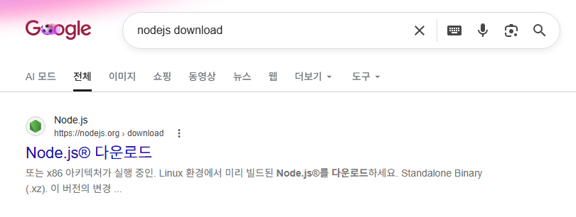
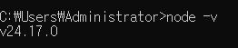
<empty-block/>
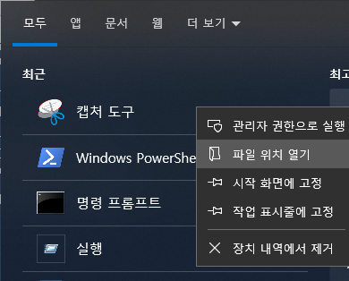
Set-ExecutionPolicy -Scope CurrentUser -ExecutionPolicy RemoteSigned
<empty-block/>
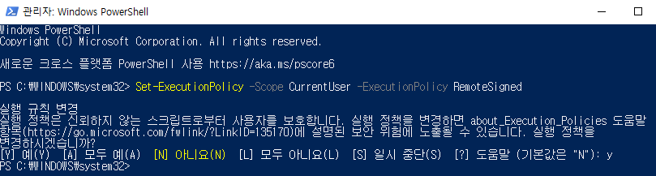
<empty-block/>
npm으로확인
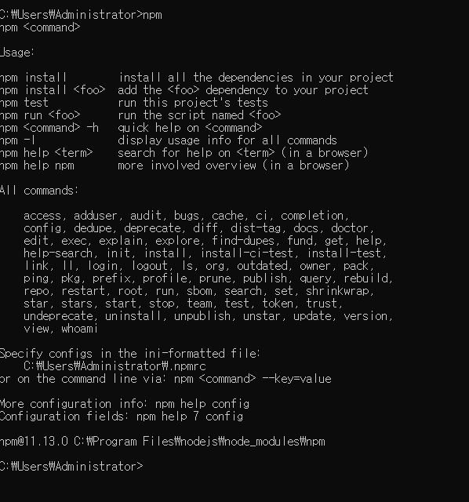
<empty-block/>
폴더 만들어서
vscode로 열고 터미널 열어 명령어 입력 `npm init -y`
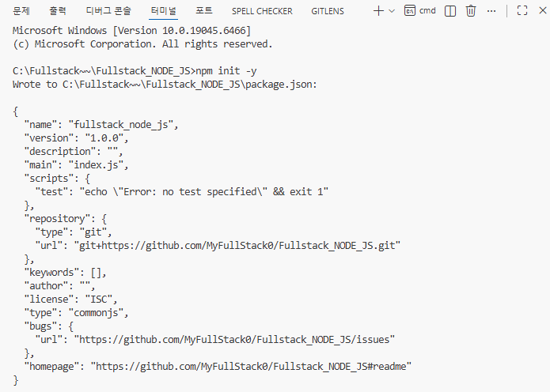
패키지 생성 확인
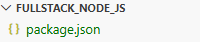
<empty-block/>
패키지 설치 `npm install lodash`
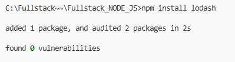
- \`lodash\`는 유틸리티 함수들을 제공하는 대표적인 JS 라이브러리
- \`node_modules/\` 폴더와 \`package-lock.json\` 자동 생성
지우고 `npm install` 만 입력해도 재설치됨(패키지에 작성되어있어서)
<empty-block/>
index만들어서 예시쓰고
`node index.js` 
로 실행
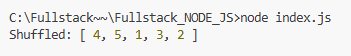
<empty-block/>
`npm run start`
패키지에   "start": "node index.js",<br> 쓰면 이것도 가능
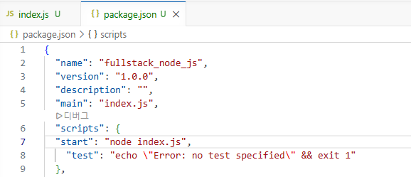
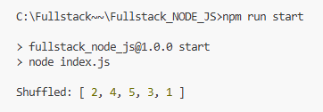
`npm install nodemon` 패키지
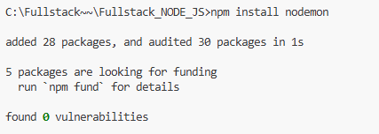
서버 개발 시 자동으로 다시 실행해주는 도구
파일 수정 때마다 서버 껐다 킬 필요 없음
저장 시 자동 재시작 됨
<empty-block/>
	`npm install --save-dev parcel`
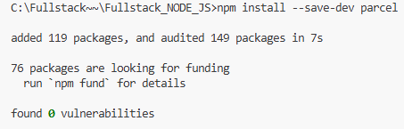
- HTML / JS / CSS 묶어서 실행해주는 도구 (번들러)
- 코드 바꾸면 자동 반영
<empty-block/>
<empty-block/>
`npm run start2`
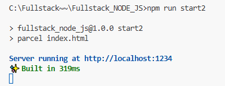
<empty-block/>
메인 안지웠더니 오류 난 상황   "main": "index.js",
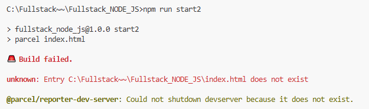
`npm run build`
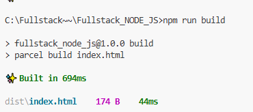
---
06.24
`npm install parcel-bundler -D`
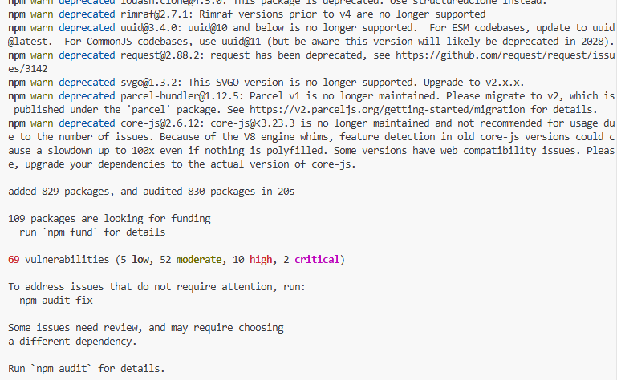
index.js
```javascript
console.log('HELLO WORLD!');
```
index.html
```javascript
<!DOCTYPE html>
<html lang="en">
<head>
    <meta charset="UTF-8">
    <meta name="viewport" content="width=device-width, initial-scale=1.0">
    <title>Document</title>
</head>
<body>
    <h1>INDEX</h1>
    <script src="./index.js"></script>
</body>
</html>
```
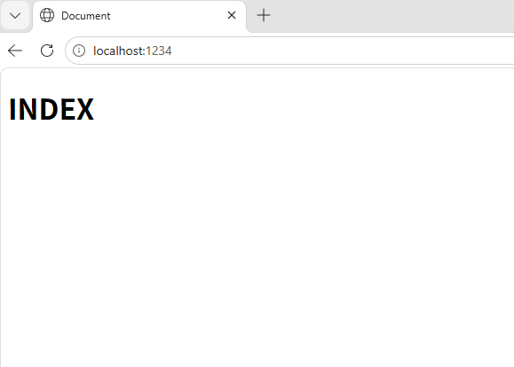
<empty-block/>
터미널
`npx parcel index.html`<br>
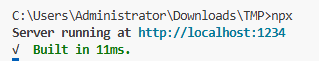
<empty-block/>
새터미널열고
`npm install lodash`
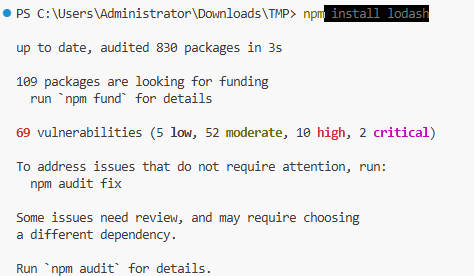
<empty-block/>
index.js
```javascript
console.log('HELLO WORLD!');

// --------------------------------
// LODASH
// --------------------------------

import _ from 'lodash'

console.log(_);

const result = _.join(['Hello','Parcel',],'|')
console.log(result)
```
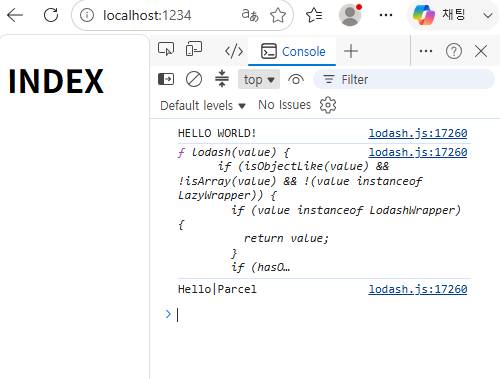
<empty-block/>
<empty-block/>
[gitignore.io](https://www.toptal.com/developers/gitignore/)  git 에 올라가지 않게 설정
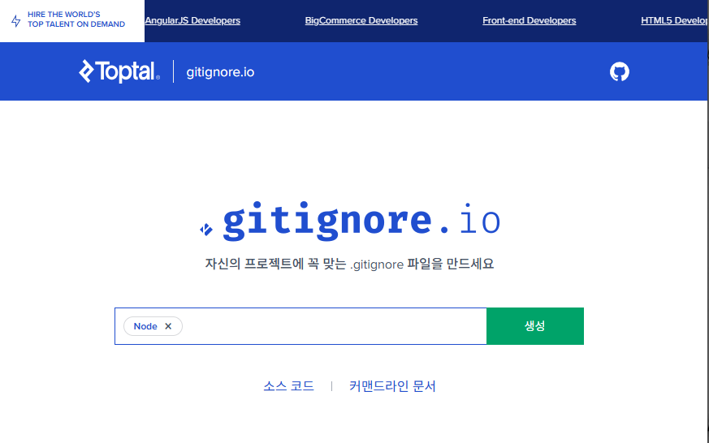
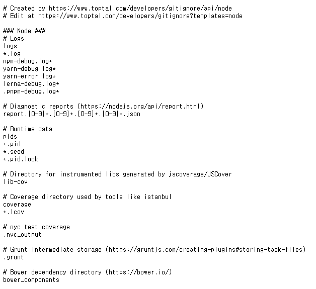
복붙해서 .gitignore 파일에 추가
---
깃허브에 리드미 없는 리포 생성
리포에 폴더 업로드
```javascript
git init
git add *
git commit -m "세팅"
git remote add origin https://github.com/MyFullStack0/Fullstack_NODE_JS_2.git
git remote -v   // 확인
git push --set-upstream origin main

```
```javascript
PS C:\Users\Administrator\Downloads\TMP> git init
Initialized empty Git repository in C:/Users/Administrator/Downloads/TMP/.git/
PS C:\Users\Administrator\Downloads\TMP> git add *
warning: in the working copy of 'package-lock.json', LF will be replaced by CRLF the next time Git touches it
warning: in the working copy of 'package.json', LF will be replaced by CRLF the next time Git touches it
PS C:\Users\Administrator\Downloads\TMP> git commit -m "세팅"
[master (root-commit) 636d5fe] 세팅
 5 files changed, 11098 insertions(+)
 create mode 100644 .gitignore
 create mode 100644 index.html
 create mode 100644 index.js
 create mode 100644 package-lock.json
 create mode 100644 package.json
PS C:\Users\Administrator\Downloads\TMP> git remote -v  
PS C:\Users\Administrator\Downloads\TMP> git remote add origin https://github.com/MyFullStack0/Fullstack_NODE_JS_2.git
PS C:\Users\Administrator\Downloads\TMP> git remote -v                
origin  https://github.com/MyFullStack0/Fullstack_NODE_JS_2.git (fetch)
origin  https://github.com/MyFullStack0/Fullstack_NODE_JS_2.git (push)PS C:\Users\Administrator\Downloads\TMP> git branch -M main
PS C:\Users\Administrator\Downloads\TMP> git push --set-upstream origin main
Enumerating objects: 7, done.
Counting objects: 100% (7/7), done.
Delta compression using up to 12 threads
Compressing objects: 100% (7/7), done.
Writing objects: 100% (7/7), 92.45 KiB | 11.56 MiB/s, done.
Total 7 (delta 0), reused 0 (delta 0), pack-reused 0 (from 0)
To https://github.com/MyFullStack0/Fullstack_NODE_JS_2.git
 * [new branch]      main -> main
branch 'main' set up to track 'origin/main'.
```
<empty-block/>
`package.json`
아래 추가
```javascript
    "build": "npx parcel build index.html",
    "deploy": "gh-pages -d dist"
```
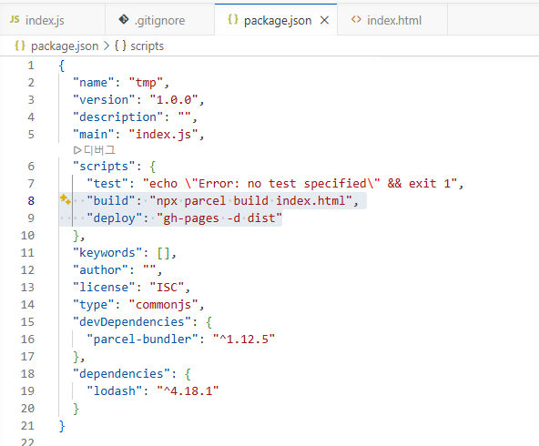
<empty-block/>
새 저장소 생성, 포토폴리오… 초기세팅 약간, 대기
<empty-block/>
npm install gh-pages -D
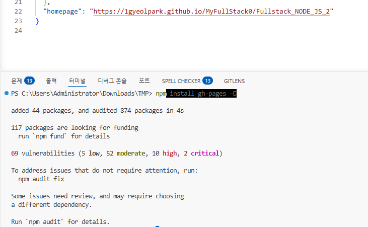
<empty-block/>
<empty-block/>
<empty-block/>
