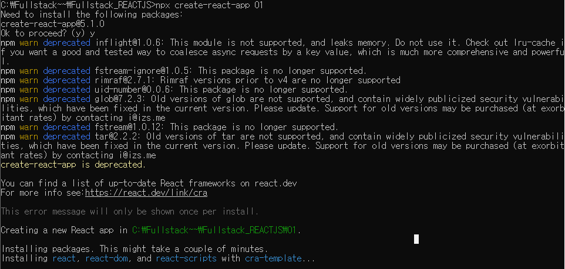
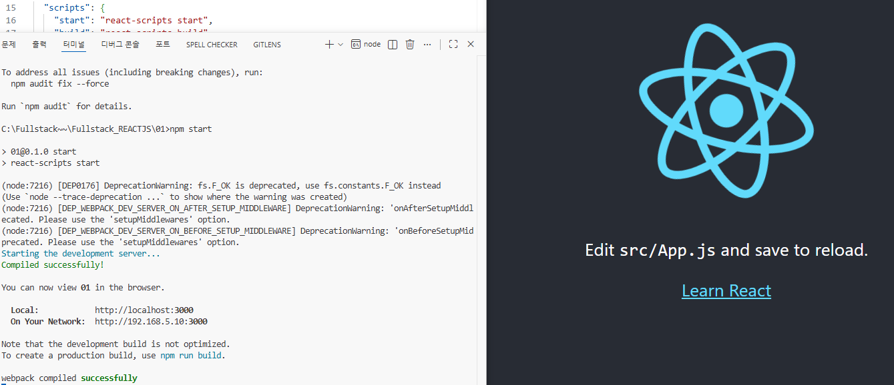
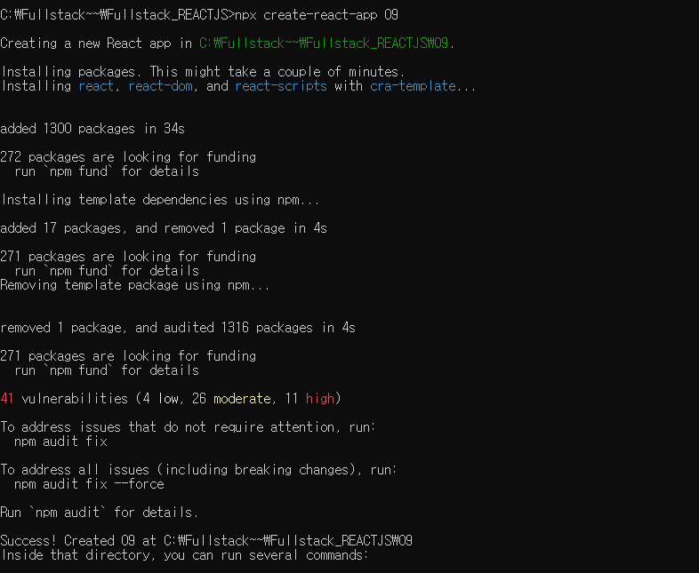
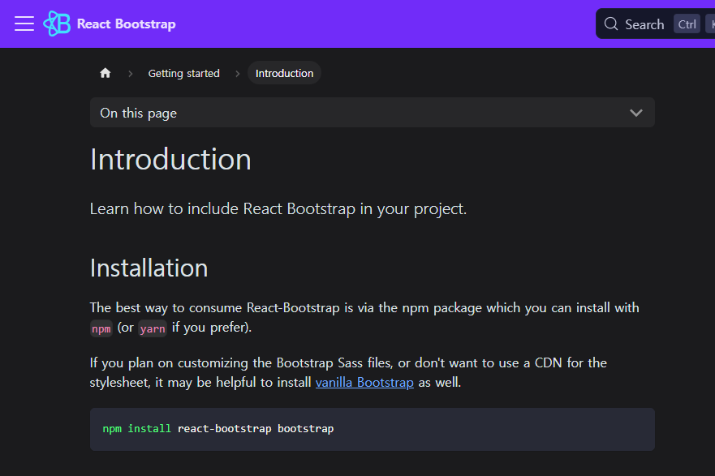

6.25
`npx create-react-app 01` 

만들어진 01 페이지 vscode 오픈
<empty-block/>
`npm start`

---
06.29
```javascript
npm install react-router-dom
```
<empty-block/>
react 생성
```javascript
npx create-react-app 폴더이름
```

<empty-block/>
---
```javascript
npm install react-bootstrap bootstrap
```

<empty-block/>
