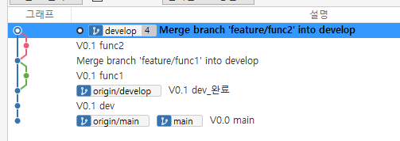
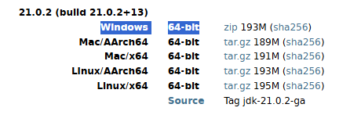

## Soursetree
> git을 쉽게 다룰 수 있는 프로그램을 사용해 github 연동하고 변화 과정을 시각적으로 확인할 수 있다.
<empty-block/>
### **\[클론\] github → rocal 내려받고 연결하기**
clone 탭에서 github 경로, 저장 폴더를 작성하고 `클론`을 클릭하면 쉽게 clone해 확인 할 수 있다.
<empty-block/>
### **\[추가\] 존재하는 rocal 저장소 불러오기**
내 로컬 파일 찾아 `추가` 클릭 
<empty-block/>
### **\[생성\] 새 rocal 저장소 만들기**
내 로컬에서 저장 폴더를 작성하고 `생성` 클릭
<empty-block/>
---
<empty-block/>
### 파일 상태
이곳에서 커밋을 할 수 있다. 파일 상태를 클릭해 스테이지에 올라가지 않은 파일을 스테이지에 올리고, 커밋 메시지를 작성한 다음 `커밋` 버튼을 누르면 된다. origin/main에 바뀐 내용 즉시 푸시를 클릭해 커밋하면 킷허브 저장소로 바로 커밋되게 된다.
<empty-block/>
---
<empty-block/>
### 커밋 초기화
초기화하고 싶은 부분까지의 커밋에 오른쪽 마우스 - `이 커밋까지 현재 브랜치를 초기화` 클릭, 사용중인 모드에 soft, mixed, hard 중 원하는 것을 선택하여 `확인` 을 클릭하면 초기화된다.
<empty-block/>
---
<empty-block/>
### 새 브랜치 생성
`브랜치` 버튼을 클릭해 새 브랜치 이름을 작성하고 `브랜치 생성`을 누르면 브랜치를 생성할 수 있다.
<empty-block/>
---
<empty-block/>
### 브랜치 병합
상위 브랜치에 헤더를 두고 병합될 브랜치에 오른쪽 마우스 → `현재 브랜치로 병합` → 확인을 통해 FF 병합을 할 수 있다.
<empty-block/>
---
<empty-block/>
### 충돌 해결
충돌 병합 메시지가 팝업되면 파일 상태에 경고가 보인다. 이를 로컬로 들어가 직접 수정한 뒤 스테이지에 올리면 경고 표시가 사라진다. 또는 파일 우클릭 → 충돌 해결 메뉴로 해결할 수 있다. 
<empty-block/>
---
<empty-block/>
### 재배치
> 재배치는 기존 커밋을 옮기는 게 아니라, 내용은 같지만 해시값이 다른 새 커밋을 생성하는 것이다.  **병합하기 전**에 깔끔하게 배치하고 작업 현황을 선명하게 보기 위해 사용한다. 재배치는 병합과는 반대로 진행한다.  재배치: 병합할 브랜치 → dev / 병합: dev → 병합할 브랜치 \*\* fast-forward가 가능해도 `새 커밋으로 생성`  필수 체크한다.
<empty-block/>
1. 먼저 dev를 커밋해 위로 한 칸 올린다.
2. ‘**병합할 브랜치**’에 헤더를 두고 ‘**dev**’가 있는 곳 오른쪽 마우스 → `재배치`
3. 한칸 올라가면 그 아래 ‘**dev**’에 헤더를 두고 ‘**병합할 브랜치**’에 오른쪽 마우스 → `병합` \*\* 이때 fast-forward가 가능해도 `새 커밋으로 생성`  필수 체크
4. 이후 필요없어진 원격 브랜치들은 오른쪽 마우스 → 제거
<empty-block/>
**요약**
특정 branch에 변경사항 있으면 → dev에 파일 생성해서 맨 위로 올리고→ 재배치로 특정 branch를 그 위로 올리고 → 병합으로 dev에 합치기
<empty-block/>
하고 남은 브랜치는 전부 강제삭제처리

<empty-block/>
---
<empty-block/>
<empty-block/>
<empty-block/>
<empty-block/>

<empty-block/>
<empty-block/>

다운로드-압축풀기-c드라이브
<empty-block/>
<empty-block/>
<empty-block/>
<empty-block/>
<empty-block/>
<empty-block/>
<empty-block/>
<empty-block/>
<empty-block/>
<empty-block/>
<empty-block/>
