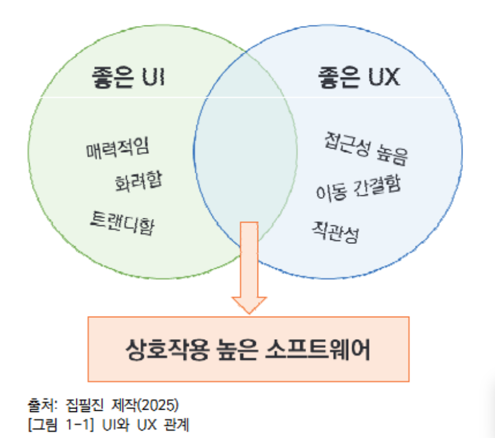
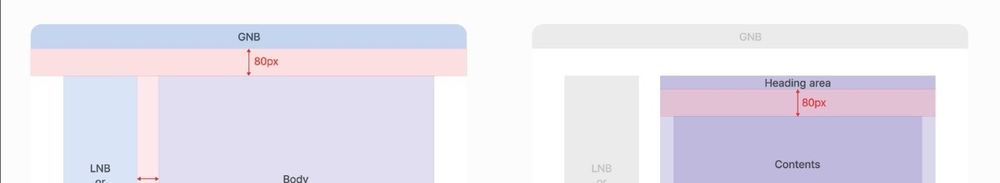
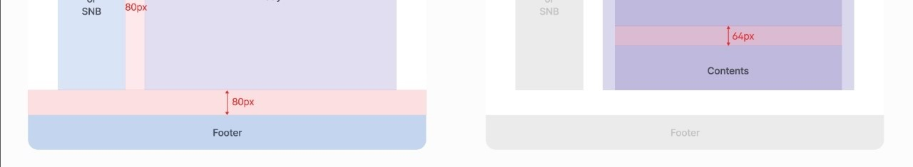
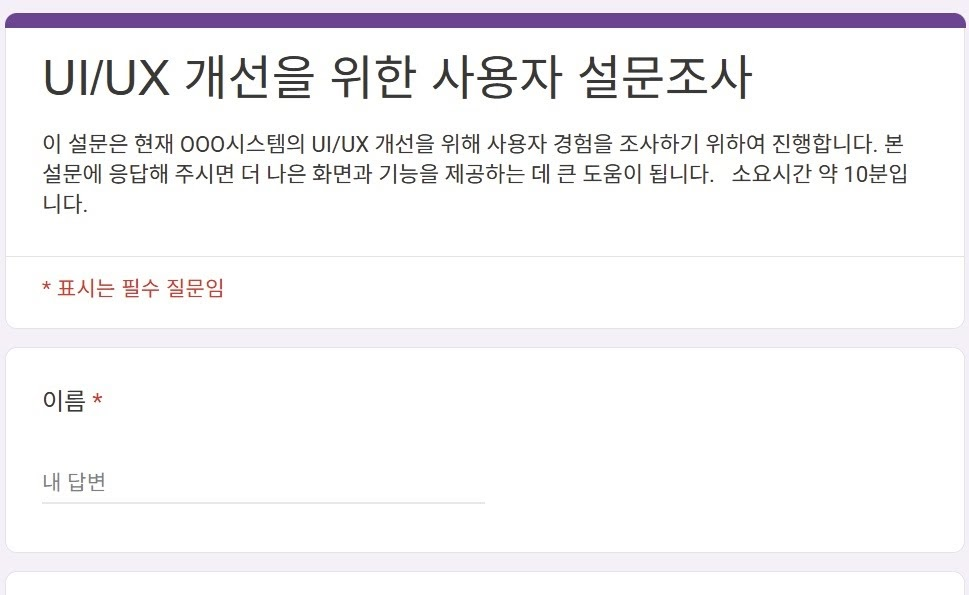
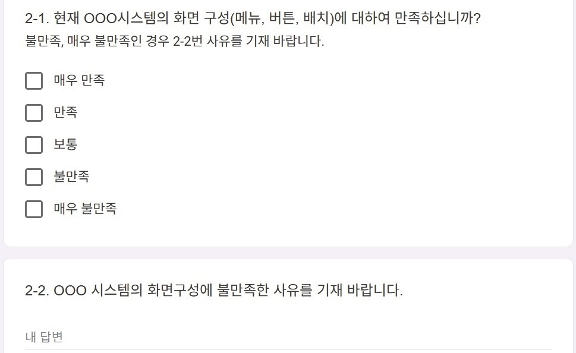

# 1. UI 요구사항 확인하기

## **1-1. UI 요구사항 확인**

### **학습 목표**

> 응용소프트웨어 개발을 위한 UI 표준 및 지침에 의거하여, 개발하고자 하는 응용소프트웨어에 적용될 UI 요구사항을 확인할 수 있다.

---

## **필요 지식**

### 1) UI/UX의 개념

### **(1) UI(User Interface,** **사용자 인터페이스)**

- 사용자가 제품과 상호작용하는 “시각적 요소와 디자인”을 의미한다.

- 예: 웹 버튼 디자인, 아이콘, 색상 구성 등

- 초점: 사용자가 소프트웨어를 “어떻게 보고, 어떻게 조작하는지”

### **(2) UX(User Experience, 사용자 경험)**

- 사용자가 소프트웨어를 사용하며 느끼는 “전체적인 경험”을 의미한다.

- 예: 만족도, 편의성, 효율성 등

- 초점: 사용자가 소프트웨어를 통해 “무엇을 얻고, 무엇을 느끼는지”

---

### **2) UI/UX 구성 요소**

### **(1) UI 구성 요소**

- 시각적 디자인: 색상, 타이포그래피, 레이아웃, 아이콘 등 사용자가 화면에서 보는 모든 요소

- 상호작용 디자인: 버튼 클릭, 스와이프 등 사용자 조작에 대한 반응

- 정보 구조: 콘텐츠의 구성 및 분류

### **(2) UX 구성 요소**

- 사용성(Usability): 사용자가 소프트웨어를 얼마나 쉽게 이용할 수 있는지 

- 유용성(Usefulness): 프트웨어가 사용자의 요구사항을 얼마나 충족하는지 

- 매력도(Desirability): 소프트웨어가 사용자에게 얼마나 매력적인지 

- 접근성(Accessibility): 다양한 사용자가 소프트웨어를 얼마나 쉽게 이용할 수 있는지 

- 신뢰성(Credibility): 소프트웨어에 대한 사용자의 믿는 정도

---

### **3) UI/UX의 관계**

- UI와 UX는 밀접하게 연관된다.

- 좋은 UX를 위해 좋은 UI는 중요하지만, 좋은 UI가 항상 좋은 UX를 보장하지는 않는다.

- 결론: UI와 UX는 상호 보완적으로 설계되어 사용자 만족도를 높인다.

-

---

## **UI/UX 표준**

### **ISO 9241-210**

### **(1) 적용 범위**

- 표준 명칭: ISO 9241-210:2019

- 제정 기관: ISO(International Organization for Standardization)

- 적용 대상: 소프트웨어, 웹사이트, 디지털 인터페이스, 기기 설계 등 사용자-컴퓨터 상호작용 전반

### **(2) 사용자 중심 설계 6대 원칙**

> 사용자 참여, 전체 사용자 경험 고려, 반복적 설계, 목표 및 환경 기반 설계, 다함께 협업, 사용자 평가 포함

\<표 1-1\> 사용자 중심 설계 6대 원칙

<table header-row="true">

<colgroup>

<col width="252.33334350585938">

<col width="286.3333435058594">

</colgroup>

<tr>

<td>원칙</td>

<td>설명</td>

</tr>

<tr>

<td>**사용자**는 설계 과정 전반에 적극적으로 **참여**해야 한다.</td>

<td>실제 사용자가 요구사항 수집/분석 등 전 과정에 참여하여 의견이 반영되어야 한다.</td>

</tr>

<tr>

<td>사용자 중심 설계는** 전체 사용자 경험**을 **고려**해야 한다.</td>

<td>단순 기능 만족이 아니라 정서/인지적 경험을 포함해야 한다.</td>

</tr>

<tr>

<td>**설계는 반복적으로** 이루어져야 한다.</td>

<td>프로토타이핑 후 피드백/보완을 반복해야 한다.</td>

</tr>

<tr>

<td>**설계**는 사용자와 구축** 목표 및 환경을 기반**으로 한다.</td>

<td>업무 환경, 기기, 사용 목적 등을 고려한다.</td>

</tr>

<tr>

<td>사용자 중심 설계 팀은 여러 학문 분야가 **함께 협력**해야 한다.</td>

<td>디자이너, 개발자, 관리자 등의 협업이 전제되어야 한다.</td>

</tr>

<tr>

<td>**사용자가 평가에 반드시 포함**되어야 한다.</td>

<td>사용성 테스트/면담 등 평가 기반을 설계하고 적용해야 한다.</td>

</tr>

</table>

---

## **수행 내용 / UI 요구사항 확인하기**

### **재료·자료**

- 국가기관 UI/UX 가이드라인 문서

- UI/UX 관련 국제 표준 문서

- 사용자 면담/설문 기초 자료

- 시나리오 작성 템플릿 및 UI 구성 요소 목록표

### **기기(장비·공구)**

- 컴퓨터(데스크톱/노트북), 태블릿, 스마트폰

- 카메라 또는 화면 캡처 도구

- 스크린 리더(VoiceOver, NVDA 등)

- 화면 설계 도구

### **안전·유의 사항**

- 면담/설문 자료는 비인가 접근 제한 등 보안 자료로 취급한다.

- UI 디자인/이미지/사례 분석 시 저작권을 준수한다.

- 실사용자 면담 시 녹음/촬영 동의를 사전 고지하고 확보한다.

- 사례 분석 중 버그/장애 발생에 유의한다.

---

## **수행 순서**

### **A. 사용자 화면 표준 및 지침 확인(수집·분석)**

### **1) 국가기관 UI/UX 가이드라인 수집 및 분석**

- 공식 웹사이트 접속 → UI/UX 관련 문서 검색 → 최신 버전 우선 확인 → 다운로드 및 목차/개요 확인

- 핵심 항목 발췌 기준 정의(접근성/일관성/색상 대비 등)

- 접근성/일관성/색상 대비 항목별로 요약 정리

- 공공기관 웹/앱 사례에 적용 여부 분석(준수/미흡 분류, 개선점 도출)

- 내비게이션 구성 및 콘텐츠 배치 지침 요약 정리

- 실사용자·기획자·디자이너 검토로 최종 지침서 확정

\<표 1-2\> OOO 기관 홈페이지 분석 결과 예시

<table header-row="true">

<colgroup>

<col width="135.453125">

<col width="234.10000610351562">

<col width="90.00000762939453">

<col>

</colgroup>

<tr>

<td>**항목**</td>

<td>**가이드라인 내용**</td>

<td>**준수 여부**</td>

<td>**비고**</td>

</tr>

<tr>

<td>색상 대비</td>

<td>텍스트와 배경의 명도 대비 4.5:1 이상</td>

<td>준수</td>

<td>전체적으로 양호</td>

</tr>

<tr>

<td>대체 텍스트</td>

<td>이미지에 대체 텍스트 제공</td>

<td>준수</td>

<td>배너, 로고 모두 적용됨</td>

</tr>

<tr>

<td>키보드 접근성</td>

<td>키보드만으로 주요 메뉴 접근 가능</td>

<td>부분 준수</td>

<td>서브 메뉴 접근 시 Tab 순서 꼬임 발생</td>

</tr>

<tr>

<td>반응형 웹 구현</td>

<td>모바일 기기에서 화면 자동 최적화</td>

<td>준수</td>

<td>다양한 해상도에서 정상 작동</td>

</tr>

<tr>

<td>콘텐츠 구조</td>

<td>논리적 제목 계층 사용</td>

<td>준수</td>

<td>h1\~h3 계층 구조 명확</td>

</tr>

<tr>

<td>외부 링크 구조</td>

<td>새 창 여부 명시</td>

<td>미준수</td>

<td>새 창 열림 여부 텍스트 미표기</td>

</tr>

<tr>

<td>민원 서비스 접근성</td>

<td>민원 신청 기능 접근 용이성</td>

<td>부분 준수</td>

<td>로그인 절차 복잡, 음성 지원 없음</td>

</tr>

</table>

출처: 행정안전부(2024). 디지털 정부 서비스 UI/UX 가이드라인. p.98

\[그림 1-2\] 콘텐츠 배치 관련 지침 예시

### **2) 국제 UI/UX 표준 규격 수집 및 분석**

- ISO, W3C, WCAG, IEEE 등 UI/UX 표준 목록화

- 표준별 정의/목적/적용 범위/요구사항 요약

- 국내 지침 반영 여부 비교 분석

- 프로젝트 적용 가능성 및 제약사항 정리

\<표 1-3\> OOO 기관 홈페이지 문제점 및 개선 방안 예시

<table header-row="true">

<colgroup>

<col width="131.796875">

<col width="264.98828125">

<col width="303.00001525878906">

</colgroup>

<tr>

<td>**항목**</td>

<td>**문제점**</td>

<td>**개선 방안**</td>

</tr>

<tr>

<td>키보드 접근성</td>

<td>Tab 이동 시 초점이 특정 메뉴에 머무름</td>

<td>초점 이동 순서 재정의 또는 Skip 내비게이션 강화</td>

</tr>

<tr>

<td>외부 링크 구조</td>

<td>새 창 열림 안내 없음</td>

<td>링크에 title 속성 추가 또는 텍스트로 ‘새 창’ 표기</td>

</tr>

<tr>

<td>민원 서비스 접근성</td>

<td>화면 낭독기 비호환, 시각장애인 안내 부족</td>

<td>음성 지원 버전 제공 또는 ‘쉬운 민원 모드’ 추가</td>

</tr>

</table>

\<표 1-4\> 국제 UI/UX 표준 규격 목록화 예시

<table header-row="true">

<colgroup>

<col>

<col width="270.00001525878906">

<col>

</colgroup>

<tr>

<td>**표준명**</td>

<td>**적용 범위**</td>

<td>**제정 기관**</td>

</tr>

<tr>

<td>ISO 9241-210</td>

<td>사용자 중심 화면 설계, UX 6원칙 포함</td>

<td>ISO</td>

</tr>

<tr>

<td>WCAG 2.2</td>

<td>웹 콘텐츠 접근성, 레벨 A/AA/AAA</td>

<td>W3C</td>

</tr>

<tr>

<td>IEEE 830</td>

<td>소프트웨어 요구사항 명세(요구사항 구조화)</td>

<td>IEEE</td>

</tr>

</table>

\<표 1-5\> 국제 표준 vs 국내 지침 비교 분석 예시

<table header-row="true">

<colgroup>

<col width="116.00000762939453">

<col width="174.90000915527344">

<col width="170.90000915527344">

<col>

</colgroup>

<tr>

<td>**항목**</td>

<td>**국제 표준(ISO 9241 등)**</td>

<td>**국내 지침 (예: 공공기관 접근성 지침)**</td>

<td>**분석 결과**</td>

</tr>

<tr>

<td>사용자 중심 설계</td>

<td>사용자 참여 강조</td>

<td>명확한 실행 지침 부족</td>

<td>국내 지침 실행 기준 미흡</td>

</tr>

<tr>

<td>접근성 기준</td>

<td>WCAG 2.2 Level AA 제시</td>

<td>웹 접근성 기준 적용</td>

<td>국제 기준 대비 최신성 부족 가능</td>

</tr>

<tr>

<td>평가 방식</td>

<td>반복적 사용자 테스트 강조</td>

<td>일회성 점검 중심</td>

<td>지속적 평가 필요</td>

</tr>

</table>

\<표 1-6\> 표준별 적용 가능성 분석 예시

<table header-row="true">

<colgroup>

<col width="135.63333892822266">

<col width="147.3000030517578">

<col>

<col>

</colgroup>

<tr>

<td>**표준명**</td>

<td>**적용 영역**</td>

<td>**고려 사항**</td>

<td>**한계점**</td>

</tr>

<tr>

<td>ISO 9241-210</td>

<td>공공 웹/앱 서비스</td>

<td>사용자 조사/반복 설계 필요</td>

<td>일정/비용 부담, 전문 인력 필요</td>

</tr>

<tr>

<td>WCAG 2.2</td>

<td>웹사이트, 전자문서</td>

<td>레벨 AA 구현, 보조기술 대응</td>

<td>콘텐츠 유형별 적용 난이도 높음</td>

</tr>

<tr>

<td>한국형 웹 콘텐츠 접근성 지침</td>

<td>공공기관 웹사이트</td>

<td>최신 버전 반영 여부 확인</td>

<td>기술 구체성 낮음, 해석 여지</td>

</tr>

<tr>

<td>행정·공공기관 구축·운영 가이드</td>

<td>공공 서비스/정보 제공</td>

<td>메뉴/화면 구성 준수</td>

<td>국제 기준과 차이, 유연성 부족</td>

</tr>

</table>

### **3) 플랫폼별 디자인 가이드라인 수집 및 분석**

- 플랫폼(모바일/웹/데스크톱/워치/TV 등) 선정 및 특성 파악

- 각 플랫폼 공식 가이드라인 문서 수집

- 공통 요소/차이점 비교(내비게이션, 버튼, 제스처 등)

- 플랫폼별 성공 사례 조사 및 분석

\<표 1-7\> 플랫폼별 특성 분석 예시 

<table header-row="true">

<tr>

<td>**유형**</td>

<td>**대표 운영체제**</td>

<td>**주요 디바이스**</td>

<td>**특성**</td>

</tr>

<tr>

<td>모바일</td>

<td>iOS, Android</td>

<td>스마트폰, 태블릿</td>

<td>터치 기반, 화면 제한, 제스처 중심</td>

</tr>

<tr>

<td>웹</td>

<td>Chrome, Edge</td>

<td>데스크톱/모바일 브라우저</td>

<td>반응형 필수, 호환성 고려</td>

</tr>

<tr>

<td>데스크톱</td>

<td>Windows, macOS</td>

<td>PC, 노트북</td>

<td>키보드/마우스 기반, 고해상도 대응</td>

</tr>

<tr>

<td>스마트워치</td>

<td>WearOS 등</td>

<td>스마트워치</td>

<td>작은 화면, 제스처/음성 중심</td>

</tr>

<tr>

<td>TV</td>

<td>Tizen, Android TV</td>

<td>스마트TV</td>

<td>리모컨 기반, 원거리 UI 필요</td>

</tr>

</table>

\<표 1-8\> 플랫폼별 가이드라인 분석 예시 (마크다운 표)

<table header-row="true">

<tr>

<td>**플랫폼**</td>

<td>**가이드라인명**</td>

<td>**주요 항목**</td>

<td>**참고 링크(원문)**</td>

</tr>

<tr>

<td>iOS</td>

<td>Human Interface Guidelines</td>

<td>색상, 상호작용, 타이포그래피</td>

<td>[https://developer.apple.com/design/human-interface-guidelines/](https://developer.apple.com/design/human-interface-guidelines/)</td>

</tr>

<tr>

<td>Android</td>

<td>Material Design 3</td>

<td>레이아웃, 컴포넌트, 동작 원칙</td>

<td>[https://m3.material.io](https://m3.material.io/)</td>

</tr>

<tr>

<td>Web</td>

<td>Google Web UX Guide</td>

<td>반응형, 접근성, 속도 중심</td>

<td>[https://web.dev/learn/design/](https://web.dev/learn/design/)</td>

</tr>

</table>

\<표 1-9\> 플랫폼별 공통 요소/차이점 비교 예시 (마크다운 표)

<table header-row="true">

<tr>

<td>**플랫폼**</td>

<td>**버튼 스타일**</td>

<td>**내비게이션 방식**</td>

<td>**상호작용**</td>

</tr>

<tr>

<td>iOS</td>

<td>둥근 모서리, 최소 텍스트</td>

<td>탭 바 중심</td>

<td>스와이프/제스처 중심</td>

</tr>

<tr>

<td>Android</td>

<td>머티리얼 강조, 아이콘+텍스트</td>

<td>하단 내비게이션/햄버거, 백 버튼</td>

<td>백 버튼 필수, 제스처 혼합</td>

</tr>

<tr>

<td>Web</td>

<td>자유로운 스타일링</td>

<td>상단 메뉴/사이드바 혼합</td>

<td>클릭/호버 기반</td>

</tr>

</table>

### **4) 유사 응용소프트웨어 UI 설계 사례 조사·분석**

- 유사 소프트웨어를 기능/목적/플랫폼 기준으로 분류

- UI 요소(레이아웃/내비게이션/버튼/피드백) 항목별 분석

- 사용자 편의성 및 UX 요소 비교 평가

- 트렌드/패턴 도출

\<표 1-10\> 유사 응용소프트웨어 분류 예시 (마크다운 표)

<table header-row="true">

<tr>

<td>**소프트웨어명**</td>

<td>**개발사**</td>

<td>**주요 기능**</td>

<td>**분류**</td>

</tr>

<tr>

<td>Notion</td>

<td>Notion Labs</td>

<td>메모, 협업 문서 편집</td>

<td>협업 도구</td>

</tr>

<tr>

<td>Evernote</td>

<td>Bending Spoons</td>

<td>노트, 태그, 검색</td>

<td>생산성</td>

</tr>

<tr>

<td>OneNote</td>

<td>Microsoft</td>

<td>필기, 스케치, 공동 작업</td>

<td>디지털 필기</td>

</tr>

</table>

---

### **B. 목표 응용소프트웨어 UI 요구사항 확인(분석·수집·정리·확정)**

### **1) 기능 및 사용자 분석**

- 구축 목적/주요 기능 문서 검토(기획 문서, 제안서, 회의록 등)

- 기능 목록 작성 및 유형 분류

- 사용자 유형 정의(연령대, 업무, IT 숙련도 등)

- 사용자 목적/기대 행동 정의

- 사용자 환경(기기/OS/이용 시간대) 분석 및 제약 도출

- UX 고려 요소 도출(클릭 수 최소화, 피드백 제공, 색 대비 등)

- 기능별 사용자 시나리오 작성

### **2) UI 구성 요소 및 흐름 파악**

- 화면별 버튼/폼/메뉴 등 구성요소 목록화

- 화면 간 이동 경로(UI 흐름도) 작성 (원문: \[그림 1-3\])

- 핵심 상호작용 방식 분석

- 디자인 일관성/접근성/사용성 평가

- 경쟁 소프트웨어 비교 분석

\<표 1-11\> 화면별 UI 구성 요소 목록 예시

<table header-row="true">

<tr>

<td>**화면명**</td>

<td>**구성 요소**</td>

<td>**유형**</td>

<td>**기능 설명**</td>

</tr>

<tr>

<td>로그인</td>

<td>로그인 버튼</td>

<td>버튼</td>

<td>사용자 인증 요청</td>

</tr>

<tr>

<td>로그인</td>

<td>아이디 입력</td>

<td>폼</td>

<td>사용자 ID 입력</td>

</tr>

<tr>

<td>메인</td>

<td>내 정보</td>

<td>메뉴</td>

<td>사용자 프로필 페이지 이동</td>

</tr>

<tr>

<td>메인</td>

<td>인증 정보 수정</td>

<td>버튼</td>

<td>인증 수단 변경</td>

</tr>

<tr>

<td>공지 사항</td>

<td>공지 사항 목록</td>

<td>리스트</td>

<td>공지 목록 조회</td>

</tr>

<tr>

<td>공지 사항</td>

<td>공지 사항 작성</td>

<td>버튼</td>

<td>제목/내용 입력</td>

</tr>

</table>

\<표 1-12\> UI 디자인 평가 체크리스트 예시 (마크다운 표)

<table header-row="true">

<tr>

<td>**항목**</td>

<td>**평가 기준**</td>

<td>**결과(예시)**</td>

<td>**개선 여부**</td>

</tr>

<tr>

<td>버튼 색상 일관성</td>

<td>동일 기능 버튼 색상 일관 유지</td>

<td>X</td>

<td>필요</td>

</tr>

<tr>

<td>텍스트 크기</td>

<td>본문 14\~16 유지</td>

<td>△</td>

<td>필요</td>

</tr>

<tr>

<td>텍스트 가독성</td>

<td>제목이 본문 대비 1.3배 이상</td>

<td>△</td>

<td>필요</td>

</tr>

<tr>

<td>명확한 피드백 제공</td>

<td>클릭 후 0.1\~0.5초 내 로딩 표시 / 오류 2초 내 안내</td>

<td>X</td>

<td>필요</td>

</tr>

<tr>

<td>상호작용 영역 크기</td>

<td>모바일 버튼 44×44px 이상</td>

<td>△</td>

<td>필요</td>

</tr>

<tr>

<td>오류 메시지 명확성</td>

<td>원인+해결 방법 포함</td>

<td>△</td>

<td>필요</td>

</tr>

<tr>

<td>접근성 보장</td>

<td>대체텍스트/키보드 접근 가능</td>

<td>△</td>

<td>필요</td>

</tr>

</table>

\<표 1-13\> 경쟁 소프트웨어 비교 예시

<table header-row="true">

<colgroup>

<col>

<col width="212.3833465576172">

<col width="198.1333465576172">

<col width="168.4166717529297">

</colgroup>

<tr>

<td>**항목**</td>

<td>**자사 소프트웨어**</td>

<td>**경쟁 A**</td>

<td>**경쟁 B**</td>

</tr>

<tr>

<td>내비게이션</td>

<td>상단+좌측 사이드바, 중첩 많음</td>

<td>좌측 보드 목록+상단 간단 메뉴</td>

<td>상단/좌측 통합, 드롭다운</td>

</tr>

<tr>

<td>버튼 디자인/색상</td>

<td>파란(기본)+회색(보조), 버튼 작음</td>

<td>카드 기반, 버튼 큼, 아이콘 직관</td>

<td>파스텔 톤, 컬러 태그 지원</td>

</tr>

<tr>

<td>입력 폼</td>

<td>다단계 입력(우선순위 등)</td>

<td>단순 입력/체크리스트</td>

<td>템플릿/세부 패널 활용</td>

</tr>

</table>

### **3) 사용자 면담/설문으로 UI/UX 요구사항 수집**

- 대상자 선정(사용자 그룹 정의, 표본, 일정)

- 질문지/설문지 작성 및 계획 수립(목적/문항/유형/템플릿)

- 사전 검증(내부 검토 + 파일럿 조사)

- 본 조사 수행(공지, 진행, 취합, 보상/피드백)

- 기능 요구사항 vs UI 개선 요구사항 분리/태깅

- 반복 불만/요구사항 우선순위 도출(빈도×영향도)

\<표 1-14\> 사용자 그룹 정의서 예시

<table header-row="true">

<colgroup>

<col>

<col width="132.43334197998047">

<col width="200.50001525878906">

<col>

<col>

</colgroup>

<tr>

<td>**사용자 그룹명**</td>

<td>**역할/직무**</td>

<td>**사용 목적**</td>

<td>**사용 빈도**</td>

<td>**중요도**</td>

</tr>

<tr>

<td>일반 사용자</td>

<td>서비스 이용 고객</td>

<td>상품 검색/주문/결제/배송 조회</td>

<td>일 2\~3회</td>

<td>높음</td>

</tr>

<tr>

<td>관리자</td>

<td>시스템 운영/관리</td>

<td>주문 관리/상품 등록/고객 응대</td>

<td>상시</td>

<td>높음</td>

</tr>

<tr>

<td>운영자</td>

<td>마케팅/콘텐츠 운영</td>

<td>프로모션/콘텐츠/배너 관리</td>

<td>주 2\~3회</td>

<td>중간</td>

</tr>

<tr>

<td>파트너</td>

<td>외부 제휴 판매자</td>

<td>상품 등록/판매량/정산</td>

<td>주 1\~2회</td>

<td>중간</td>

</tr>

<tr>

<td>고객센터 직원</td>

<td>상담/문제 해결</td>

<td>문의/환불/교환 처리</td>

<td>상시</td>

<td>높음</td>

</tr>

</table>

\[그림 1-4\] 온라인 설문지 작성 예시

### **4) UI 요구사항 도출 및 문서화**

- 사용자 요청/리뷰/로그 등 결과 통합, 중복 요청 그루핑

- 사용자 목적/시나리오별 UI 요구사항 도출

- 기능 요구사항 vs 비기능 요구사항 분류

- UI 요구사항에 고유 ID 부여 및 설명 작성

- 우선순위/난이도/중요도 기준 정의

- UI 요구사항명세서 작성

### **5) UI 요구사항 검토 및 확정**

- 내부 팀(기획/디자인/개발) 공유 및 피드백 반영

- 이해관계자 워크숍/회의 준비 및 진행(회의록 기록)

- 최종 문서 반영/버전 관리/승인/배포 및 변경관리 정의

\<표 1-15\> UI 요구사항명세서 예시

<table header-row="true">

<colgroup>

<col width="63.00000762939453">

<col width="147.50000762939453">

<col width="213.4166717529297">

<col width="66">

<col width="74.00000762939453">

<col width="72.00000762939453">

<col width="68.01667022705078">

</colgroup>

<tr>

<td>**ID**</td>

<td>**요구사항**</td>

<td>**설명**</td>

<td>**유형**</td>

<td>**우선순위**</td>

<td>**난이도**</td>

<td>**중요도**</td>

</tr>

<tr>

<td>UI-001</td>

<td>비밀번호 보이기/숨기기</td>

<td>로그인 화면에 토글 버튼 추가</td>

<td>기능</td>

<td>높음</td>

<td>낮음</td>

<td>높음</td>

</tr>

<tr>

<td>UI-002</td>

<td>버튼 색상/크기 일관성</td>

<td>메인 화면 버튼 규칙 통일</td>

<td>비기능</td>

<td>중간</td>

<td>중간</td>

<td>중간</td>

</tr>

<tr>

<td>UI-003</td>

<td>등록일 표시 형식</td>

<td>공지 목록 등록일 YYYY-MM-DD</td>

<td>기능</td>

<td>중간</td>

<td>낮음</td>

<td>중간</td>

</tr>

<tr>

<td>UI-004</td>

<td>프로필 미리보기</td>

<td>이미지 업로드 시 미리보기 제공</td>

<td>기능</td>

<td>높음</td>

<td>중간</td>

<td>높음</td>

</tr>

<tr>

<td>UI-005</td>

<td>로딩 애니메이션</td>

<td>화면 전환 상태를 시각적으로 표시</td>

<td>비기능</td>

<td>낮음</td>

<td>낮음</td>

<td>낮음</td>

</tr>

<tr>

<td>UI-006</td>

<td>모바일 클릭 영역</td>

<td>버튼 클릭 영역 최소 48px 이상</td>

<td>비기능</td>

<td>높음</td>

<td>낮음</td>

<td>높음</td>

</tr>

</table>
