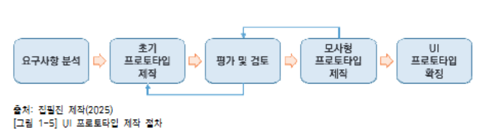
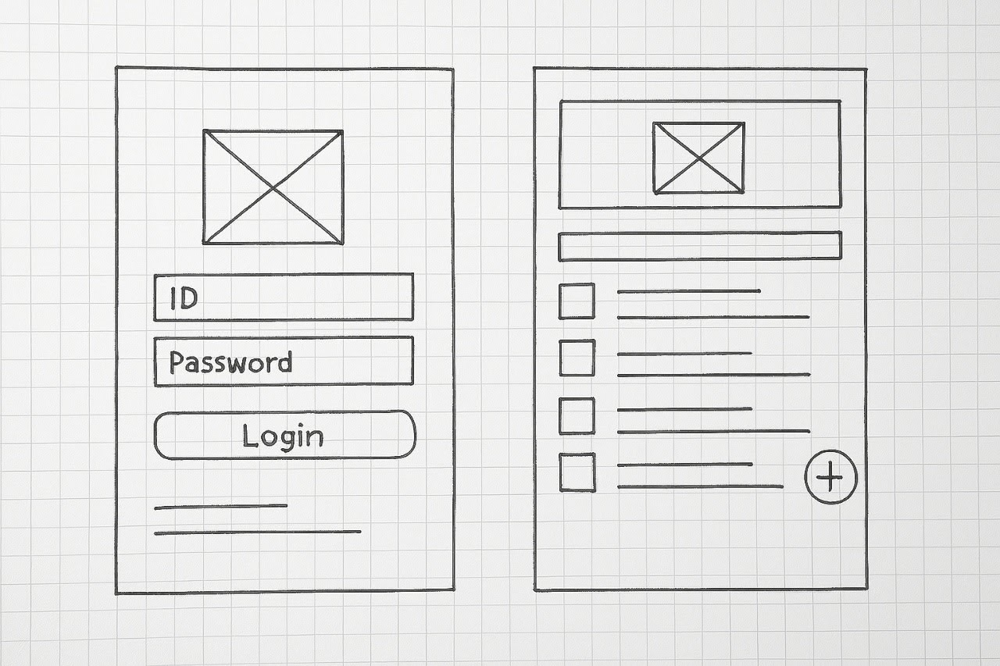
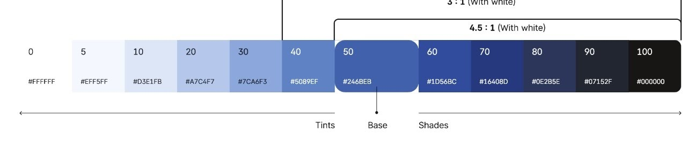
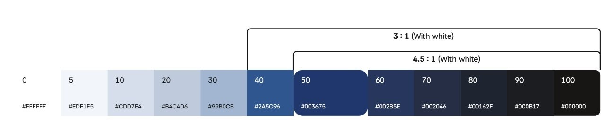
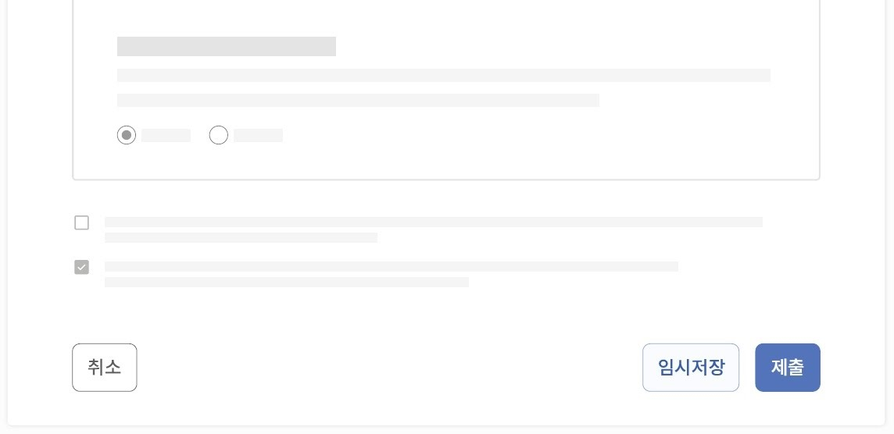
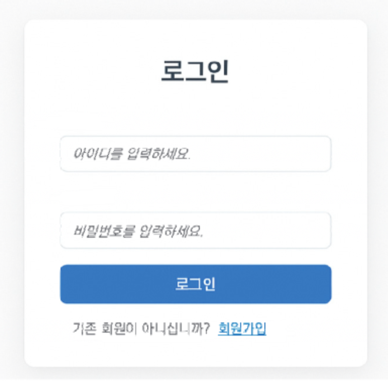

# 1. UI 요구사항 확인하기

## **1-2. UI 프로토타입 제작, 검토**

### **학습 목표**

> 응용소프트웨어 개발을 위한 UI 표준 및 지침에 의거하여, UI 요구사항을 반영한 프로토타입을 제작할 수 있다. 또한 작성한 프로토타입을 활용하여 UI/UX 엔지니어와 향후 적용할 UI의 적정성에 대해 검토할 수 있다.

---

## **필요 지식 / UI 프로토타입 개념 및 제작 절차**

### **1. UI 프로토타입(Prototype) 개념**

사용자와 시스템 간의 상호작용을 분석하여 사용성을 테스트하고 사전에 UI의 품질을 확보하기 위하여 시스템 기능 개발 전에 사용자의 요구사항을 반영하여 초안 화면을 설계하는 활동이다.

### **2. UI 프로토타입 유형**

### **(1) 초기 프로토타입(Low-fidelity Prototype)**

초기 기획 단계에서 <span color="yellow_bg">간략하게 구현</span>된 형태로, 사용자의 반응을 신속하게 파악하고 요구사항을 수집하는 데 활용한다.

### **(2) 모사형 프로타입(High-fidelity Prototype)**

<span color="yellow_bg">실제 제품과 유사한 수준</span>으로 구현된 형태의 UI로 사용자가 시스템을 실제 사용하는 것과 유사한 경험을 제공하는 화면이다.

### **3. UI 프로토타입 제작 절차**



### **(1) 요구사항 분석**

사용자 요구사항명세서와 시나리오를 분석하고 대표 사용자를 정의하는 등의 분석을 수행하는 단계이다.

### **(2) 정보 구조 및 UI 흐름 설계**

메뉴, 정보, 콘텐츠 구조 정리와 화면 간 이동 흐름을 정의하는 단계이다.

### **(3) 초기 프로토타입 제작**

기능 중심의 버튼, 입력창 등의 위치를 설계하고 핵심 기능과 정보의 시각적 우선순위에 따라 배치하는 단계이다.

### **(4) 모사형 프로토타입 제작**

색상, 폰트, 스타일 가이드를 적용하고 클릭 시 반응, 에러 메시지, 알림 등을 구현하여 사용자가 실사용과 유사한 경험을 제공하는 단계이다.

### **(5) 검토 및 개선**

사용자의 테스트와 버튼, 메시지, 배치 등 디자인 일관성을 검토하고 의견을 반영하여 개선하는 단계이다.

---

## **UI 프로토타입 설계 및 제작 도구**

### **1. 초기 프로토타입 설계 도구**

### **(1) Adobe XD**

와이어프레임, 상호작용 프로토타입, 자동 애니메이트, 클라우드 라이브러리 연동 등의 기능을 제공하는 도구이다.

### **(2) Sketch**

심벌 기반 재사용 디자인이 가능한 도구로 플러그인 확장, 스마트 가이드, 프로토타입 연결 등의 공동 작업 기능을 제공하는 도구이다.

### **(3) Balsamiq**

드래그 앤 드롭 UI 요소를 제공하고 빠른 스케치, 파일로 내보내기 등의 협업 기능을 제공하는 도구이다.

### **2. 모사형 프로토타입 제작 도구**

### **(1) Figma**

클릭, 화면 이동 링크 설정, 플러그인 등의 기능을 제공하여 웹 기반 실시간 협업을 지원하는 제작 도구이다.

### **(2) UXPin**

코드 기반으로 실제 개발 환경과 유사한 프로토타입을 제작 지원하는 도구이다.

### **(3) ProtoPie**

인터랙션 및 멀티모달 요소를 지원하며, 코딩 없이 구현을 지원하는 도구이다.

### **(4) Axure RP**

고급 상호작용과 구체적이고 세밀한 논리적 화면의 기능을 구현할 수 있도록 조건 분기, 이벤트 기반의 상호작용을 제작하는 등의 기능을 제공하는 도구이다.

---

## **수행 내용 / UI 프로토타입 제작, 검토하기**

### **재료·자료**

- 국가기관 UI/UX 가이드라인 문서

- UI/UX 관련 국제 표준 문서

- UI 요구사항명세서

- 시나리오 작성 템플릿 및 UI 구성 요소 목록표

### **기기(장비 ･ 공구)**

- 컴퓨터(데스크톱/노트북), 태블릿, 스마트폰

- 카메라 또는 화면 캡처 도구

- UI 프로토타입 제작 도구

### **안전 ･ 유의 사항**

- 프로토타입 작성 시 맞춤법과 그림의 가독성에 유의한다.

- 프로토타입 작성 도구는 학습 시간을 고려하여 선정하고 적용한다.

- 프로토타입 제작 시 UI 요구사항과 설계 원칙을 준수해야 한다.

- 프로토타입 과정에서 구현이 불가한 UI 요구사항은 이해관계자와 협의하여 조치 방안을 만들어야 한다.

---

## **수행 순서**

UI 요구사항을 바탕으로 구성 요소를 정의하고 흐름을 설계하여 프로토타입을 제작한다.

## **1. UI 구성 요소를 정의한다.**

### **(1) 사용자 요구사항 및 시나리오 분석 결과를 확인한다.**

사용자가 기대하는 기능과 사용 목적을 파악하여 UI 설계 방향을 정의한다.

(가) 요구사항명세서를 검토한다.

(나) 사용자 및 이해관계자와의 면담과 회의 결과를 정리한다.

(다) 유스케이스를 도출하고 흐름을 확인한다.

### **(2) 화면별 주요 기능을 식별한다.**

전체 시스템의 흐름을 바탕으로 각 화면이 어떤 기능을 수행해야 하는지 정의한다.

(가) 업무 및 서비스의 흐름을 기준으로 화면을 식별한다.

(나) 화면별 기능을 식별하여 목록으로 작성한다.

(다) 중복 기능 혹은 누락된 기능을 식별하고 확인한다.

### **(3) 구성 요소 유형을 분류한다.**

각 기능을 구성하는 버튼, 입력창 등 UI 구성 요소의 유형을 나누어 분류한다.

(가) 화면 내 사용된 UI 요소 목록을 작성한다.

(나) UI 구성 요소들을 기능, 형태, 사용처를 분류한다.

(다) 재사용이 가능한 공통 컴포넌트 혹은 모듈을 추출한다.

### **(4) 각 구성 요소의 속성 및 역할을 정의한다.**

UI 구성 요소별 처리하는 정보와 이벤트(기능)를 명확히 정리한다.

(가) UI 요소별 기능 및 제약 조건을 정의한다.

(나) 기본값, 유효성 조건, 필수 여부 등의 속성을 기술한다.

(다) UI 요소 중 접근성 관련 속성, 예를 들어 레이블, alt text 등을 정의한다.

---

## **2. UI 흐름을 설계한다.**

### **(1) 주요 화면 목록을 도출한다.**

사용자의 요구사항과 서비스 목적에 따라 필요한 화면의 종류를 식별하고 정리한다.

(가) 요구사항명세서 및 기능 목록을 분석한다.

(나) 유스케이스 기반으로 화면 기능을 도출한다.

\<표 1-16\> 화면 목록 정의 예시

<table header-row="true">

<tr>

<td>**화면 ID**</td>

<td>**화면명**</td>

<td>**주요 기능**</td>

<td>**비고**</td>

</tr>

<tr>

<td>UI-S001</td>

<td>로그인 화면</td>

<td>아이디/비밀번호 입력, 로그인 버튼, 회원 가입 링크</td>

<td>비회원 접근 가능</td>

</tr>

<tr>

<td>UI-S002</td>

<td>회원 가입 화면</td>

<td>이용 약관 동의, 회원 정보 등록, 본인 인증</td>

<td>본인 인증 필요</td>

</tr>

<tr>

<td>UI-S003</td>

<td>메인</td>

<td>추천 콘텐츠, 최근 본 항목, 메뉴</td>

<td>로그인 필요</td>

</tr>

</table>

(다) 유사 시스템의 주요 화면을 벤치마킹한다.

(라) 화면 이름, 목적과 사용자 권한을 정의한다.

### **(2) 사용자의 동선의 흐름 시나리오를 작성한다.**

사용자가 시스템을 사용하는 과정을 시나리오로 작성하고 각 단계에서 수행하는 작업을 파악한다.

(가) 사용자 페르소나를 설정한다.

(나) 시스템 사용 목적 중심의 시나리오를 작성한다.

<callout>

	사례: 시나리오 예시

	\[시나리오 #1\] 상품 주문 시나리오

	1단계: 로그인 화면 → 로그인

	2단계: 메인 화면 → 검색창에 상품 입력

	3단계: 검색 결과 화면 → 원하는 상품 선택

	4단계: 상세 정보 화면 → 장바구니 담기

	5단계: 장바구니 화면 → 결제 진행

</callout>

(다) 단계별 사용자 작업 및 기대 결과를 정리한다.

(라) 시나리오별 진입 조건 및 종료 조건을 정리한다.

### **(3) 화면 동작 및 이동 조건을 정의한다.**

각 화면의 실행 사전 조건이나 다음 화면으로 전환되는 조건을 정의하고, 사용자의 동작에 따른 화면의 동작 및 이동 흐름을 정의한다.

(가) 각 화면에서 사용자가 입력하는 항목을 정리한다.

(나) 화면 실행의 사전 조건, 예를 들어 로그인 여부, 권한 부여 여부 등을 명시한다.

(다) 각 화면의 동작 이벤트의 트리거(예를 들어 버튼 클릭, 슬라이드, 자동 전환 등)를 정리한다.

(라) 각 화면의 트리거 실행 실패 조건(예를 들어 로그인 실패 시 에러 메시지 제공)을 정의한다.

\<표 1-17\> 화면 동작 조건 및 흐름 정의 예시

<table header-row="true">

<colgroup>

<col width="102.00000762939453">

<col>

<col>

<col width="254.00001525878906">

</colgroup>

<tr>

<td>**출발 화면**</td>

<td>**사용자 동작**</td>

<td>**조건**</td>

<td>**도착 화면**</td>

</tr>

<tr>

<td>로그인 화면</td>

<td>로그인 버튼 클릭</td>

<td>정상적인 ID/비밀번호 입력</td>

<td>홈 화면</td>

</tr>

<tr>

<td>로그인 화면</td>

<td>로그인 버튼 클릭</td>

<td>ID/비밀번호 오류</td>

<td>에러 메시지 팝업</td>

</tr>

<tr>

<td>로그인 화면</td>

<td>로그인 버튼 클릭</td>

<td>ID/비밀번호 3회 오류</td>

<td>ID/비밀번호 찾기 화면</td>

</tr>

<tr>

<td>홈 화면</td>

<td>상품 클릭</td>

<td>상품 ID 유효</td>

<td>상세 정보 화면</td>

</tr>

<tr>

<td>장바구니 화면</td>

<td>장바구니 버튼 클릭</td>

<td>장바구니 1개 이상 상품 존재</td>

<td>결제 화면</td>

</tr>

<tr>

<td>장바구니 화면</td>

<td>장바구니 버튼 클릭</td>

<td>장바구니 상품 미존재</td>

<td>“장바구니가 비어있습니다.” 메시지 화면</td>

</tr>

</table>

### **(4) UI 흐름도를 작성한다.**

도출된 화면과 사용자 흐름을 시각적으로 정리하여 전체 화면 흐름 구조를 한눈에 볼 수 있도록 UI 흐름도를 작성한다.

(가) 주요 화면과 화면 간 연결 흐름을 노드로 구성한다.

(나) 화면의 조건 분기/예외 흐름을 포함하여 작성한다.

(다) 반복 가능성, 되돌아가기 흐름도를 고려하여 보완한다.

### **(5) 예외 흐름 및 오류 처리 흐름을 설계한다.**

일반 흐름에서 벗어나는 예외 상황에 대한 UI 처리 기능을 정의하고, 메시지/알림 등을 제공하는 방법과 문구를 설계한다.

(가) 각 화면에서 발생 가능한 예외 상황을 도출한다.

(나) 오류 메시지 및 사용자 행동 유도 방법을 정의한다.

(다) 오류 발생 시 이동 화면 또는 팝업 화면을 설계한다.

(라) 비정상 입력/접근 차단 흐름을 작성한다.

\<표 1-18\> 예외 사항 및 처리 방법 설계 예시

<table header-row="true">

<tr>

<td>**예외 상황 처리 방법**</td>

<td>**사용자 안내**</td>

</tr>

<tr>

<td>로그인 실패: 로그인 화면 유지, 에러 메시지 표시</td>

<td>“아이디 또는 비밀번호가 다릅니다. 다시 확인하시기 바랍니다.”</td>

</tr>

<tr>

<td>필수 항목 미입력: 해당 입력 칸 강조, 경고 메시지 표시</td>

<td>“이 항목은 필수 입력입니다.”</td>

</tr>

<tr>

<td>서버 연결 오류: 팝업창 표시</td>

<td>“네트워크 연결 상태를 확인해 주세요.”</td>

</tr>

<tr>

<td>...중략</td>

<td></td>

</tr>

</table>

## **3. 기능 중심의 간단한 UI 설계 초안을 제작한다.**

### **(1) 기능 중심의 간단한 UI 레이아웃을 작성한다.**

전체 화면의 기능 배치를 구상하며, 사용자의 흐름과 핵심 기능을 기준으로 화면 레이아웃의 초고를 그린다.

(가) 메인, 팝업 등과 같은 화면의 종류를 정의한다.

(나) 기능 흐름에 따른 화면 구성을 고안한다.

(다) 간단한 형태의 각 화면을 스케치한다.



출처: 집필진 제작(2025)   \[그림 1-6\] 각 화면 스케치 예시

### **(2) UI별 구성 요소 위치를 배치한다.**

각 화면에 들어가는 UI 구성 요소를 정리하고 기능 수행에 적절한 위치에 배치한다.

(가) 화면마다 필수 UI 기능을 도출한다.

(나) 버튼 및 데이터 항목의 위치, 간격 등 시각적 배치를 고려하여 화면을 구성한다.

(다) 화면별 구성 요소의 일관된 위치, 정렬 등 구성 원칙을 적용한다.

### **(3) 정보 구조 및 데이터 우선순위를 설정한다.**

사용자가 정보를 효율적으로 이해할 수 있도록 중요한 정보와 기능을 어떤 순서로 보여 줄지 정하고, 그에 맞는 정보 구조를 설계한다.

(가) UI별 데이터 항목 우선순위를 매핑한다.

\<표 1-19\> 로그인 화면 데이터 항목 우선순위 예시

<table header-row="true">

<colgroup>

<col width="112.78334045410156">

<col width="338.0000305175781">

<col width="59.00000762939453">

<col>

</colgroup>

<tr>

<td>**데이터/이벤트**</td>

<td>**설명**</td>

<td>**중요도**</td>

<td>**우선순위 이유**</td>

</tr>

<tr>

<td>ID</td>

<td>사용자 ID는 영문과 숫자를 조합해 3자 이상 입력해야 함</td>

<td>높음</td>

<td>로그인 시 핵심 데이터</td>

</tr>

<tr>

<td>비밀번호</td>

<td>영문, 숫자, 특수문자 포함해 9자 이상 입력해야 함</td>

<td>높음</td>

<td>로그인 시 핵심 데이터</td>

</tr>

<tr>

<td>로그인 버튼</td>

<td>입력된 정보를 바탕으로 로그인을 시도</td>

<td>높음</td>

<td>로그인 동작 트리거</td>

</tr>

<tr>

<td>자동 로그인 체크 박스</td>

<td>자동 로그인 사용 여부는 해당 데이터에 따라 결정</td>

<td>중간</td>

<td>편의 기능으로 선택적 사용</td>

</tr>

<tr>

<td>비밀번호 찾기(링크)</td>

<td>비밀번호 분실 시 재설정 안내 페이지로 이동</td>

<td>중간</td>

<td>예외 상황 대비 기능</td>

</tr>

<tr>

<td>회원가입 버튼</td>

<td>신규 사용자 계정 생성 안내 페이지로 이동</td>

<td>낮음</td>

<td>사용자별 일회성 기능</td>

</tr>

</table>

(나) 데이터 항목의 계측 구조를 설계한다.

(다) 레이아웃에 정보 우선순위를 반영한다.

### **(4) 상호작용 과정 설명을 추가한다.**

사용자가 시스템 사용 시 어떤 동작을 하는지 설명을 추가한다.

(가) 각 UI 요소에 상호작용 관련 설명을 기술한다.

(나) 화면 간 이동 조건을 표시한다.

(다) 상호작용에 대한 정리표를 작성한다.

### **(5) 팀 내 공유하고 의견을 수렴한다.**

작성한 화면 초안을 팀원들과 공유하고 기능/디자인/사용성 관점에서 의견을 수렴하여 반영한다.

(가) 작성한 화면 초안을 공유할 수 있는 도구에 업로드하고 공유 링크를 생성한다.

(나) 의견 수렴을 위한 회의를 진행하고 회의록을 작성한다.

(다) 수집한 의견 목록을 작성하고 우선순위를 정리한다.

\<표 1-20\> 검토 의견 정리 예시

<table header-row="true">

<tr>

<td>**의견**</td>

<td>**제안자**</td>

<td>**중요도**</td>

<td>**반영 여부**</td>

<td>**개선 방향/조치 내용**</td>

</tr>

<tr>

<td>로그인 버튼이 너무 작음</td>

<td>디자이너</td>

<td>높음</td>

<td>반영</td>

<td>버튼 크기 확대 및 배경색 강조 적용</td>

</tr>

<tr>

<td>‘비밀번호 찾기’ 위치가 눈에 잘 안 보임</td>

<td>기획자</td>

<td>중간</td>

<td>반영</td>

<td>텍스트 크기 크게 조정, 중앙으로 위치 변경</td>

</tr>

<tr>

<td>자동 로그인 체크 박스는 모바일 제외 필요</td>

<td>개발자</td>

<td>낮음</td>

<td>미반영</td>

<td>기본 설정 유지, 차후 반응형 설계 시 재검토</td>

</tr>

<tr>

<td>로그인 실패 시 에러 메시지 위치 명확하지 않음</td>

<td>기획자</td>

<td>높음</td>

<td>반영</td>

<td>입력창 하단에 붉은색 안내 문구 추가</td>

</tr>

</table>

---

## **4. 시각적으로 완성도 있고 동작 가능한 프로토타입을 제작한다.**

### **(1) 색상, 폰트, 여백 등 시각 요소를 소프트웨어에 적용한다.**

- (가) UI에 적용할 색상, 폰트, 여백, 아이콘 스타일 등 디자인 요소의 기준을 수립한다.



출처: 행정안전부(2024). 디지털 정부 서비스 UI/UX 가이드라인. p.65. \[그림 1-7\] 주요 색상 기준 예시



출처: 행정안전부(2024). 디지털 정부 서비스 UI/UX 가이드라인. p.65. \[그림 1-8\] 부가적인 색상 기준 예시

(나) 버튼, 입력창, 목록 형태(그리드) 등의 공통 UI 요소에 스타일을 적용한다. 



출처: 행정안전부(2024). 디지털 정부 서비스 UI/UX 가이드라인. p.65. \[그림 1-8\] 부가적인 색상 기준 예시

(다) 디자인 도구를 활용하여 실제 화면에 스타일을 적용한다.

### **(2) 실제 서비스처럼 보이는, 동작하는 프로토타입 UI를 제작한다.**

(가) 초안 UI를 바탕으로 시각 디자인이 포함된 화면을 제작한다.

<details>

<summary>사례: 로그인 화면 프로토타입 코드 예시</summary>
	```html
<!--사례: 로그인 화면 프로토타입 코드 예시-->

<!DOCTYPE html>
<html lang="ko">
<head>
    <meta charset="UTF-8">
    <meta name="viewport" content="width=device-width, initial-scale=1">
    <title>로그인</title>
    <style>
        body {
            margin: 0; font-family: 'Noto Sans KR', sans-serif; background: #f0f4f8;
            display: flex; align-items: center; justify-content: center; height: 100vh;
        }
        main {
            background: #fff; padding: 2.5rem; border-radius: 12px;
            box-shadow: 0 8px 20px rgba(0,0,0,0.1); width: 100%; max-width: 380px;
        }
        h1 {
            font-size: 1.5rem; text-align: center; margin-bottom: 2rem; color: #333;
        }
        form {
            display: flex; flex-direction: column;
        }
        label {
            margin: 0.5rem 0 0.3rem; font-size: 0.95rem; color: #555;
        }
        ... 중략
        .footer {
            margin-top: 1rem; text-align: center; font-size: 0.9rem; color: #666;
        }
        .footer a {
            color: #3366ff; text-decoration: none; margin-left: 0.3rem;
        }
        .footer a:hover {
            text-decoration: underline;
        }
    </style>
</head>
<body>
    <main>
        <h1>로그인</h1>
        <form aria-label="로그인 폼">
            <label for="username">아이디</label>
            <input type="text" id="username" placeholder="아이디 입력" required>
            <label for="password">비밀번호</label>
            <input type="password" id="password" placeholder="비밀번호 입력" required>
            <button type="submit">로그인</button>
        </form>
        <div class="footer">
            계정이 없으신가요? <a href="#">회원가입</a>
        </div>
    </main>
</body>
</html>
	```
</details>

(나) 사용 흐름에 따라 기능 및 버튼 위치를 정의하여 구현한다. 



출처: 집필진 제작(2025) \[그림 1-10\] 기능 및 버튼 위치를 적용한 프로토타입 UI 예시

(다) 로그인 실패 경고, 입력 정보 오류 등과 같은 상태를 구현한다.

### **(3) 화면 간 링크 연결 및 상호작용을 구현한다.**

(가) 화면 간 이동 흐름을 설계하기 위해 버튼이나 메뉴를 클릭했을 때 연결될 다음 화면을 구체적으로 정의한다.

(나) 사용자가 조작하였을 때 어떤 반응이 일어나는지 추가한다.

(다) UI 설계 및 구현 도구를 활용해 실제로 동작하는 링크를 설정한다.

### **(4) 사용자와 개발 팀의 의견을 반영해 수정하고 반복 테스트를 수행한다.**

(가) 사용성 테스트를 통해 디자인에 대한 의견을 수집한다.

(나) 개선해야 할 항목을 기능 중요도와 구현 난이도에 따라 분류한다.

(라) 수집한 의견을 반영해 프로토타입을 수정한다.

### **(5) 최종 프로토타입을 확정하고 공유할 수 있는 링크와 파일을 준비한다.**

(가) 모든 화면, 링크, 오류 메시지가 포함되었는지 최종 디자인을 검토한다.

(나) 외부 공유할 수 있는 링크를 생성한다.

(다) 프로토타입과 함께 기능 요약 문서와 화면 구성을 작성하여 개발 팀에 전달한다.

---

## **제작한 UI 프로토타입의 적정성을 검토한다.**

## **1. UI 구성 요소의 일관성을 평가한다.**

### **(1) 사전에 정의한 스타일 가이드와 디자인 기준을 준수하였는지 확인한다.**

(가) 기본(Primary)/보조(Secondary) 색상과 배경·텍스트 색상이 스타일 가이드와 일치하는지 확인한다.

(나) 사용된 폰트가 지정된 글꼴과 크기에 맞는지 확인한다.

(다) UI 구성 요소 간의 간격이 가이드라인에 맞는지 점검한다.

### **(2) 버튼, 입력창 등 동일한 기능 요소가 일관되게 적용되었는지 검토한다.**

(가) 기능별 UI 요소를 수집하여 목록으로 정리한다.

(나) 동일 기능 요소 간 색상, 테두리, 라운드 처리 등을 비교한다.

(다) 같은 기능인데 다른 형태로 표현된 사례가 있는지 확인한다.

### **(3) 시각적 요소인 아이콘과 텍스트의 정렬 상태, 오타 및 간격 오류를 점검한다.**

(가) 아이콘이 동일한 크기와 정렬 기준 등이 적용되었는지 점검한다.

(나) 버튼과 입력창 안의 텍스트가 중앙 정렬되었는지 점검한다.

(다) 맞춤법 오류나 불필요한 줄바꿈이 있는지 확인한다.

### **(4) 상호작용 시 상태 표현(활성/비활성/에러 등)의 일관성을 확인한다.**

(가) 버튼의 상태(활성/비활성/에러 등) 색상 및 효과를 비교한다.

(나) 입력창 포커스 시 테두리 변화, 에러 시 경고 색상, 메시지 일관성을 확인한다.

(다) 입력 오류 시 메시지가 일관된 위치/형식으로 표시되는지 점검한다.

---

## **2. 화면 흐름 및 기능 연계성을 검토한다.**

### **(1) 유스케이스 흐름에 따른 화면 전환 및 기능 배치 여부를 확인한다.**

(가) 사용 목적에 맞는 대표 시나리오를 작성한다.

(나) 단계별 사용 흐름도를 작성한다.

(다) 사용자가 원하는 기능을 쉽게 찾을 수 있도록 배치되었는지 확인한다.

### **(2) 사용자가 버튼 클릭, 메뉴 이동 등의 기능 연계를 확인한다.**

(가) 각 버튼, 메뉴의 목적과 클릭 시 이동할 화면을 정의한다.

(나) 버튼 클릭 등과 같은 사용자 동작 시 연결된 동작이 실행되는지 확인한다.

(다) 클릭하였을 때 아무 반응 없거나 잘못된 화면으로 이동하는 문제가 있는지 확인한다.

(라) 기능 연계 오류가 발생한 위치와 조건을 구체적으로 기록한다.

### **(3) 오류 발생 시 경고창이나 안내 메시지가 적절하게 처리되는지 점검한다.**

(가) 비 번호 미입력, 잘못된 이메일 형식 등 발생 가능한 오류 시나리오를 정의한다.

(나) 실제 입력 조건을 변경하여 오류를 유도하고 그 결과를 확인한다.

(다) 사용자가 문제를 이해하고 해결할 수 있도록 적절히 안내하는지 점검한다.

(라) 메시지의 색상, 위치, 문구 길이 등이 전체 UI와 조화를 이루는지 검토한다.

### **(4) 설계 흐름과 구현 결과 사이에 차이가 있는지 분석한다.**

(가) 사전 계획 문서를 기준으로 구현된 프로토타입이 일치하는지 확인한다.

(나) 프로토타입이 설계와 다르게 동작하거나 배치된 부분을 기록한다.

(다) 차이의 원인에 따라 설계를 조정할지, 구현을 다시 할지 정리한다.

---

## **3. 사용성 테스트를 수행한다.**

### **(1) 일반 사용자, 전문가, 개발자 등 적절한 테스트 대상자를 선정한다.**

(가) 초보 사용자, 실무자, 접근성 요구자 등 사용자 유형을 정의한다.

(나) 사용자 유형별 테스트 수행 방식을 정의한다.

(다) 사용자 데이터 수집 및 분석을 위해 사전 동의 절차를 정의한다.

### **(2) 유스케이스 기반 테스트를 수행한다.**

(가) 핵심 시나리오를 작성한다.

(나) 테스트용 기기, 화면 녹화 도구 등을 준비하여 테스트 환경을 구축한다.

(다) 과제별 수행 시간과 성공 여부, 오류 여부 등을 기록한다.

### **(3) 사용자의 마우스 이동, 머뭇거림, 잘못된 클릭 등에 대한 기록을 확인한다.**

(가) 마우스 추적, 스크린 레코딩, 시선 추적 도구인 행동 기록 도구를 선정한다.

(나) 버튼 클릭 오류, 빈 화면 클릭 등 비정상 상호작용을 표시한다.

(다) 사용자가 머뭇거린 시간, 클릭 순서, 반복 행동 등 사용자의 반응 속도와 이동 경로를 분석한다.

### **(4) 사용성, 디자인 만족도 등 평가 항목별로 사용자 의견을 수집한다.**

(가) 사용자 설문지나 면담 문항을 작성한다.

(나) 사용자로부터 수집한 평가 점수와 자유 의견을 정리한다.

(다) 사용자별 반복 제안이나 긍정/부정 의견을 분류하고 요약한다.

### **(5) 테스트 결과를 취합하여 주요 문제점과 개선 제안 내용을 문서로 작성한다.**

(가) 테스트 결과를 UI별로 문제 발생 빈도와 심각도에 따라 분류한다.

(나) 주관적인 불만과 실제 오류가 일치하는지 비교 분석한다.

(다) 개발에 적용할 수 있는 개선안을 도출하고 우선순위를 정리한다.

---

## **4. 접근성 및 반응성을 점검한다.**

(1) 텍스트와 배경 간의 명도 대비가 기준에 맞는지 검토한다.

(2) 탭(Tap) 키 이동이나 엔터(Enter) 입력으로 기능을 조작할 수 있는지 확인한다.

(3) 다양한 해상도에서 화면이 깨지지 않는지 점검한다.

(4) 스크린리더, 화면 확대 기능 등이 지원되는지 확인한다.

---

## **5. 검토 의견을 취합하여 개선 사항을 정리한다.**

(1) 일관성, 흐름, 사용성 등 영역별 문제점을 정리한다.

(2) 이해관계자별 피드백을 취합해 분류한다.

(3) 심각도와 구현 난이도 기준으로 개선 항목 우선순위를 정의한다.

(4) 수정 대상과 일정 등을 구체적으로 정의한다.

(5) 개선 전후 변화를 비교하고 최종 UI 프로토타입을 재검토한다.
