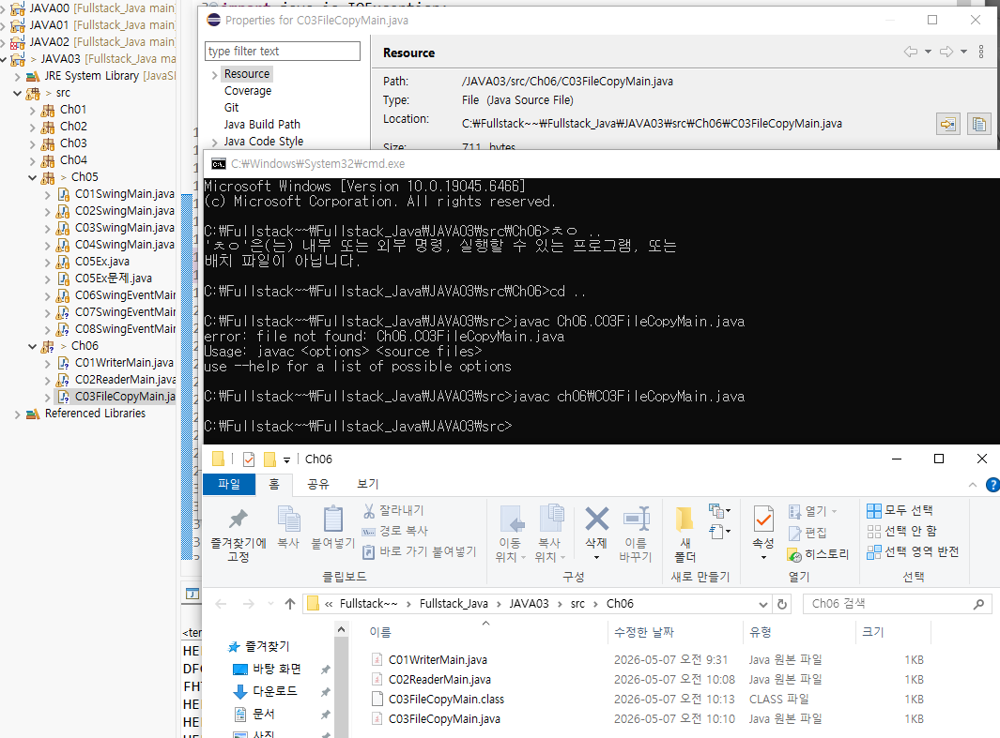
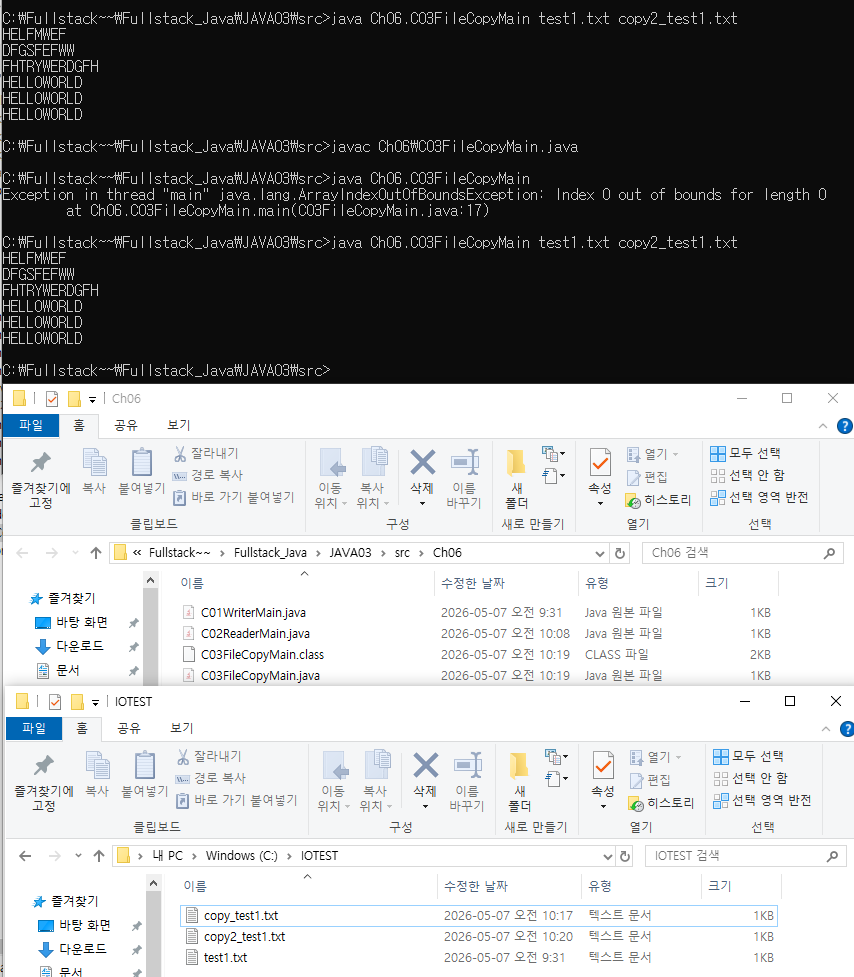
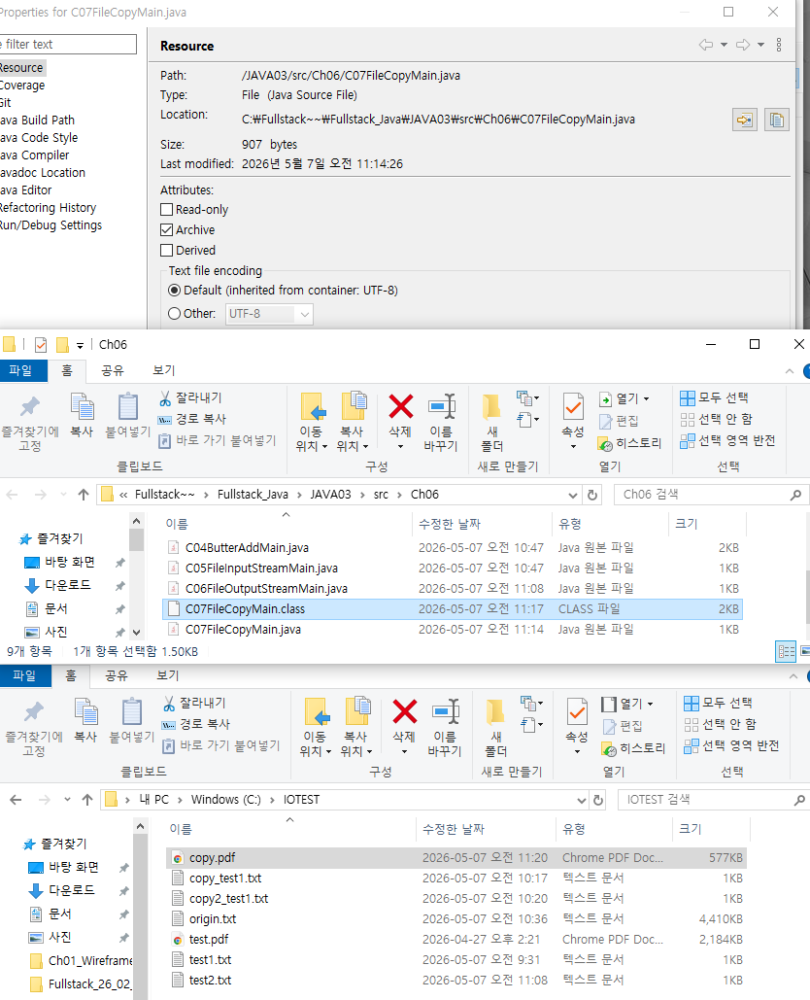

<empty-block/>
#### class 생성

#### 카피 txt

#### 코드 실습
```javascript
C:\Fullstack~~\Fullstack_Java\JAVA03\src\Ch06>cd ..

C:\Fullstack~~\Fullstack_Java\JAVA03\src>javac Ch06\C03FileCopyMain.java

C:\Fullstack~~\Fullstack_Java\JAVA03\src>java Ch06.C03FileCopyMain
Exception in thread "main" java.lang.ArrayIndexOutOfBoundsException: Index 0 out of bounds for length 0
        at Ch06.C03FileCopyMain.main(C03FileCopyMain.java:17)

C:\Fullstack~~\Fullstack_Java\JAVA03\src>java Ch06.C03FileCopyMain test1.txt copy2_test1.txt
HELFMWEF
DFGSFEFWW
FHTRYWERDGFH
HELLOWORLD
HELLOWORLD
HELLOWORLD
```
> **오류로그<br>**수정 후 저장하지 않고 실행해 copy2_test1이 만들어지지 않았었다. 저장 후 실행하니 정상 작동했다.
```javascript
// 오류 발생한 코드
C:\Fullstack~~\Fullstack_Java\JAVA03\src\Ch06>cd ..

C:\Fullstack~~\Fullstack_Java\JAVA03\src>javac Ch06\C03FileCopyMain.java

C:\Fullstack~~\Fullstack_Java\JAVA03\src>java Ch06.C03FileCopyMain // 여기서 Ex..가 출력 안됨
HELFMWEF
DFGSFEFWW
FHTRYWERDGFH
HELLOWORLD
HELLOWORLD
HELLOWORLD

C:\Fullstack~~\Fullstack_Java\JAVA03\src>java Ch06.C03FileCopyMain test1.txt copy2_test1.txt // 여기서 파일 생성 안됨
HELFMWEF
DFGSFEFWW
FHTRYWERDGFH
HELLOWORLD
HELLOWORLD
HELLOWORLD
```
<empty-block/>
#### C07FileCopyMain

```javascript
C:\Fullstack~~\Fullstack_Java\JAVA03\src\Ch06>cd ..

C:\Fullstack~~\Fullstack_Java\JAVA03\src>javac Ch06\C07FileCopyMain.java

C:\Fullstack~~\Fullstack_Java\JAVA03\src>java Ch06.C07FileCopyMain test.pdf copy.pdf
```
<empty-block/>
