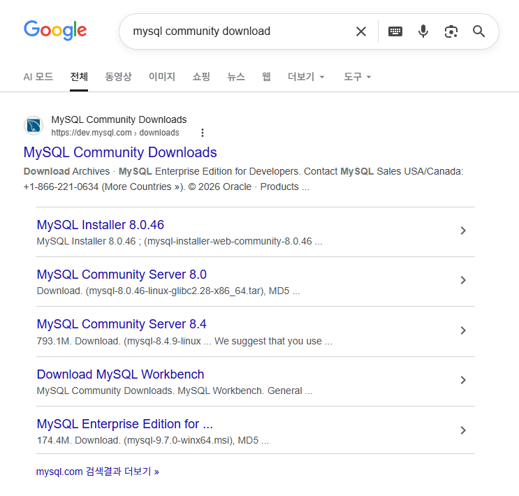

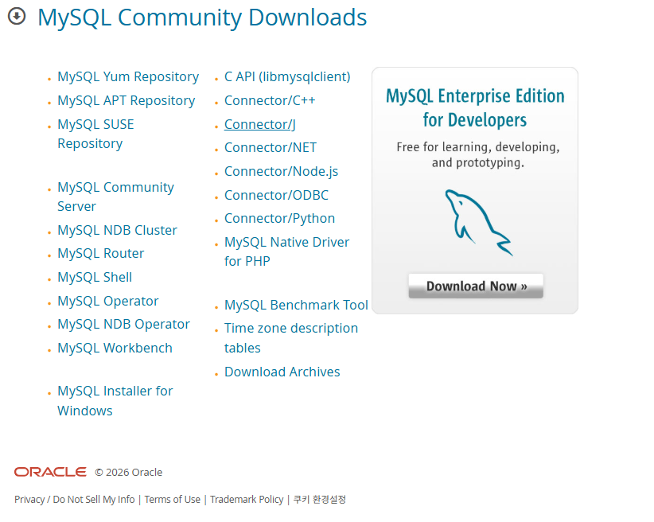

### 두번째 다운로드

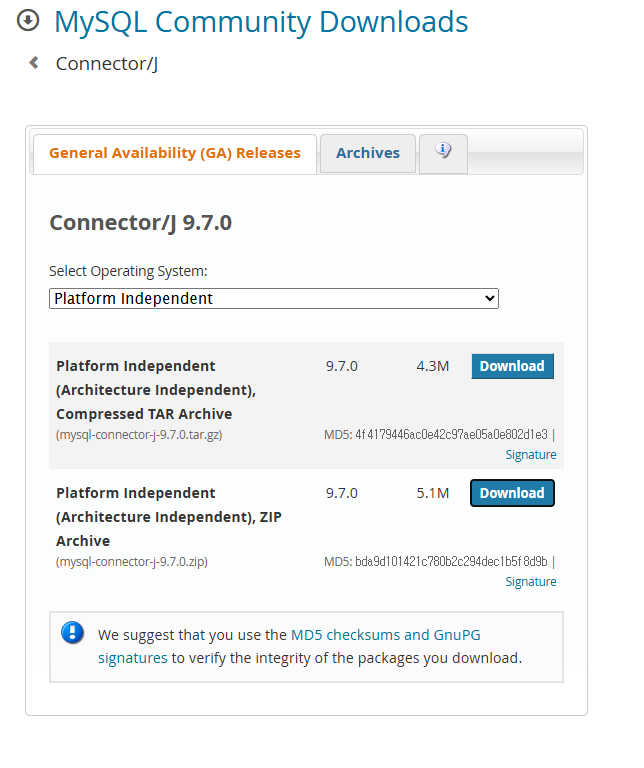

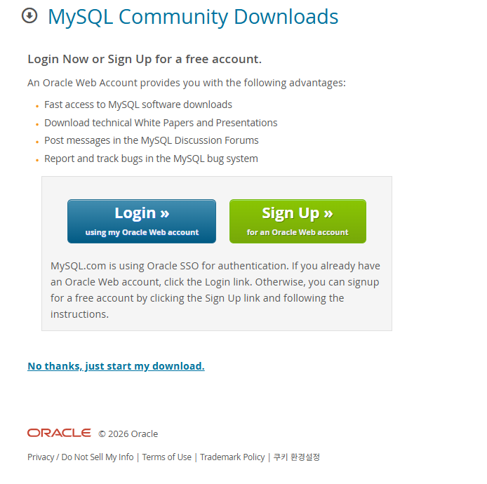

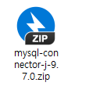

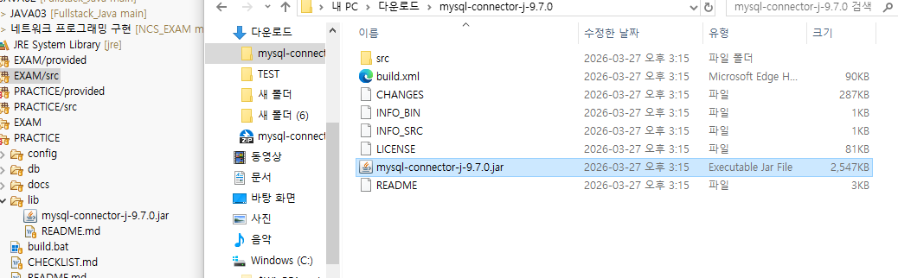

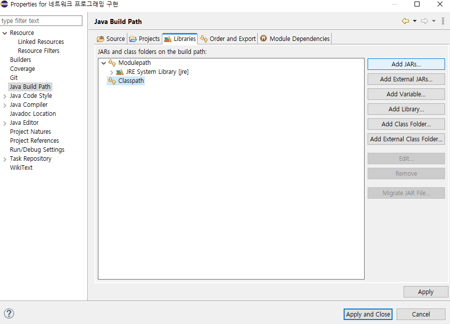

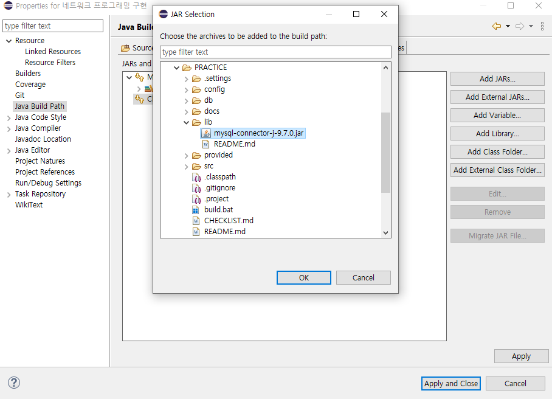

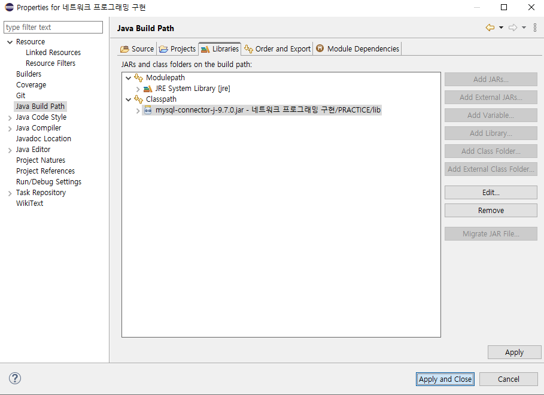

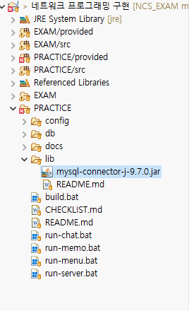

### db.properties.sample 복제해 이름 db.properties 설정 후 주석들 지우기

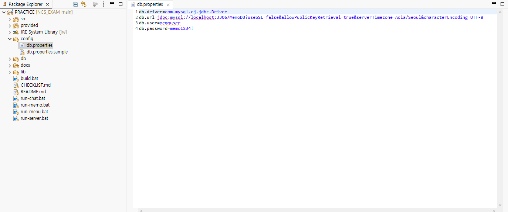

### db\\schema.sql 을 mysql에서 실행

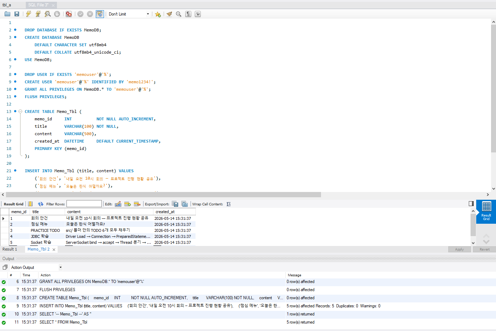

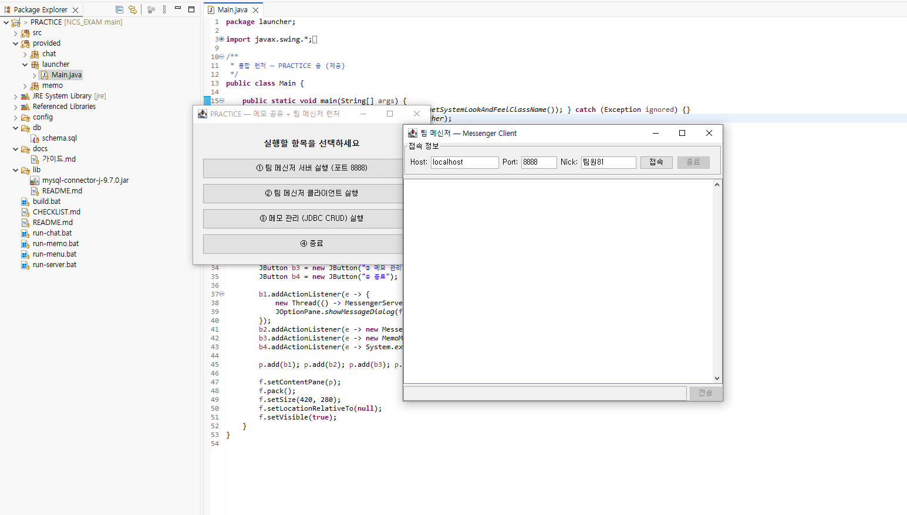

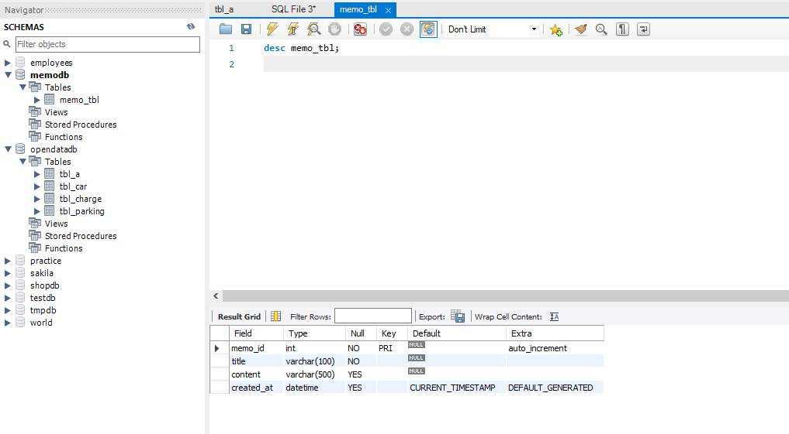

<table>

<tr>

<td>memo_id</td>

<td>int</td>

</tr>

<tr>

<td>title</td>

<td>varchar(100)</td>

</tr>

<tr>

<td>content</td>

<td>varchar(500)</td>

</tr>

<tr>

<td>created_at</td>

<td>datetime</td>

</tr>

</table>

# Memo.java

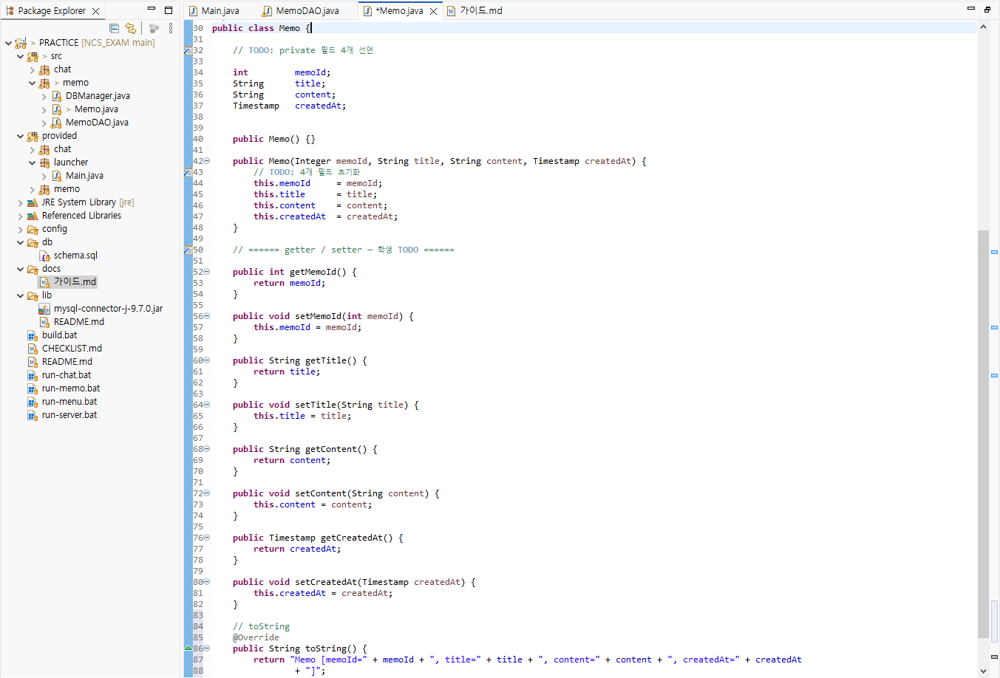

# DBManager.java

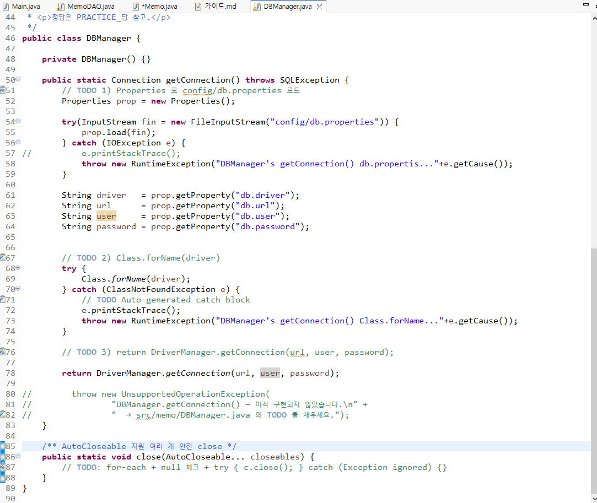

# memo\\MemoDAO.java

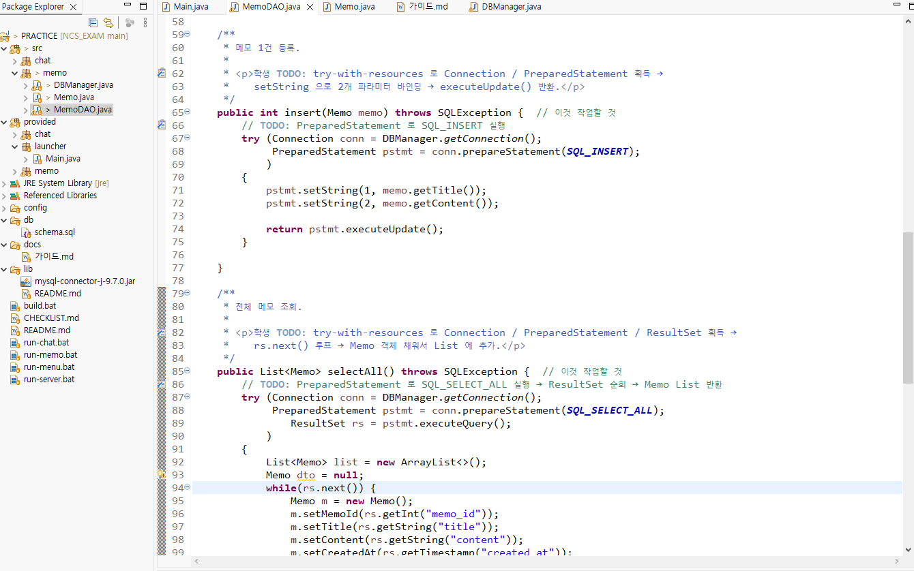
```javascript
package memo;

import java.sql.Connection;
import java.sql.PreparedStatement;
import java.sql.ResultSet;
import java.sql.SQLException;
import java.util.ArrayList;
import java.util.List;

/**
 * [PRACTICE] Memo_Tbl DAO — ☆ 학생 구현
 *
 * <pre>
 * 능력단위요소 3 / 수행준거 3.1 + 3.2 + 3.3
 * 체크리스트 3-3 (JDBC 4단계), 3-4 (PreparedStatement), 3-5 (UI 연동)
 * </pre>
 *
 * <p><b>학생 구현 가이드 (정답 코드 ✗ — 가이드만)</b></p>
 *
 * <ul>
 *   <li>4개 메서드(<code>insert / selectAll / update / delete</code>) 모두 구현</li>
 *   <li>반드시 <b>PreparedStatement</b> + <b>?</b> 파라미터 바인딩 (SQL Injection 방어 — 체크리스트 3-4)</li>
 *   <li>Connection 은 <code>DBManager.getConnection()</code> 으로 획득, <b>try-with-resources</b> 권장</li>
 *   <li>SQLException 은 그대로 throws</li>
 * </ul>
 *
 * <p>JDBC 4단계 (체크리스트 3-3):
 *   ① Driver Load (DBManager 에서 처리됨) →
 *   ② Connection 획득 →
 *   ③ PreparedStatement 작성 →
 *   ④ executeUpdate() / executeQuery() + ResultSet 처리
 * </p>
 *
 * <p>필요 import 4개 추가:
 *   <code>java.sql.Connection</code>,
 *   <code>java.sql.PreparedStatement</code>,
 *   <code>java.sql.ResultSet</code>,
 *   <code>java.util.ArrayList</code>
 * </p>
 *
 * <p>📌 SQL 문은 이미 상수로 선언되어 있음 — 그대로 사용 (직접 작성 금지).</p>
 * <p>정답은 PRACTICE_답 참고.</p>
 */
public class MemoDAO {  // 이것 작업할 것

    private static final String SQL_INSERT =
            "INSERT INTO Memo_Tbl (title, content) VALUES (?, ?)";

    private static final String SQL_SELECT_ALL =
            "SELECT memo_id, title, content, created_at " +
            "FROM Memo_Tbl ORDER BY memo_id DESC";

    private static final String SQL_UPDATE =
            "UPDATE Memo_Tbl SET title = ?, content = ? WHERE memo_id = ?";

    private static final String SQL_DELETE =
            "DELETE FROM Memo_Tbl WHERE memo_id = ?";

    /**
     * 메모 1건 등록.
     *
     * <p>학생 TODO: try-with-resources 로 Connection / PreparedStatement 획득 →
     *    setString 으로 2개 파라미터 바인딩 → executeUpdate() 반환.</p>
     */
    public int insert(Memo memo) throws SQLException {  // 이것 작업할 것
        // TODO: PreparedStatement 로 SQL_INSERT 실행
    	try (Connection conn = DBManager.getConnection();
    		 PreparedStatement pstmt = conn.prepareStatement(SQL_INSERT);
    		 )
    	{
    		pstmt.setString(1, memo.getTitle());
    		pstmt.setString(2, memo.getContent());
    		
    		return pstmt.executeUpdate();    		
    	}
    	
    }

    /**
     * 전체 메모 조회.
     *
     * <p>학생 TODO: try-with-resources 로 Connection / PreparedStatement / ResultSet 획득 →
     *    rs.next() 루프 → Memo 객체 채워서 List 에 추가.</p>
     */
    public List<Memo> selectAll() throws SQLException {  // 이것 작업할 것
        // TODO: PreparedStatement 로 SQL_SELECT_ALL 실행 → ResultSet 순회 → Memo List 반환
    	try (Connection conn = DBManager.getConnection();
       		 PreparedStatement pstmt = conn.prepareStatement(SQL_SELECT_ALL);
    			ResultSet rs = pstmt.executeQuery();
       		 )
       	{
       		List<Memo> list = new ArrayList<>();
       		Memo dto = null;
       		while(rs.next()) {
       			Memo m = new Memo();
       			m.setMemoId(rs.getInt("memo_id"));
       			m.setTitle(rs.getString("title"));
       			m.setContent(rs.getString("content"));
       			m.setCreatedAt(rs.getTimestamp("created_at"));
       			list.add(m);
       		}
       		return list;    		
       	}
       	
    }

    /**
     * 메모 1건 수정.
     *
     * <p>학생 TODO: SQL_UPDATE 실행. 파라미터 3개: title, content, memoId(WHERE).</p>
     */
    public int update(Memo memo) throws SQLException {
    	
    	try (Connection conn = DBManager.getConnection();
       		 PreparedStatement pstmt = conn.prepareStatement(SQL_UPDATE);
       		 )
       	{
       		pstmt.setString(1, memo.getTitle());
       		pstmt.setString(2, memo.getContent());
       		pstmt.setInt(3, memo.getMemoId());
       		
       		return pstmt.executeUpdate();    		
       	}
    }

    /**
     * 메모 1건 삭제.
     *
     * <p>학생 TODO: SQL_DELETE 실행. setInt(1, memoId).</p>
     */
    public int delete(int memoId) throws SQLException {  
    	
    	try (Connection conn = DBManager.getConnection();
       		 PreparedStatement pstmt = conn.prepareStatement(SQL_DELETE);
       		 )
       	{
       		pstmt.setInt(1, memoId);

       		return pstmt.executeUpdate();    		
       	}
    }
}

```
# memo\\DBManager.java

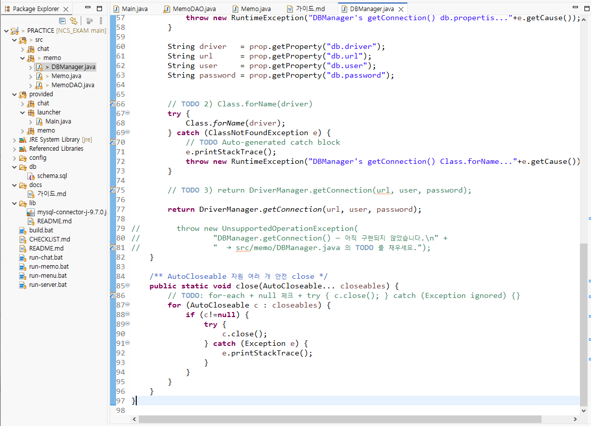

### EXAM \< 이게 시험. 제출할 것.

이게 완성시켜야 할 부분. memo\~는 어제 한 것

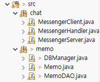

# chat\\MessengerServer.java

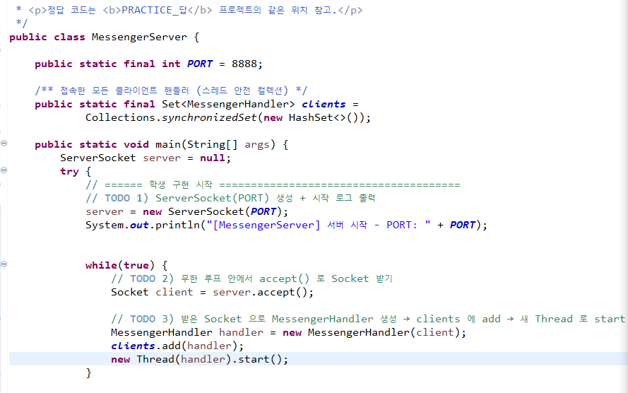

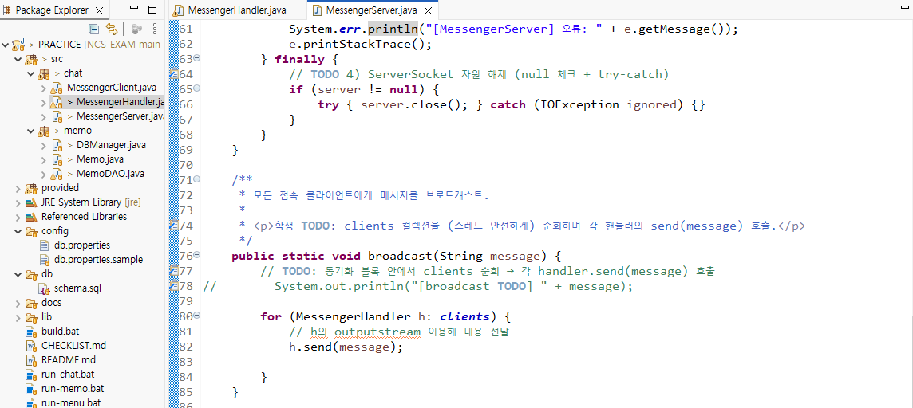

# chat\\MessengerHandler.java
```javascript
package chat;

import java.io.BufferedReader;
import java.io.IOException;
import java.io.InputStream;
import java.io.InputStreamReader;
import java.io.PrintWriter;
import java.net.Socket;

/**
 * [PRACTICE] 클라이언트 1명을 처리하는 Thread — ☆ 학생 구현
 *
 * <pre>
 * 능력단위요소 2 / 수행준거 2.3 + 2.4
 * 체크리스트 2-3 (Thread), 2-4 (broadcast 송신), 2-5 (자원 해제)
 * </pre>
 *
 * <p><b>학생 구현 가이드 (정답 코드 ✗ — 가이드만)</b></p>
 * <ol>
 *   <li>생성자: Socket 의 InputStream/OutputStream 을 BufferedReader/PrintWriter 로 감싸기 (UTF-8 명시).</li>
 *   <li>run(): readLine() 루프 — 첫 줄 닉네임 받고, 이후 받는 줄마다 broadcast.</li>
 *   <li>send(): out.println(message) 한 줄.</li>
 *   <li>finally: MessengerServer.remove(this) + in/out/socket close.</li>
 * </ol>
 *
 * <p>필요 import 추가: <code>java.io.InputStreamReader</code>, <code>java.io.OutputStreamWriter</code></p>
 * <p>정답은 PRACTICE_답 참고.</p>
 */
public class MessengerHandler implements Runnable {

    private final Socket socket;
    private BufferedReader in;
    private PrintWriter out;
    private String nickname = "팀원";

    public MessengerHandler(Socket socket) throws IOException {
    	
        this.socket = socket;
        // TODO: in / out 스트림 초기화 (UTF-8 명시!)
        InputStream tmpIn = socket.getInputStream();
        InputStreamReader in_reader = new InputStreamReader(tmpIn);
        in = new BufferedReader(in_reader);
        
        //in = new BufferedReader(new InputStreamReader(socket.getInputStream()));
        out = new PrintWriter(socket.getOutputStream());
    }

    @Override
    public void run() {
        try {
            // ====== 학생 구현 시작 ======================================
            // TODO 1) (선택) 첫 줄을 닉네임으로 받아 nickname 필드에 저장 + 입장 broadcast
        	String nick = in.readLine();
        	if (nick != null && !nick.isBlank()) {
        		this.nickname = nick;
        	}
            // TODO 2) readLine() 반복 → null 이 아니면 MessengerServer.broadcast(닉네임 + " : " + line)
        	String line = null; // resv용
        	
        	while( (line = in.readLine()) != null )
        		MessengerServer.broadcast(nickname + ":" + line);
        	
        	
            // 학생이 위 TODO 를 모두 구현하면 아래 한 줄 삭제
//            throw new IOException("MessengerHandler.run() 이 아직 구현되지 않았습니다. (TODO)");
            // ====== 학생 구현 끝 ========================================
        } catch (IOException e) {
            System.err.println("[MessengerHandler] " + nickname + " 접속 종료: " + e.getMessage());
        } finally {
            // TODO 3) MessengerServer.remove(this) 로 컬렉션에서 제거
        	MessengerServer.remove(this);
            // TODO 4) in / out / socket 자원 해제 (각각 null 체크 + try-catch)
        	try {in.close();} catch (IOException e) {e.printStackTrace();}
        	try {out.close();} catch (Exception e) {e.printStackTrace();}
        	try {socket.close();} catch (IOException e) {e.printStackTrace();}
        	
            // TODO 5) 퇴장 broadcast
        	MessengerServer.broadcast("[퇴장]" + nickname);
        }
    }

    /**
     * 이 핸들러가 담당하는 클라이언트에게 한 줄 전송.
     *
     * <p>학생 TODO: out 이 null 이 아니면 println(message) 호출.</p>
     */
    public void send(String message) {
        // TODO: out 으로 한 줄 송신
    	if (out != null) {
    		out.println(message);
    		out.flush();
    	}
    	
    }

    public String getNickname() {
        return nickname;
    }
}

```

학생별 이슈

학생의 todo는 체크리스트

todo마다 커밋으로 확인
