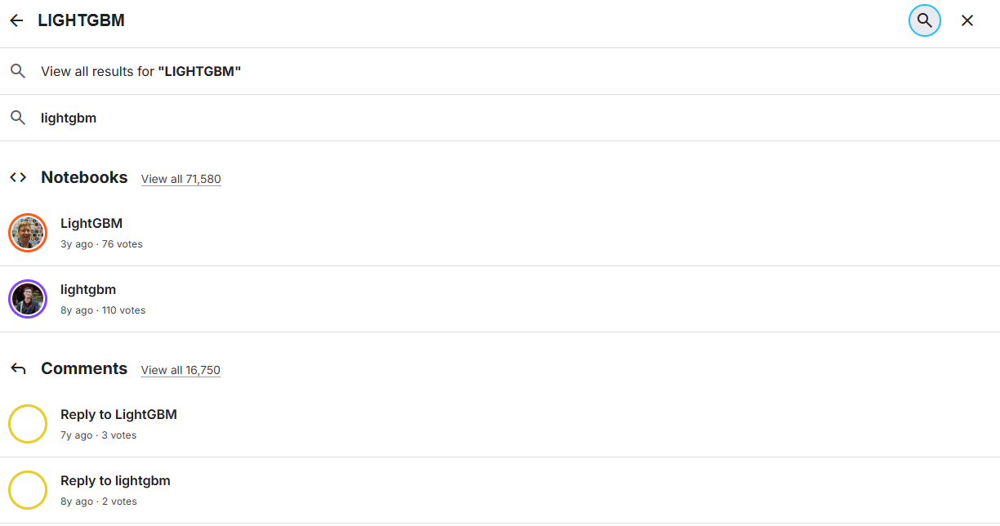
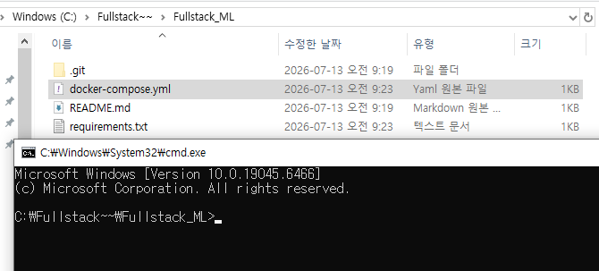
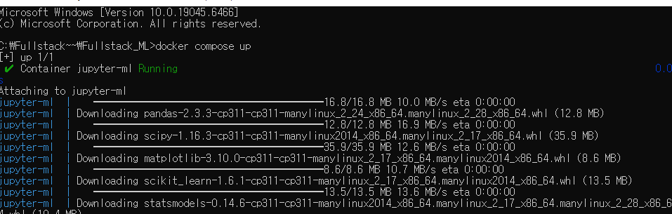
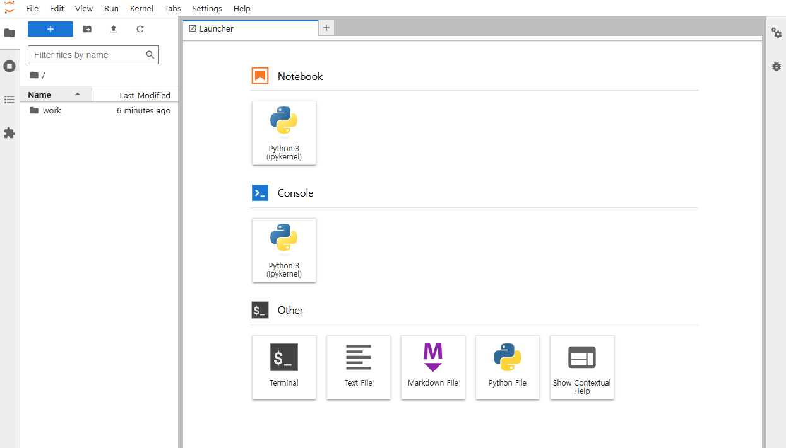
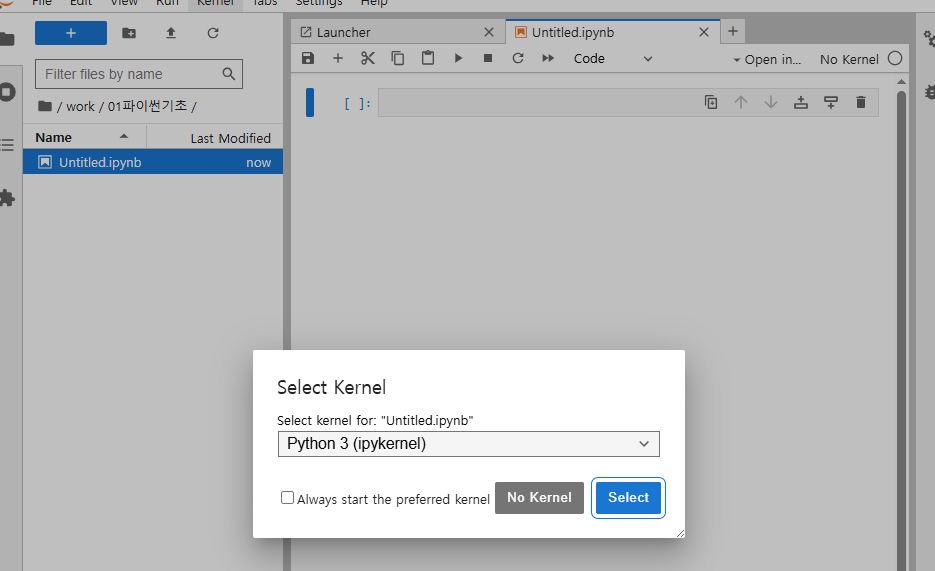
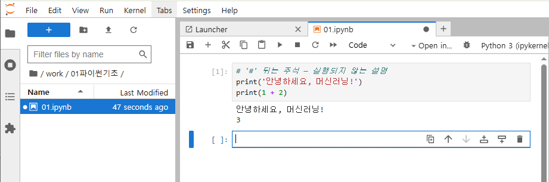
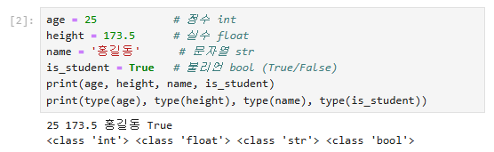

가입




## **docker-compose.yml (전문)**
```yaml
name: ml_jupyter

services:
  jupyter:
    image: jupyter/scipy-notebook:latest
    container_name: jupyter-ml
    ports:
      - "9999:8888"
    volumes:
      # 실습코드 폴더 전체를 Jupyter 작업 폴더로 마운트
      - ../실습코드:/home/jovyan/work
      - ./requirements.txt:/tmp/requirements.txt
    command: >
      bash -c "pip install --no-cache-dir -r /tmp/requirements.txt &&
               pip uninstall -y bottleneck numexpr pyarrow &&
               start-notebook.sh --IdentityProvider.token=''"
    restart: unless-stopped
```

## **requirements.txt**
```plain text
# 코어 수치 스택 — 반드시 버전 고정 (numpy ABI 충돌 방지)
numpy==2.2.6
pandas==2.3.3
scipy==1.16.3
matplotlib==3.10.0
scikit-learn==1.6.1
statsmodels==0.14.6
# 머신러닝(앙상블·부스팅·불균형)
xgboost
lightgbm
imbalanced-learn
# 시각화 / 연관규칙 / 저장
seaborn
mlxtend
joblib
```
도커 데스크탑 키고 cmd



```javascript
docker compose up
```


### 접속 링크 [http://localhost:9999/](http://localhost:9999/)






shift-enter: 실행




```javascript
docker compose down // 끄기
```
