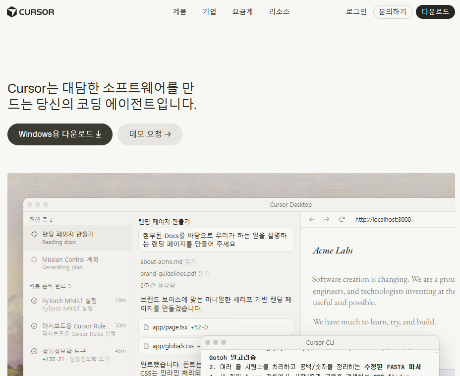

> 현재 내 폴더들 확인<br>2026 UIUX트랜드에 맞는 스타일 가이드 조사해서 chat으로 정리

> 쇼핑몰 프로젝트 진행 예정이야 관련 디자인 시안 chat으로 이미지 생성해서 보고, 파일 생성해서 넣을 것 디자인 가이드.md도 생성할 것 / 타이포그래피, 기본색상, 로그인 로그아웃, 기본 레이아웃도 이미지 시안에 포함해주고 디자인 가이드 md 파일에도 정리<br>현재 FN의 JSX파일에 해당 디자인 가이드 md와 디자인 시안 참고해서 CSS 스타일링 작업 진행

> 바탕 색 흰색으로. FN에 이 시안 적용. 실제 쇼핑몰 같은 사진 포함하여 쇼핑몰처럼 .

> 제작 후 docker compose up해서 기능 확인.

> 회원가입 실패했는데 확인. 상품 CRUD 페이지 FN에 샘플 생성해줘 현재 디자인 [가이드.md](http://xn--o39a11o86p.md/) 와 디자인 시안 참고할 것. 기능 추가는 추후 할 예정. FN에 JSX파일 만들고 라우팅 작업 진행해 페이지간 연결 작업 완료할 것. 상품 등록, 수정, 삭제는 관리자 계정(ROLE_ADMIN)으로만 사용 가능 해야 함. 상품보기, 상세보기, 결제화면, 장바구니까지 포함해서 만들어줘. *그외 다른 기능에 영향을 주면 절대 안됨 매우 중요.* 작업 위한 시나리오 먼저 chat 보고부터. 제작 X(이미지!로 생성해 보고 확인용)

> 추가한 상품 CRUD에 맞는 BN Endpoint 기능 생성을 해야됨<br>FN 추가한 페이지 내 기능을 모두 만족시키는 Endpoint설계 뱡안을 chat으로 보고해 정리.

> endpoint단계별로 작업 진행할 것 *그외 다른 기능에 영향을 주면 절대 안됨 매우 중요.* 단계가 끝나면 테스트 작업 자체적으로 진행 후 기능 성공 여부 chat으로 보고 하고 프롬프트에서 '다음' 전달하면 다음 작업 진행

> 모든 endpoint 차례로 만들고 검수 확인하고 문제없으면 다음 이어 진행 모든 결정은 알아서 하고 기존 기능들은 모두 정상동작 해야됨

> 현재 만든 BN endpoint와 FN의 API연동작업 진행 위한 작업 시나리오 chat으로 보고 *기존기능은 모두 정상동작 해야됨*

> 단계별로 작업 진행하고 각 단계별 테스트 진행 후 문제 없을 때 다음 단계 진행<br>모든 단계 끝나고 완료 여부 chat 보고

> GITLOGS라는 폴더 직접 만들기

> git, github 에서 브랜치별 커밋 메세지에 대한 [rule.md](http://rule.md/) 파일 생성해줘  C:\Fullstack~~\Fullstack_VIBECODING_WITH_CURSOR\01\GITLOGS 안에 [GITBASE.md](http://gitbase.md/) 파일로 기본 룰 생성 예정. 먼저 어떻게 로그를 남길지 제안해 chat으로 보고. 확인 후 적용 예정.<br>혼자하는 작업이 아니라 조원들과 함께 작업 하는 것 감안해.

> 그것까지 다 고친 다음, 브랜치 룰 따라 md파일을 커밋푸시하고 앞으로 해당 프로젝트를 진행할때 DOCS를 따르도록 하는 프로젝트RULE.md도 만들어.<br>현재 수정한 모든 파일 보통 실무에서 처리하는 푸시 구간별??로 나눠서 브랜치 따로 만들고 삭제하고 하면서 프로젝트 푸시처럼 쭉 나눠서 끝까지 푸시해줘 확인하게. (내 계정으로 커밋 해야함.)

---

---

이론 [http://192.168.5.50:5500/](http://192.168.5.50:5500/)

02 수정~

02 수정 예정. 폴더 구조 확인 후 보고

02/FN에 상품 카드 컴포넌트 하나 만들어줘. 

FN/ProductCard App.js 에 라우팅하고 docker-compose yml으로 docker 실행

현재 @폴더위치/~~UIUX디자인가이드 md를 기준으로 02/FN/src/components/ProductTile.jsx 를 다시 만들어줘. 

~~

~

FN의 전체 JSX 페이지에 디자인 시안 형태로 CSS와 디자인 가이드.md에 따라 디자인 작업 진행해줘 기존 페이지로 범위 제한해서 만들어줘 기존 기능들은 정상 동작해야됨 매우 중요

방금 생성한 JSX 파일 APP.js 라우팅

~~

지금 적용중인 규칙 뭐가 있는지 정리해서 chat으로 보고<br>어떻게 동작하는지 flow도 확인

쇼핑몰에 필요한 추가 페이지 하나 FN에서 만들어줘

.env 파일 만들고 개발모드/프로덕트 모드 설정해서 해당 설정 내용을 [project-rules.md](http://project-rules.md)c 여기서 읽어서 개발모드라면 FN의 디자인 작업 환경을 localhost(npm install, npm run start)에서 실행해서 디자인 확인할 수 있도록 전역 rule 설정

FN 필요한 다음 페이지 후보 jsx 하나 제안해서 chat으로 보고

FN에 해당 페이지 만들어줘

.cursorignore 만들어서 규칙 넣어줘

~~

데이터베이스 mcp 이용해서 현재 생성된 테이블 구조와 값들 정리해 표로 chat 보고

~

현재 연결된 디자인가이드(Figㅁ=     ….

                          ㅁ

DOCS 안에 전자정부 폴더 생성 후 현재 연결된 figma 디자인 가이드를 우리 쇼핑몰 프로젝트에 맞게 필요한 시안만 가져와서 png나 html 로 생성. 그리고 디자인 가이드.md도 생성

FN에 현재 페이지들 전자정부 디자인 시안 적극 적용. 작업 종료 이후 메인 병합 커밋 푸시

위 작업 종료 이후 서버도 종료

---

## **13. PLAYWRIGHT_MCP 직접 실습**

AI가 브라우저를 직접 조작합니다. 오늘 실습 중 **가장 인상적인 부분**입니다.

1. **13-1**설정을 추가합니다.<br>경로: Fullstack_VIBECODING_WITH_CURSOR\03\.cursor\mcp.json 하단
```plain text
"playwright": {
  "command": "npx",
  "args": ["-y", "@playwright/mcp@latest"]
}
```

AI 대화

> 현재 사용 가능한 mcp 리스트 chat으로 보여줘

> Playwriter mcp로 현재 시간 기준 주요 핫이슈 뉴스 정리해서 chat으로 보고 

> [https://exam-all.duckdns.org](https://exam-all.duckdns.org로) 링크 user/zhfldk11!가 계정 로그인해서 현재 /subjects의 과목 정보 확인해줘
